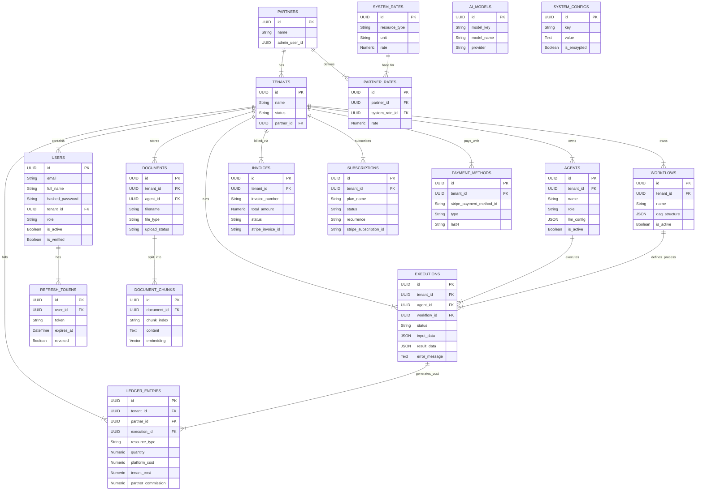

# Database Schema Documentation

This document outlines the database schema for the HireBuddha platform, including table structures, relationships, and an Entity-Relationship (ER) diagram.

## ER Diagram

## Schema Details

### Auth Module

#### `partners`
Represents partner organizations that can resell or manage tenants.

| Column | Type | Nullable | Description |
| :--- | :--- | :--- | :--- |
| `id` | UUID | No | Primary Key |
| `name` | String | No | Name of the partner organization |
| `admin_user_id` | UUID | Yes | Link to the main administrator user for this partner |
| `created_at` | DateTime | No | Creation timestamp |
| `updated_at` | DateTime | No | Last update timestamp |

#### `tenants`
Represents the workspaces or customers using the platform.

| Column | Type | Nullable | Description |
| :--- | :--- | :--- | :--- |
| `id` | UUID | No | Primary Key |
| `name` | String | No | Name of the workspace/tenant |
| `status` | String | Yes | Status (e.g., active, suspended). Default: active |
| `partner_id` | UUID | Yes | Foreign Key to `partners`. Optional if direct customer. |
| `created_at` | DateTime | No | Creation timestamp |
| `updated_at` | DateTime | No | Last update timestamp |

#### `users`
Represents individual users with access to the system.

| Column | Type | Nullable | Description |
| :--- | :--- | :--- | :--- |
| `id` | UUID | No | Primary Key |
| `email` | String | No | Unique email address |
| `full_name` | String | No | User's full name |
| `hashed_password` | String | No | Argon2 hashed password |
| `tenant_id` | UUID | No | Foreign Key to `tenants`. Users belong to a tenant. |
| `role` | String | Yes | Role (e.g., tenant_admin, user, app_admin). Default: tenant_admin |
| `is_active` | Boolean | Yes | Whether the user can login. Default: True |
| `is_verified` | Boolean | Yes | Whether email is verified. Default: False |
| `created_at` | DateTime | No | Creation timestamp |
| `updated_at` | DateTime | No | Last update timestamp |

#### `refresh_tokens`
Stores long-lived tokens for session management.

| Column | Type | Nullable | Description |
| :--- | :--- | :--- | :--- |
| `id` | UUID | No | Primary Key |
| `user_id` | UUID | No | Foreign Key to `users` |
| `token` | String | No | Unique refresh token string |
| `expires_at` | DateTime | No | Expiration timestamp |
| `revoked` | Boolean | Yes | Whether token has been manually revoked. Default: False |
| `created_at` | DateTime | No | Creation timestamp |

### AI Module

#### `agents`
Defines AI agents configured within a tenant.

| Column | Type | Nullable | Description |
| :--- | :--- | :--- | :--- |
| `id` | UUID | No | Primary Key |
| `tenant_id` | UUID | No | Foreign Key to `tenants` |
| `name` | String | No | Name of the agent |
| `role` | String | No | System prompt defining the agent's role |
| `llm_config` | JSON | No | Configuration for LLM (provider, model, etc.) |
| `is_active` | Boolean | Yes | Default: True |
| `created_at` | DateTime | No | Creation timestamp |
| `updated_at` | DateTime | No | Last update timestamp |

#### `workflows`
Defines DAG-based workflows for chaining agents.

| Column | Type | Nullable | Description |
| :--- | :--- | :--- | :--- |
| `id` | UUID | No | Primary Key |
| `tenant_id` | UUID | No | Foreign Key to `tenants` |
| `name` | String | No | Name of the workflow |
| `dag_structure` | JSON | No | Structure of the DAG (nodes, edges) |
| `is_active` | Boolean | Yes | Default: True |
| `created_at` | DateTime | No | Creation timestamp |
| `updated_at` | DateTime | No | Last update timestamp |

#### `executions`
Records specific runs of an agent or workflow.

| Column | Type | Nullable | Description |
| :--- | :--- | :--- | :--- |
| `id` | UUID | No | Primary Key |
| `tenant_id` | UUID | No | Foreign Key to `tenants` |
| `agent_id` | UUID | Yes | Foreign Key to `agents` (if single agent run) |
| `workflow_id` | UUID | Yes | Foreign Key to `workflows` (if workflow run) |
| `status` | String | Yes | Status (pending, running, completed, failed). Default: pending |
| `input_data` | JSON | Yes | Input provided to execution |
| `result_data` | JSON | Yes | Output of execution |
| `error_message` | Text | Yes | Error details if failed |
| `started_at` | DateTime | Yes | Start timestamp |
| `completed_at` | DateTime | Yes | Completion timestamp |
| `created_at` | DateTime | No | Creation timestamp |

#### `documents`
Uploaded files for RAG (Retrieval Augmented Generation).

| Column | Type | Nullable | Description |
| :--- | :--- | :--- | :--- |
| `id` | UUID | No | Primary Key |
| `tenant_id` | UUID | No | Foreign Key to `tenants` |
| `agent_id` | UUID | Yes | Foreign Key to `agents` (Optional association) |
| `filename` | String | No | Original filename |
| `file_type` | String | No | File extension/type (pdf, docx, etc.) |
| `file_size` | String | Yes | Size of file |
| `upload_status` | String | Yes | Status (processing, completed, failed). Default: processing |
| `created_at` | DateTime | No | Creation timestamp |
| `updated_at` | DateTime | No | Last update timestamp |

#### `document_chunks`
Vector embeddings and text chunks from processed documents.

| Column | Type | Nullable | Description |
| :--- | :--- | :--- | :--- |
| `id` | UUID | No | Primary Key |
| `document_id` | UUID | No | Foreign Key to `documents` |
| `chunk_index` | String | No | Order/Index of chunk in document |
| `content` | Text | No | Tect content of chunk |
| `embedding` | Vector(768) | Yes | Vector embedding (pgvector) |
| `created_at` | DateTime | No | Creation timestamp |

### Billing Module

#### `system_rates`
Base costs for resources defined by the platform.

| Column | Type | Nullable | Description |
| :--- | :--- | :--- | :--- |
| `id` | UUID | No | Primary Key |
| `resource_type` | String | No | Type (e.g., text_tokens_input) |
| `unit` | String | No | Unit (e.g., 1k_tokens) |
| `rate` | Numeric(18,6) | No | Cost in USD |
| `is_active` | Boolean | Yes | Default: True |
| `description` | Text | Yes |  |

#### `partner_rates`
Marked-up rates defined by partners for their tenants.

| Column | Type | Nullable | Description |
| :--- | :--- | :--- | :--- |
| `id` | UUID | No | Primary Key |
| `partner_id` | UUID | No | Foreign Key to `partners` |
| `system_rate_id` | UUID | No | Foreign Key to `system_rates` |
| `rate` | Numeric(18,6) | No | Reseller price in USD |
| `is_active` | Boolean | Yes | Default: True |

#### `ledger_entries`
Immutable record of resource consumption and costs.

| Column | Type | Nullable | Description |
| :--- | :--- | :--- | :--- |
| `id` | UUID | No | Primary Key |
| `tenant_id` | UUID | No | Foreign Key to `tenants` |
| `partner_id` | UUID | Yes | Foreign Key to `partners` |
| `execution_id` | UUID | Yes | Foreign Key to `executions` |
| `resource_type` | String | No | Type of resource consumed |
| `quantity` | Numeric(18,6) | No | Amount consumed |
| `unit` | String | No | Unit of measurement |
| `platform_cost` | Numeric(18,6) | No | Base cost to platform |
| `tenant_cost` | Numeric(18,6) | No | Charged to tenant |
| `partner_commission` | Numeric(18,6) | No | Profit for partner |
| `entry_metadata` | Text | Yes | JSON string of extra info |
| `created_at` | DateTime | No | Creation timestamp |

#### `invoices`
Generated invoices for tenants.

| Column | Type | Nullable | Description |
| :--- | :--- | :--- | :--- |
| `id` | UUID | No | Primary Key |
| `tenant_id` | UUID | No | Foreign Key to `tenants` |
| `invoice_number` | String | No | Unique Invoice # |
| `total_amount` | Numeric(18,6) | No | Total due |
| `currency` | String | Yes | Default: USD |
| `status` | String | Yes | Status (pending, paid, etc.) |
| `period_start` | DateTime | No | Billing period start |
| `period_end` | DateTime | No | Billing period end |
| `due_date` | DateTime | No | Payment due date |
| `paid_date` | DateTime | Yes | Payment date |
| `stripe_invoice_id` | String | Yes | Stripe Invoice ID |
| `payment_intent_id` | String | Yes | Stripe Payment Intent ID |

#### `subscriptions`
Tenant subscription plans.

| Column | Type | Nullable | Description |
| :--- | :--- | :--- | :--- |
| `id` | UUID | No | Primary Key |
| `tenant_id` | UUID | No | Foreign Key to `tenants` |
| `plan_name` | String | No | Name of plan (e.g., pro) |
| `status` | String | Yes | Status (active, cancelled) |
| `billing_cycle` | String | Yes | monthly/annual |
| `credit_balance` | Numeric(18,6) | Yes | Prepaid credits available |
| `stripe_subscription_id` | String | Yes | Stripe ID |
| `stripe_customer_id` | String | Yes | Stripe Customer ID |

#### `payment_methods`
Stored payment methods.

| Column | Type | Nullable | Description |
| :--- | :--- | :--- | :--- |
| `id` | UUID | No | Primary Key |
| `tenant_id` | UUID | No | Foreign Key to `tenants` |
| `stripe_payment_method_id` | String | No | Stripe ID |
| `stripe_customer_id` | String | No | Stripe Customer ID |
| `type` | String | Yes | card, etc. |
| `last4` | String | Yes | Last 4 digits |
| `is_default` | Boolean | Yes | Default method |

### Config Module

#### `ai_models`
Available AI Models in the system.

| Column | Type | Nullable | Description |
| :--- | :--- | :--- | :--- |
| `id` | UUID | No | Primary Key |
| `model_key` | String | No | Unique key (e.g., gpt-4) |
| `model_name` | String | No | Display name |
| `provider` | String | No | Vendor (openai, internal) |
| `model_type` | String | No | text, image, etc. |
| `is_active` | Boolean | Yes | Default: True |

#### `system_configs`
Global system configuration.

| Column | Type | Nullable | Description |
| :--- | :--- | :--- | :--- |
| `id` | UUID | No | Primary Key |
| `key` | String | No | Config key |
| `value` | Text | No | Config value (potentially encrypted) |
| `is_encrypted` | Boolean | Yes | Default: True |
| `description` | String | Yes | What this config does |
