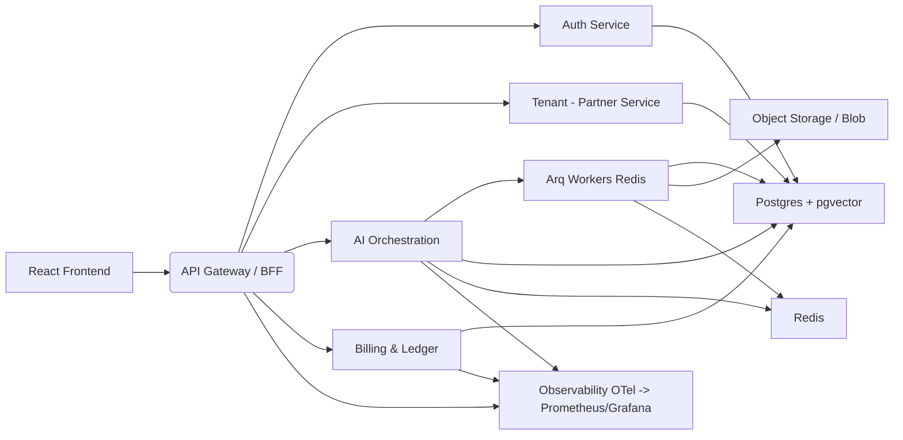

# HireBuddha — Technical Architecture Document

> Minimal, pragmatic, and developer-friendly microservices design for the HireBuddha platform.

---

## 1. Executive summary

This document translates the supplied Functional Requirements and Epics/Stories into a practical technical architecture. The goal is a minimal but robust microservices design that:

- decomposes the platform into clear, independently deployable services,
- maps responsibilities and key APIs for each service,
- defaults to simplicity and developer velocity (FastAPI + Postgres + React),
- preserves the ability to scale and evolve without premature optimization.

Files used as input:
- `/mnt/data/Hirebuddha Functional Specification Document.md`
- `/mnt/data/Epics-Features-Stories_ Hirebuddha Platform v2.0.md`

---

## 2. Design principles (how we make choices)

1. **Keep services small & purposeful** — one primary responsibility per service.
2. **Prefer async I/O over threads** for AI and network-bound workloads (FastAPI / asyncpg / arq).
3. **Shared-schema multi-tenancy** with strong logical isolation (tenant_id on rows + application-level RLS; optional Postgres RLS later).
4. **Immutable ledger** for billing: never recompute historical charges after the fact.
5. **Developer velocity**: sensible defaults, CI/CD, clear contract-first APIs that the frontend and automation can rely on.

---

## 3. System overview (high level)



---

## 4. Service decomposition & responsibilities

### 4.1 API Gateway / BFF
- **Purpose:** Single entry point, TLS termination, authentication check, rate limiting, basic aggregation for frontend.
- **Tech:** Nginx/Traefik + small FastAPI BFF layer for frontend-specific routes.
- **Responsibilities:** route to microservices, validate JWT (short-lived), inject tenant context into downstream calls, limit request rates per tenant/partner.

### 4.2 Auth Service (Identity & Access)
- **Purpose:** Register/login, OAuth2/OIDC integrations (Google, Microsoft), access & refresh tokens, RBAC enforcement helpers.
- **Tech:** FastAPI, PyDantic schemas, asyncpg / SQLAlchemy Async, Argon2 for password hashing, JWT for access tokens, refresh token storage (hashed) in DB.
- **Key responsibilities:**
  - Registration (self-tenant creation flow), email verification, password policies.
  - OIDC flows: map provider `sub` to local user.
  - Token rotation & revocation: refresh token hash in DB.
  - Role checks helper library (used by other services as a dependency pattern).

**APIs (examples):**
- `POST /auth/register` -> returns user + tenant creation
- `POST /auth/token` -> access_token
- `POST /auth/refresh` -> rotate refresh token
- `GET /auth/me`

### 4.3 Tenant & Partner Service
- **Purpose:** Manage Partner, Tenant, User metadata, partner-led onboarding, tenant lifecycle (Active/Suspended).
- **Tech:** FastAPI + Postgres.
- **Key responsibilities:**
  - CRUD for partners, tenants, tenant settings, subdomain mapping.
  - Middleware to validate tenant status; respond 403 when suspended.
  - Provide partner-scoped views for partner admins.

**APIs (examples):**
- `POST /partners` (App admin)
- `POST /partners/:id/tenants` (Partner onboarding)
- `GET /tenants/:id` (Tenant details)

### 4.4 AI Orchestration Service
- **Purpose:** Authoring, validating, and orchestrating agent/workflow definitions; enqueue executions.
- **Tech:** FastAPI, Arq (workers on Redis), LangChain/Pydantic-based schemas for tools, JSON DAG config storage.
- **Responsibilities:**
  - CRUD for Agents, Workflows, Tools configuration.
  - Validate DAG (acyclicity, variable requirements).
  - Endpoint to `POST /agents/:id/execute` which enqueues an Arq job and returns `job_id`.
  - Optional streaming path via SSE/WebSocket for real-time chunks.

**Notes:** Keep heavy LLM API calls inside Arq workers (not inside request handlers).

### 4.5 Worker Fleet (Arq + Redis)
- **Purpose:** Execute long-running workflows: call external LLM/APIs, perform RAG retrievals, store results & usage into DB.
- **Tech:** Python worker process (Arq), Redis.
- **Responsibilities:**
  - Execute DAG nodes sequentially or in parallel (as workflow defines).
  - Handle retries with exponential backoff.
  - Emit fine-grained metrics (tokens used, provider, latency) to observability.
  - Write ledger entries on completion of each provider call.

### 4.6 Billing & Ledger Service
- **Purpose:** Metering, rate application (system cost, partner price, commission), ledger entries, invoice generation triggers.
- **Tech:** FastAPI, Postgres ledger table (immutable rows), integration with Stripe (or preferred PSP).
- **Responsibilities:**
  - Provide rate card CRUD (system_rates, partner_rates).
  - Consume usage recorded by Worker or directly be called by Worker to insert ledger entry.
  - Expose reporting endpoints for partner earnings and tenant bills.
  - Dunning workflows (retries, suspension triggers).

**Important:** Ledger entries are immutable and include all computed fields (cost, price, commission) at time of insertion.

### 4.7 Storage & Ingestion Service
- **Purpose:** Store uploaded assets (PDF/DOCX/audio) and perform preprocessing tasks (chunking, embedding generation).
- **Tech:** Object store (S3-compatible), background tasks kicked off to Worker to perform embeddings, pgvector storage in Postgres.
- **Responsibilities:**
  - Upload endpoints with virus-scan / size limits.
  - Trigger background task to extract text -> chunk -> create embeddings -> insert vectors.
  - Store metadata (source, mime, tenant_id).

### 4.8 Notification Service
- **Purpose:** Centralize emails, webhooks, and optional SMS notifications.
- **Tech:** FastAPI; Twilio / SMTP; produce events for asynchronous processing.
- **Responsibilities:**
  - Send verification emails, dunning emails, system alerts.
  - Allow tenants/partners to configure webhook endpoints.

### 4.9 Frontend (React + BFF)
- **Purpose:** SPA that implements Liquid Glass UI. BFF layer to aggregate multiple service responses when beneficial.
- **Tech:** React, TypeScript, Framer Motion, Vite or Next.js (if server-side rendering/subdomains required).
- **Responsibilities:**
  - Management consoles for partners & tenants.
  - Agent builder UI (node-based editor or form-driven for MVP).
  - Execution UX with SSE/WebSocket streaming.

---

## 5. Data model guidance

### 5.1 Multi-tenant baseline fields
All tenant-specific tables MUST include at least:
```sql
tenant_id UUID NOT NULL
created_at timestamptz NOT NULL
updated_at timestamptz NOT NULL
```

### 5.2 Key tables (high level)
- `users` (id, tenant_id, email, name, roles, password_hash, provider_sub, created_at)
- `tenants` (id, partner_id, name, status, settings)
- `partners` (id, name, admin_user_id)
- `agents` (id, tenant_id, name, config jsonb, version, created_at)
- `workflows` (id, tenant_id, root_agent_id, dag jsonb)
- `ledger_entries` (id, tenant_id, partner_id, job_id, model, tokens_prompt, tokens_completion, cost_usd, price_usd, commission_usd, created_at) — immutable
- `ai_models` (model_key, provider, type, rate_key)
- `vectors` (id, tenant_id, document_id, embedding vector, metadata) — pgvector

### 5.3 Row-level security
- Start with application-layer enforced tenant filters (FastAPI dependency that provides `current_tenant_id` and applies to all DB queries).
- Optionally add Postgres RLS policies after MVP when operations maturity and infra support are in place.

---

## 6. Security & secrets

- **Encryption at rest for API keys:** Use Fernet encryption and store only ciphertext in DB; decryption only when making provider calls.
- **Secrets storage:** Use a cloud secret manager (AWS Secrets Manager / GCP Secret Manager) for deployment, not env vars for long term.
- **Token handling:** Access tokens JWT short-lived; refresh tokens stored hashed.
- **Input validation:** Strict Pydantic schemas for all external inputs.
- **Network:** Use private subnets for DB & Redis; vault/secretmanager for keys; mTLS between services if required.

---

## 7. Observability & operations

- **Tracing & metrics:** OpenTelemetry to collect traces; export to Prometheus + Grafana. Capture LLM provider latencies, tokens, worker queue time.
- **Logging:** Structured JSON logs (request_id, tenant_id, job_id, user_id). Do not log secrets or decrypted API keys.
- **Alerts:** SLO-based alerts: job queue length, error-rate across AI workers, billing ingestion failures.

---
