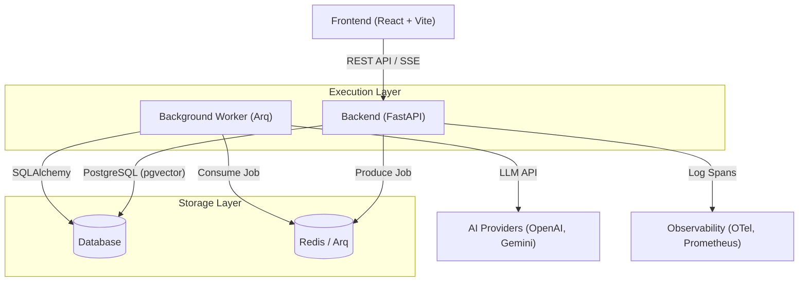
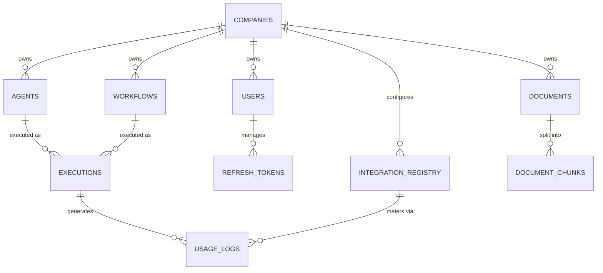

# Phase 2 - Architecture & Technical Specifications: HireBuddha Platform

## 1. Technical Architecture Overview
The platform follows a modern, distributed architecture designed for scalability, isolation, and AI-heavy workloads.

### High-Level Architecture Diagram

### Key Components
1.  **Frontend**: Built with React, Vite, and CSS Modules. Uses a "Glassmorphism" design system. Communicates with the backend via a centralized `apiClient`.
2.  **API Layer**: FastAPI handles routing, authentication (JWT), and multi-tenant middleware.
3.  **Background Worker**: `arq` is used for asynchronous task execution (LLM calls, document processing, RAG).
4.  **Database**: PostgreSQL with the `pgvector` extension for storing and searching high-dimensional vector embeddings.
5.  **Cache/Queue**: Redis serves as the message broker for background tasks and the pub/sub engine for execution streaming.

---

## 2. Database Structure

### Entity Relationship Diagram (ERD)

### Database Tables Detail

| Table | Description | Key Columns |
| :--- | :--- | :--- |
| **companies** | Multi-tenant organization records. | `id`, `name`, `type` (APP/PARTNER/TENANT), `status` |
| **users** | Platform users associated with companies. | `email`, `role`, `company_id`, `hashed_password` |
| **agents** | AI Agent personas and LLM configs. | `role` (System Prompt), `llm_config` (JSON) |
| **workflows** | Multi-step DAG structures. | `dag_structure` (JSON - Nodes/Edges) |
| **executions** | History of agent and workflow runs. | `status`, `input_data`, `result_data`, `started_at` |
| **documents** | Uploaded knowledge base files. | `filename`, `file_type`, `upload_status` |
| **document_chunks**| Text segments with vector embeddings. | `content`, `embedding` (VECTOR 768) |
| **integration_registry**| SKU-based pricing and API keys. | `service_sku`, `internal_cost`, `encrypted_api_key` |
| **usage_logs** | Metered usage for billing. | `raw_quantity`, `calculated_cost`, `sku_id` |

---

## 3. File Significance Checklist

### Backend Overview (`backend/src/`)
- **`main.py`**: Application entry point, mounts routes and middleware.
- **`common/`**:
    - `database.py`: SQLAlchemy async engine and session management.
    - `middleware.py`: Multi-tenant logic (`CompanySuspensionMiddleware`).
    - `security.py`: JWT, encryption (AES-256), and password hashing.
    - `telemetry.py`: OpenTelemetry and Prometheus configuration.
- **`auth/`**:
    - `models.py`: User, Company, and RefreshToken schemas.
    - `service.py`: Authentication and RBAC business logic.
    - `router.py`: Login/Logout/Register endpoints.
- **`ai/`**:
    - `models.py`: AI-specific entities (Agent, Workflow, Execution, RAG).
    - `service.py`: Orchestration logic for CRUD and RAG search.
    - `worker.py`: The heart of the platform; executes LLM calls and DAGs.
    - `dag_validator.py`: Logic for topological sorting and cycle detection.
    - `usage_service.py`: Logs token usage and calculates costs.
- **`config/`**:
    - `models.py`: `IntegrationRegistry` schema for billing/keys.

### Frontend Overview (`frontend/src/`)
- **`pages/`**:
    - `ai/AgentBuilder.tsx`: UI for creating agent personas.
    - `ai/WorkflowBuilder.tsx`: UI for chaining agents into sequences.
    - `ai/ExecutionPage.tsx`: Interface to trigger and monitor runs.
    - `KnowledgeBase.tsx`: Document management and RAG view.
    - `Dashboard.tsx`: Cumulative stats for active entities.
- **`components/ui/`**: Core Design System (GlassCard, JellyButton).
- **`services/api.client.ts`**: Axios instance with automated auth headers.

### Infrastructure & DevOps
- **`docker-compose.yml`**: Full stack orchestration (API, Worker, DB, Redis).
- **`alembic/`**: Database migration scripts.
- **`start_services.sh`**: Helper script to initialize the developer environment.
- **`prometheus.yml`**: Configuration for metric collection.
