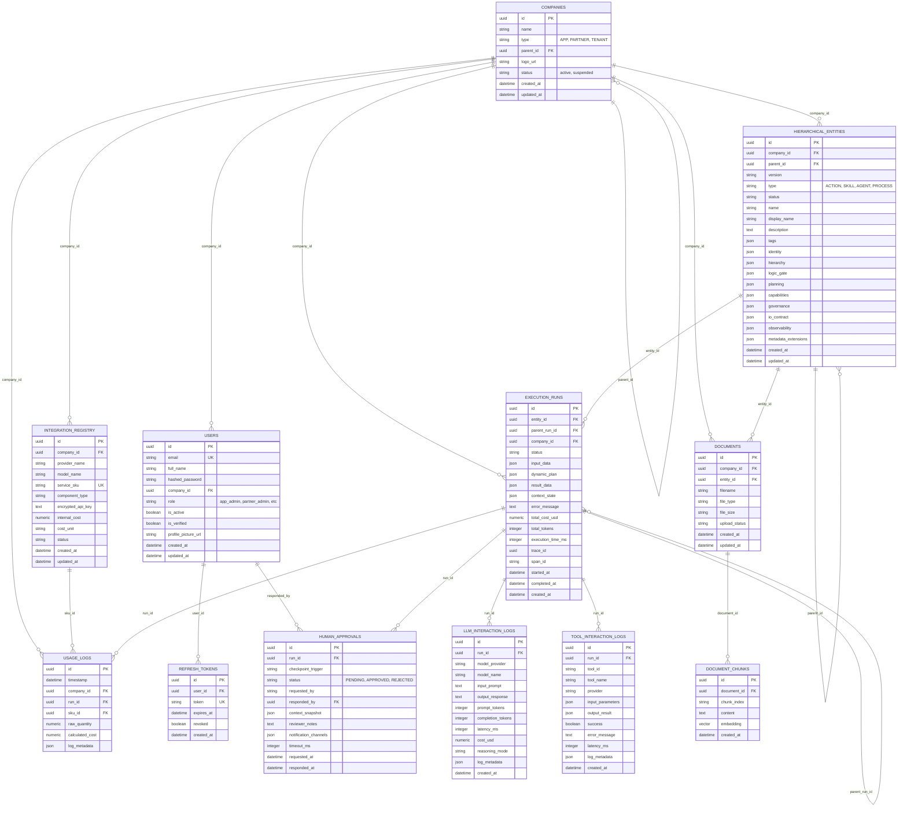

# Entity Relationship Diagram - Phase 3
## Hierarchical Autonomous AI Agentic Platform

This document describes the database schema and entity relationships for the HireBuddha Phase 3 platform.

## 1. ER Diagram

## 2. Table Descriptions

### 2.1 Core Platform Tables
- **companies**: Manages the multi-tenant hierarchy (Partners, Tenants).
- **users**: System users with role-based access control.
- **refresh_tokens**: Manages secure persistent sessions.

### 2.2 AI Entity Schema
- **hierarchical_entities**: The primary repository for all intelligence units. Uses JSONB columns for modular configuration blocks (Identity, Logic, Planning, etc.).
- **documents**: Catalog of uploaded documents for RAG (Knowledge Base).
- **document_chunks**: Processed text fragments with vector embeddings for semantic search.

### 2.3 Execution & Logging
- **execution_runs**: Tracks every execution instance, including hierarchical relationships for nested sub-units.
- **llm_interaction_logs**: Atomic record of every LLM prompt and completion, including token usage and cost.
- **tool_interaction_logs**: Audits of external tool calls made during execution.
- **human_approvals**: Manages HITL (Human-In-The-Loop) checkpoints.

### 2.4 Integration & Billing
- **integration_registry**: Catalog of available service SKUs (Models, Tools) and their internal costs.
- **usage_logs**: The source of truth for all resource consumption across the platform.

---
**Version**: 0.2.0 (Phase 3)  
**Last Updated**: Dec 27, 2025
