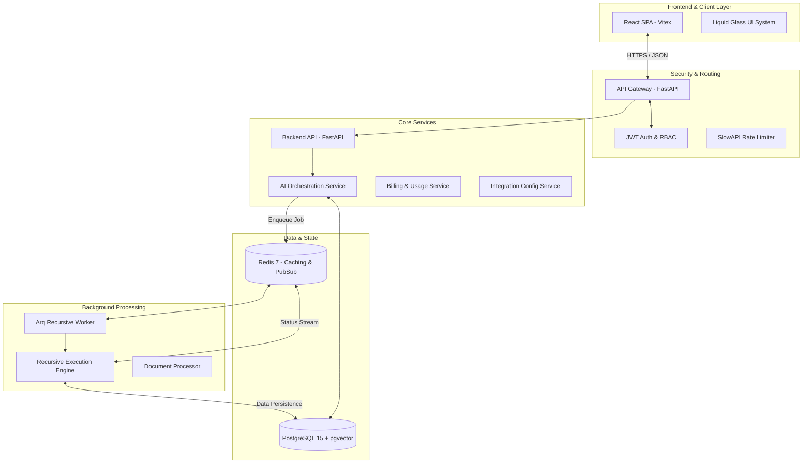
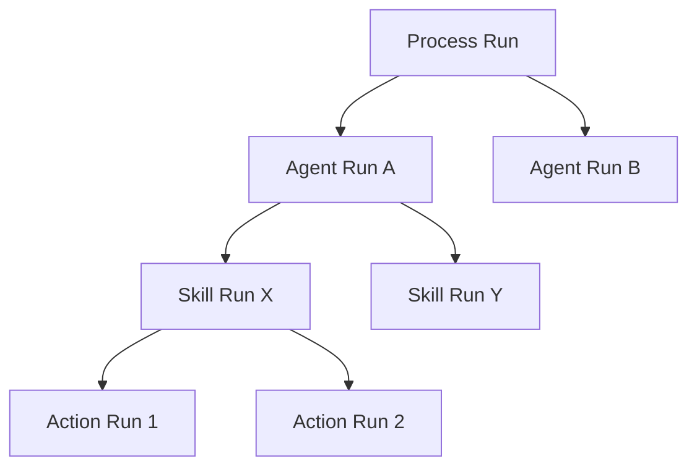
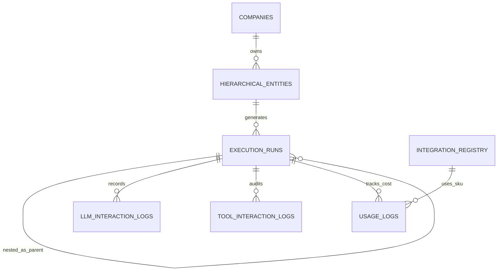

# Technical Architecture Guide - Phase 3
## HireBuddha Hierarchical Autonomous AI Agentic Platform

This document provides a comprehensive technical breakdown of the HireBuddha Phase 3 architecture, detailing the unified entity model, recursive execution engine, and observability framework.

## 1. High-Level Architecture

The platform follows a distributed, multi-tenant micro-modular architecture. It separates the orchestration layer (API) from the heavy execution layer (Async Workers).

### 1.1 System Component Diagram

---

## 2. Recursive Execution Engine

The heart of Phase 3 is the **Recursive Execution Engine**, which allows for arbitrary nesting of intelligence units.

### 2.1 Execution Hierarchy Logic

The engine treats all entities (Actions, Skills, Agents, Processes) as polymorphic units. An execution of a "Process" can trigger multiple "Agents", which in turn execute "Skills" and "Actions".

### 2.2 Trace ID Propagation

To maintain observability across deep nested calls:
1.  **Root Trace ID**: Generated at the top-level invocation (e.g., Process).
2.  **Parent ID**: Every child run stores its parent's execution ID.
3.  **Span ID**: Unique identifier for the specific unit's scope.

---

## 3. Data Integration & persistence

### 3.1 Unified Entity Schema

Instead of separate tables for Agents and Workflows, all intelligence units are stored in the `hierarchical_entities` table. The behavior is governed by JSONB configuration blocks:

| Block | Purpose |
| :--- | :--- |
| **Identity** | System Persona, Tone, and System Prompt. |
| **Logic Gate** | LLM Model, Reasoning Mode (ReAct/Reflection), Temperature. |
| **Planning** | Static steps vs. Dynamic autonomous task generation. |
| **capabilities** | External Toolkits (Web Search, DB) and Memory Context. |
| **Governance** | HITL Checkpoints and Financial Guardrails ($ Max Cost). |

### 3.2 ER Diagram (Refactored)

---

## 4. Frontend Architecture (Entity Architect)

The frontend is a React-based Single Page Application (SPA) utilizing a modern "Liquid Glass" design system.

### 4.1 Modular UI Structure
- **Entity Library**: Centralized repository for all intelligence units.
- **Entity Architect (Builder)**: A multi-tab configuration interface:
    - *Identity*: Persona & System Instruction.
    - *Logic*: Model selection & Reasoning settings.
    - *Planning*: Hierarchical step definition.
    - *capabilities*: Tool/Memory configuration.
    - *Governance*: HITL & Cost settings.
- **Execution Observatory**: A real-time trace visualizer that allows expanding/collapsing nested runs to audit the AI's internal reasoning.

---

## 5. Security & Governance

### 5.1 RBAC (Role Based Access Control)
- **App Admin**: Full platform management & Partner creation.
- **Partner Admin**: Tenant management & Revenue audit.
- **Tenant Admin**: Management of users & AI entities within their organization.
- **User**: Execution and basic creation of AI units.

### 5.2 Guardian Guardrails (HITL)
Critical actions (e.g., executing a deletion or making a payment) can be configured with **HITL Checkpoints**.
- The execution engine pauses and creates a `HumanApproval` record.
- The user is notified via the **Guardian Oversight** panel.
- Execution resumes only after explicit authorization.

---

## 6. Observability Stack

- **Hierarchical Traces**: Reconstructs the entire execution path across sub-units.
- **Financial Audit**: Real-time USD cost calculation per execution node.
- **Token Efficiency**: Per-interaction token consumption metrics.
- **Inference Logs**: Full access to prompts/responses for debugging and tuning.

---
**Document Status**: Finalized (Phase 3)  
**Last Revised**: Dec 27, 2025
