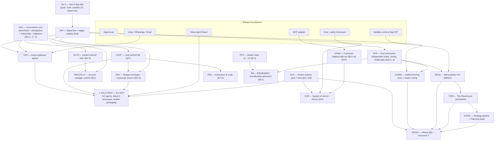

# HireBuddha — Build Road Map: Dependency Graph & Increment Plan

> **Document Class:** Product Development Road Map (the *path*; the other docs in this folder are the *destination*)
> **Author:** Buddha Cognitive Lab (drafted by Claude, decisions by Rahul)
> **Created:** 2026-07-18 · **Status:** v1.0 — closes register findings **F2** (dependency graph) and **F3** (MVP cut)
> **Inputs:** [codebase_current_state_analysis.md](./codebase_current_state_analysis.md) (what exists) · [product_functional_documentation.md](./product_functional_documentation.md) v3.0.2 + [product_technical_documentation.md](./product_technical_documentation.md) v3.0.3 + [Blueprint v2.2](./Unified%20Business%20Process%20%26%20Agent%20Template%20Blueprint%20v2.md) (the target) · [roadmap_gap_register.md](./roadmap_gap_register.md) (open findings)
> **Decisions incorporated:** one Sheel + 7 starter bundles (A4) · Solo Pack default deployment (C7) · per-object system of record (B4) · impact-tiered Pragya auth (D1) · post-trained open-weight BabyBuddha/OmniBuddha (B15) · LOOP federation first-class (A8)

---

## 1. The Goal, Stated Once

> **Sell the Solo Pack:** Sheel (one root Loop) + Pragya + 12 agents running thin slices of P03/P06/P08/P10/P14/P19 at autonomy A1, on a governed signal fabric, for a solopreneur/SME — then expand by bundles.

Everything below is ordered to reach that sellable moment fastest, without building anything that has to be thrown away for the later increments (router, Pragya, self-evolution, federation).

## 2. Foundations Already In Place

The road map *builds on*, and does not re-plan, what ships today (baseline §3): the **AgentLoop** as sole engine with async suspend/resume · **CORTEX v2** (4 domains, dreaming, trust) as the `hb-cortex-memory` package · the **Meta-Agent Board** (7 roles) with tool synthesis flag-OFF · **billing** (TB formula, 3-bucket wallets, thresholds, cost attribution) · **channels** (Gemini Live + Azure Realtime voice over Twilio/Tata, WhatsApp ×2, IMAP/SMTP email, campaigns) · **HITL** (approvals + panel) · the **eval/parity harnesses** · the **MCP adapter** · **per-tenant sandbox containers** with egress allow-listing (flag-OFF) · 4-level tenancy, key vault, suspension middleware.

## 3. The Dependency Graph (F2)

**Reading the graph — three structural facts:**

1. **SIG (the signal bus) is the keystone.** The Loop runtime, Karuna gateways, SoR sync, Pragya's reporting, and the unified learning store all hang off it. It is deliberately first after ops debt — and it has *no* unbuilt prerequisites (Postgres + Arq ship today).
2. **GOV and SCH are parallel roots.** Neither depends on anything unbuilt; both are pure-schema starts. They can proceed alongside SIG with separate hands.
3. **Nothing on the MVP path depends on the router, Pragya, self-evolution, GenUI, or BabyBuddha.** The expensive, speculative subsystems are all post-MVP by construction — the MVP risk is integration work on proven parts, not research.
4. **GENUI sinks to the bottom of the graph** (edges added 2026-07-24). It consumes SCH, LEARN, SEGA, TWIN *and* STRAT — every other Increment-6 workstream. That in-degree is what forced the split into its own increment: a workstream depending on all its siblings is a successor, not a peer.

## 4. The Increment Plan (F3)

Sizing is relative (S < M < L < XL), not calendar time. Each increment ends in a state you can demo, and Increment 2 ends in a state you can *sell*.

> **Per-increment working docs** live in subfolders of this directory — [increment-1/](./increment-1/00_overview.md) (full design + implementation plan) and charters for [increment-2](./increment-2/00_charter.md) through [increment-8](./increment-8/00_charter.md), each deepened just-in-time when its turn comes (with a clarifying-questions round first).

### Increment 0 — Ops & Flag Debt *(S–M, mostly ops)*
Clear the "built but not live" backlog (`docs/phase12/OPS_REMAINDER.md`): push pending commits · publish `hb-cortex-memory` to PyPI and delete the in-repo copy · sandbox image CVE scan + registry publish + S7 canary→default-ON · Meta-Agent board GA flip · frontend polish items. **Outcome:** the shipped platform *is* the baseline document, with no flag-gated asterisks on the MVP path.

### Increment 1 — One-Loop Foundations *(L)*
The three parallel roots, then the Loop:
* **SIG** — `signals` + `trigger_registry`, outbox insert, SKIP-LOCKED dispatcher, sweeper, parked/dead states, completion hook (§18).
* **GOV** — typed governance block, `hitl_checkpoint_defs` (18 seeded), PolicyGate ahead of the Pre-Critic, deploy-time SoD/Karuna validators (§20.1–.3, .5).
* **SCH** — `tenant_entity_defs` + `tenant_records` + `tenant_record_links`, initialized with the **predefined HireBuddha Business Schema** (27 canonical objects as the spine; module skeletons per §10.3), hosted in the **sandbox-resident tenant DB** — a uniform Postgres+pgvector container per tenant with tiered hibernation (§23.4), under the master/tenant segregation of §10.5. The record service enforces owner-writes/others-propose + CAS versioning (§23.1–§23.2); the credit service gains wallet holds (§23.3); memory scoping lands per the §24 matrix. Evolution triggers still deferred to Increment 6.
* **LOOP-lite** — `LOOP` enum + root-Loop index + `loop_runtime` + heartbeat/watchdog crons; then **ENV** budget envelopes with the protected reserve (§17, §20.4).

**Register gaps:** none open — B6, B8, and E3 closed at design level (technical §23–§24, decisions 2026-07-18); this increment *executes* those designs. The §24.4 retrieval upgrade may trail into Increment 2.
**Outcome (demo):** a Sheel row exists; a webhook becomes a signal, a trigger fires a Process run, the PolicyGate raises a HITL card, the heartbeat rolls up cost — and two concurrent runs cannot double-spend the same wallet dollar.

### Increment 2 — 🎯 The Solo Pack (the MVP cut) *(L–XL)*
* **KAR** — Karuna gateway agents (voice, email, messaging) as templates over the shipped channels, entering work through SIG, with the Karuna-profile deploy check live.
* **The 12 Solo Pack agents** (Blueprint §14 Wave 0) seeded via the Board, plus the six Wave-0 processes (thin P03/P06/P08/P10/P14/P19) authored as PROCESS entities.
* **Bundle packaging** — the 7 starter bundles as named activation sets; Solo Pack as the default.
* **Onboarding** — wizard-driven (Pragya-less) setup: connect channels, upload KB, confirm governance defaults (all A1).

**Register gaps to close here:** C1 (process design sheets for the six Wave-0 processes — the template for the other 13), C3 (HITL capacity: per-checkpoint SLAs for the checkpoints Solo Pack actually fires), C5 (dunning/degraded mode — money is on the line once it's sellable), D6 (consent/DNC registry — the AR chaser and deal closer make outbound calls), B7 (realtime-voice vs loop reconciliation — the voice gateway forces it), B13 (platform-spend budget class), E1/E2/E4 (idle-cost model, free-credit abuse controls, fee edge cases — pricing must be right to sell).
**Outcome (sellable):** a solopreneur activates the Solo Pack, and it answers calls/email/WhatsApp, qualifies and quotes, books appointments, chases invoices, reconciles, and reports — governed at A1 with HITL.

**Explicitly NOT in the MVP:** the model router (static per-task config stays), Pragya (the wizard + dashboards serve), SoR mirrors (HireBuddha masters everything the pack touches; connectors read-only), dynamic-schema evolution, GenUI, self-evolution GA, federation, BabyBuddha. Every one of these is additive later — none is load-bearing for the sale.

### Increment 3 — Pragya v1 *(L)*
**AUTH** (§11.3 tiers + step-up) → **PRAGYA v1**: the **nine-stage engagement flow** (functional §4.3 — baseline research → assumptions → deep ingestion → revised analysis → solution engineering → blueprint finalization → integration → test/deploy → operate), implemented as conversational orchestration over the same APIs the wizard uses. Stages 1–5 need per-stage scripts/prompts (the discovery protocol's flow closed C8; the scripts are built here). **Register gaps:** C4 (autonomy demotion triggers), C6 (KPI metric definitions — Pragya reports them, so they must be defined). **Outcome:** the "talk to your account manager" experience, safely authenticated, running a consulting-grade onboarding.

### Increment 4 — The Connected Business *(L–XL, parallelizable per connector)*
**CONN** — the §6.6 catalog built out MCP-first (accounting/bank feed first: it deepens the Solo Pack's AR/bookkeeping immediately; then calendar, e-sign, enrichment, payouts behind the authority matrix) → **SOR** — per-object mastering, mirrors, write-back, `sync.conflict` flow (§21). **HBS module depth** (§10.3) lands here too: field-level completeness for Accounting/HRMS/ERP/Legal so the standalone-system guarantee holds for tenants with no external software. **Register gaps:** D2 (per-agent credential scoping — SoD becomes real here or never), C2 (human-task step type — physical fulfillment appears with real operations). **Outcome:** the tenant's existing systems join the loop without a migration — or HireBuddha *is* all their systems.

### Increment 5 — The Intelligence Engine *(L)*
**B12 first** (model registry versioning/regions/price dating — the router is blind without it) → **RTR v1** (registry + static rules + `routing_decisions` attribution) → **RTR v2** (complexity scoring, wallet-aware downshift) → fleet expansion (GLM/Qwen/Kimi behind **D5** data-flow disclosure + conservative default allow-list) → **EVX** (§22.2–.4) wired as the admission gate. **Outcome:** the §3.3 cost story becomes real and auditable.

### Increment 6 — The Self-Improving Platform *(XL, gated hardest)* — **backend only**
Six workstreams ([increment-6/00_overview.md](./increment-6/00_overview.md)): **LEARN** (learning store on the signal bus + CORTEX, charter tuning under EVX, the B10 risk policy, **KPI history**, the density store) → **SEGA** (self-evolution GA: independent-suite rule, the **entity-change canary**, B11 blast-radius limits, the **entity version ledger**, D3 taint) → **TWIN** (the **Glasshouse** — twin plane, replay, forecast, honesty grading, promotion pipeline) → **STRAT** (Minutes→Propositions→Resolutions→Mandates→Reviews + **HBS Planning depth**), with **GATE** (KAR-05 governed broadcast gates) and **LIB** (Library data layer — provenance, the retrieval-usage log, staleness, connected drives) parallelisable throughout. Dynamic-schema evolution triggers (§10.2) land inside LEARN and SEGA. **Outcome:** the "Week 12 > Week 1" promise, measured by the §22 harness rather than asserted — and every store Vihara will read, already accumulating.

> **GENUI left this increment (owner decision 2026-07-24)** for [Increment 7](./increment-7/00_charter.md). Four reasons, in full there: GENUI consumes *every other* Inc-6 workstream, so the increment could not close until its most dependent part finished; G0–G6 is seven gates on its own; its exit criteria (zero-training test, a11y audit, device matrix, 30-day parallel run, 59-screen parity) are increment-level, not workstream-level; and the split **does not** reopen the §6.8 full-flagship decision, which was about not phasing Vihara's *launch*.

### Increment 7 — 🏛 Vihara, the GenUI Flagship *(XL)*
**Phase A — the design phase** the ratified spec explicitly defers: wireframes for the ~17 surfaces at both densities, the **component registry JSON schema** (§9.3 calls it "a build-time artifact"), the manifest contract in full with `honesty_grade` mandatory at schema level (L6), backend API contracts for the estate read model / live stream / Pragya event channel, the **art bible** + §14.5 portrait style boards, and the device matrix behind §12.1's <300ms budget. **Phase B — G0→G6** per spec §12. **Prerequisites:** Increment 6 complete · **voice go-live** (G3 cannot pass on a tested seam) · the step-up refusal rendered in the frontend. Per §14.2 the cutover retires the **tenant** React surface only — partner and platform-admin consoles stay legacy and are rebuilt later, so the 59-screen parity checklist marks them *out of scope*, not *retired*.

### Increment 8 — Scale & Enterprise *(L–XL)*
**FED** at scale (child Loops, group Pragya view) · **B14** production topology (HA, regions — pull earlier if tenant count demands) · compliance packs incl. **D4** employment-AI gates *(hard gate: the Talent bundle does not GA without D4)* · **BB** — BabyBuddha/OmniBuddha post-training runs and must pass §22.4 admission; falls out of the router as just another registry row if it wins, costs nothing if it doesn't.

## 5. Open Register Findings → Increment Map

| Increment | Register findings to close in it |
|---|---|
| 1 | ~~B6, B8, E3~~ — all closed at design level (technical §23–§24, 2026-07-18); Increment 1 executes the designs |
| 2 | C1, C3, C5, D6, B7, B13, E1, E2, E4 |
| 3 | C4, C6 (C8 closed by the §4.3 nine-stage flow; its per-stage scripts are Inc-3 build work) |
| 4 | D2, C2 |
| 5 | B12, D5 (+ EVX docs side of B9 done) |
| 6 | B10, B11, D3 (full taint; §18.6 down-payment ships in Inc 1) |
| 7 | *(none of its own — Vihara consumes Inc-6 closures and carries D3's manifest-path obligation)* |
| 8 | B14, D4 |

Every remaining open finding has exactly one home. When an increment starts, its row above is the checklist; the register is updated as each closes.

## 6. Standing Rules for All Increments

1. **Nothing ships flag-OFF into the sellable path.** A capability is either GA'd in its increment or it isn't in the increment (the Increment-0 lesson).
2. **Docs move with code.** Each increment updates the maturity tags (⬜→🚩→✅) in the three target-state docs — the F1 matrix stays true forever.
3. **The eval/parity gates are non-negotiable** on the AgentLoop path, and §22.2's independent-suite rule applies to *anything* self-modified from Increment 6 on.
4. **Autonomy starts at A1 everywhere** and rises only through the §9.7 evidence process — including for platform-built (Solo Pack) agents.

---

## Change Log

| Date | Change |
|---|---|
| 2026-07-18 | v1.0 — initial road map: dependency graph (F2) + increment plan with MVP cut at the Solo Pack (F3). |
| 2026-07-18 | v1.1 — owner directives folded in: SCH is the predefined HBS in a sandbox-resident tenant DB with master/tenant segregation (Inc 1, depth in Inc 4); Pragya v1 implements the nine-stage engagement flow (Inc 3; C8 closed at protocol level); GenUI is a ground-up new frontend behind a mandatory Design Gate (Inc 6). |
| 2026-07-18 | v1.2 — B6/B8/E3 closed at design level (technical §23–§24): uniform Postgres-in-sandbox data plane with tiered hibernation, owner-writes/others-propose, wallet holds with graceful-finish + bounded debt, share-knowledge-not-habits memory scoping. Increment 1 now has zero open design questions; §24.4 retrieval upgrade may trail into Increment 2. |
| 2026-07-18 | v1.3 — Increment 0 complete (ops debt cleared); per-increment doc subfolders created: increment-1/ full plan (4 workstream docs + overview), increment-2..7/ charter stubs. Inc-1 build decisions recorded: data plane built in Inc 1 (not staged), HBS spine drafted-then-reviewed, no new frontend in Inc 1. |
| 2026-07-19 | v1.4 — Increment-1 brainstorm closed: all open questions answered (decisions recorded in each increment-1/ doc §5). Notable: email ingest is SIG's first channel producer; PolicyGate passes unset authority bands through until Inc-2 seeding; uniform configurable default envelope; **KB + CORTEX memory are control-plane permanent** (technical doc v3.0.6 — §10.4/§10.5/§23.4/§24.4 amended; export bundle includes KB+memory dump). Increment 1 is clear to build. |
| 2026-07-24 | v2.2 — **GENUI split into its own increment** (owner decision). Increment 6 becomes six **backend** workstreams — LEARN · SEGA · **TWIN** · **STRAT** · **GATE** · **LIB** — with a forced order (SEGA's canary is what TWIN's promotion pipeline calls; TWIN's honesty grades are what STRAT's reviews read; LEARN first because KPI history is the increment's longest-lead time series). **Increment 7 is Vihara**, opening with the *design phase* the ratified spec defers (wireframes · component registry schema · manifest + API contracts · art bible · device matrix) ahead of G0–G6; **Scale & Enterprise renumbers to Increment 8**. Three further decisions: twin spend is **tenant-initiated**, overriding spec §12.1 (tenant-asked-for work must not sit in `PLATFORM_INITIATED_ATTRIBUTIONS` or it exhausts the cap protecting tenants from platform work); pooled platform learning is **disclosed but not opt-out**, resting on decision 2's schema guarantee; **KAR-05 broadcast gates are in scope**, closing an ungoverned outbound social path in shipped code. Dependency graph updated — GENUI's in-degree is what forced the split. |
| 2026-07-24 | v2.1 — **GenUI gap analysis written** ([increment-6/00a_genui_backend_gap_analysis.md](./increment-6/00a_genui_backend_gap_analysis.md)): the ratified Vihara spec walked against `master` @ `a403cda` — **23 backend gaps + 12 road-map gaps**. Increment 6's scope grows: the **Glasshouse** (VR-02, proposed workstream **TWIN**) and the **strategy pipeline + HBS Planning depth** (VR-03, proposed **STRAT**) are net-new subsystems the road map never scoped; **G5 consumes SEGA**, not only LEARN/EVX (VR-01); **push/Private-Line infrastructure is in no increment** (VR-07); **no KPI history store exists** for the increment whose goal is "Week 12 > Week 1, measured" (VR-08); and "GenUI replaces the React app" is false by ratification — partner/platform-admin consoles stay legacy, so cutover retires the *tenant* surface only (VR-10). Two items promoted to prerequisites: **voice go-live** (a G3 gate, not an ops remainder, VR-11) and **certified-action step-up** (`require_tier` has no REST call sites — a live gap in the shipped app, VR-12). Also verified: **the push is done** (`origin/master` = `master` = `a403cda`), all gates green (typecheck 259, unit 1523, parity/eval 16, integration 281, head `fleet001`). Six new owner questions open in the analysis §6. |
| 2026-07-24 | v2.0 — **GENUI Design Gate PASSED at design level** (run ahead of Inc 6 per owner direction; Inc 5 merged to `master` the same day). Ten-concept brainstorm + owner selection ([genui_design_gate_concepts.md](./genui_design_gate_concepts.md) §6 — the **Sanctum+Firm+Atlas+Twin+Private Line** hybrid, eight locked decisions) + the full ratified spec **[genui_design_gate_spec.md](./genui_design_gate_spec.md) v1.1** ("**Vihara**"): ten Binding Laws, depth ladder, unified estate ontology, W/S/C renderer architecture over one component registry, the Pragya frontend contract, and the G0–G6 internal gate plan under the owner's full-flagship decision; all §14 ratifications closed. Inc-6 charter question 1 answered; GENUI still builds **last** in Inc 6 (LEARN → SEGA → GENUI). |
| 2026-07-23 | v1.9 — **Increment 5 BUILT** (branch `inc5/rtr`, 15 commits, not yet merged). **REG**: control-plane `model_registry` + effective-dated `model_prices` + per-company binding — **B12 closed**. **RTR v1+v2**: the router in `ai/intelligence/`, reached through the shipped `LLMRouter.call_llm` seam; v1 reproduces defaults (non-inferior) + a `routing_decisions` audit trail, v2 adds heuristic complexity scoring, wallet-aware downshift and next-best fallback. **EVX**: the §22.2–.4 admission gate *in the mutation path* (`RegistryService.activate` refuses a failed admission) + canary + the `MODEL_ADMISSION` B13 attribution — B9's build side. **FLEET**: GLM/Qwen/**Kimi** over one OpenAI-compatible adapter (injectable transport, no live call), all `preview` + opt-in only behind the conservative allow-list, the auditable `company_provider_optin`, and the published data-flow disclosure — **D5 closed**. Migrations `reg001`→`rtr001`→`fleet001`. Gates: typecheck 259 files strict, parity/eval 16, 1523 unit, 24 Inc-5 integration. Honest limits (both activation-time ops): no live GLM/Qwen/Kimi call; admission scoring injected. |
| 2026-07-23 | v1.8 — **Increment 5 designed** (clarifying-questions round + full docs, [increment-5/00_overview.md](./increment-5/00_overview.md) + 4 workstream docs). Four decisions locked: global `model_registry` catalog + per-company binding (B12); router in a new `ai/intelligence/` package with `LLMRouter` delegating; heuristic-first RTR v2 complexity scoring; conservative D5 default allow-list (GLM/Qwen opt-in with disclosure). Workstreams: REG · RTR (v1+v2) · EVX · FLEET; build order REG→RTR→EVX→FLEET (EVX gates FLEET activation). Closes B12/D5/B9-build-side here. Fleet ships as a tested seam (no live call); BabyBuddha stays Inc 7. Awaiting build. |
| 2026-07-20 | v1.7 — **Increment 2 / SLICE built** (`inc2/slice`): the email→quote vertical slice proves the sellable path end-to-end. 4 curated Solo Pack templates + GOV-validating loader (T1), activation service (T2), agent tools tenant_record_write/emit_business_signal (T3), the `email_dispatch` PolicyGate category so an A1 quote-send raises a HITL card (T5), and an end-to-end test driving email.inbound → dispatcher → KAR-02 → Lead → P03 → Opportunity+Quote (graph) → A1 HITL card → approve across real SIG+SCH+GOV seams (T4/T6). Closes C1 for P03. Gates green throughout. Next: PACK+KAR broaden the slice to all 12 agents / 6 processes. |
| 2026-07-20 | v1.6 — **Increment 2 designed** (clarifying-questions round + full docs, [increment-2/00_overview.md](./increment-2/00_overview.md) + 6 workstream docs). Decisions: thin vertical slice first (email→P03 acquisition), async-first (voice/**B7 deferred** to a follow-on), curated hand-authored agent templates, wizard onboarding (Pragya in Inc 3), **global-neutral** market (pluggable consent/multi-currency), graduated dunning (notify→grace→read-only→suspend). Workstreams: SLICE · KAR · PACK · ONBOARD · TRUST · RETR. Closes C1/C3/C5/D6/B13/E1/E2/E4 here; B7 moves to the voice follow-on. Awaiting brainstorm review before build. |
| 2026-07-19 | **v1.5 — Increment 1 BUILT** (all four workstreams, on `inc1/*` branches, gates green throughout). **SIG** (§18): Postgres-outbox signal bus + trigger registry + email-ingest producer. **GOV** (§20.1–.3/.5/.6): typed governance, 18-checkpoint registry, unconditional PolicyGate before the Pre-Critic, deploy validators. **SCH** (§10/§19/§23.1–.2/.4/§24.3): HBS 27-object spine on a two-backend tenant data plane, record service with CAS + owner-writes/others-propose, memory viewport, export-with-KB. **LOOP+ENV** (§17/§20.4/§23.3): LOOP tier + Sheel + heartbeat/watchdog, budget envelopes with protected reserve, wallet holds closing the E3 race. Register B1/B2/B3/B5/B6/B8/E3/A6 executed. Exit demo achievable end-to-end. Docs: technical §17/§18/§19/§20/§23 tags → ✅; each increment-1/ doc carries a §6 build-note delta log. |
