# GenUI Design Gate — Frontend Concept Brainstorm

> **Document class:** Design Gate artifact — brainstorm round (no code changes; no spec yet)
> **Author:** Buddha Cognitive Lab (drafted by Claude, decision by Rahul)
> **Created:** 2026-07-24 · **Status:** v1.2 — **SELECTION MADE** (§6): hybrid of Sanctum + Firm + Atlas + Twin + Private Line; full spec in [genui_design_gate_spec.md](./genui_design_gate_spec.md). (v1.0: concepts A–E; v1.1: concepts F–J added on owner request; v1.2: gate decision recorded)
> **Parent:** [build_roadmap.md](./build_roadmap.md) §4 (GENUI, hard-gated behind the Design Gate) · functional doc §11 · technical doc §8
> **Next step:** Rahul selects one concept (or a hybrid); the selected concept is then detailed into full specs — that spec is the artifact that exits the Design Gate.

---

## 1. What the Frontend Must Be (derived from the product docs)

Before the concepts, the non-negotiables every concept below satisfies. These come straight from the functional/technical docs and the owner's brief:

1. **Pragya drives it end-to-end.** Pragya is the single point of contact (functional §4). The frontend is not "an app with a chat widget" — it is *Pragya's body*. Every surface can be summoned, explained, filled, and acted on through conversation (voice or text), and everything the user does manually is visible to Pragya as shared context.
2. **Zero training.** No manuals, no onboarding tours that teach navigation. The interface must be learnable by *recognition* (things look like what they are) and by *narration* (Pragya explains anything on screen, because she composed it).
3. **One product, every user.** A first-week solopreneur and a power operator use the *same* frontend. The difference is **progressive density**, not separate "modes" that fragment the product.
4. **The full functional surface:**
   - **Dynamic tenant schema** (§13 / technical §10): view/create/update/delete records of the 27 canonical objects + HBS modules (CRM, Accounting, HRMS, ERP, Legal, Marketing, Planning) + per-tenant extensions — at field-level granularity, plus analytics over all of it.
   - **The five-tier workforce** (Loop → Process → Agent → Skill → Action): creation (via Meta-Agent/Board), execution, monitoring, evolution (versioning, autonomy promotion A0→A3), termination.
   - **Bird's-eye → granular:** the whole business at a glance, drillable without discontinuity down to one field on one record, one step of one run.
   - **Strategy → design → effect:** high-level plans made with Pragya (nine-stage flow, §4.3) visibly *become* process/agent designs, and their effect on the business is traceable.
   - **The growth journey:** the KPI tree (Blueprint §10.2) in historical, narrative form — the "Week 12 > Week 1" promise made visible.
   - Plus: HITL Judgment Desk, budget envelopes and wallets, signals, governance/audit, connectors & SoR, model routing attribution.
5. **Beautiful, elegant, luxurious, unique.** The aesthetic is part of the product promise: a tenant hands their business to this system; the interface must *feel* like it deserves that trust.

### 1.1 The Shared Substrate (all concepts sit on this)

All ten concepts are **experience shells** over the same generative machinery — choosing a concept does not change this layer, so nothing below is throwaway:

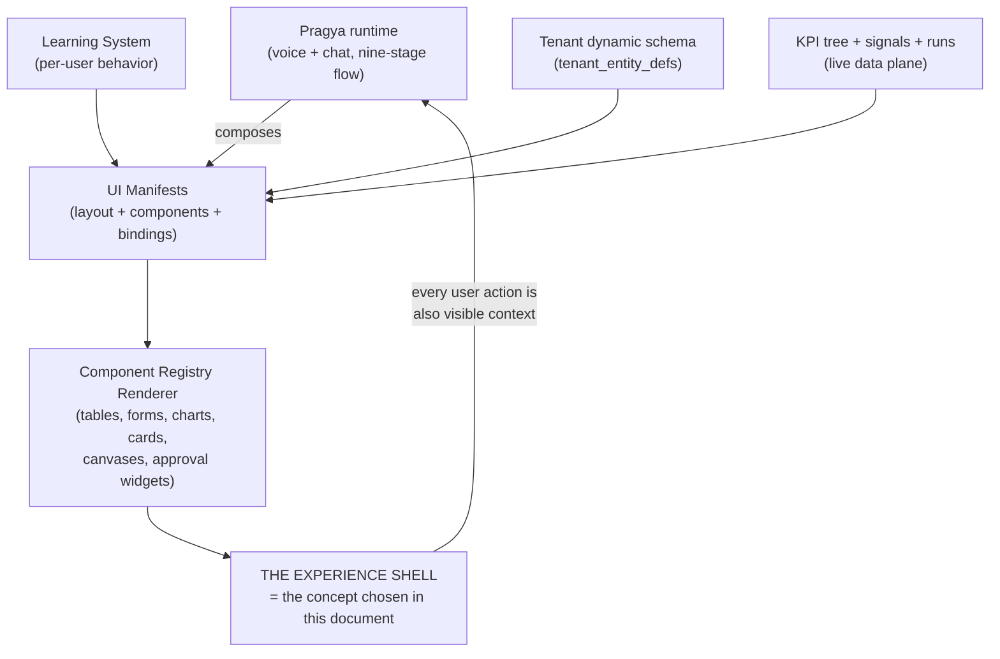

Three substrate principles every concept inherits:

- **The Equivalence Principle:** every UI action has a sentence, and every sentence has a UI action. Clicking "approve" and telling Pragya "approve it" are the same event. This is the zero-training engine: the UI *demonstrates* the language, the language *summons* the UI.
- **Certified surfaces:** anything with money, approvals, or legal effect (HITL cards, payment approvals, consent) renders from **fixed, deterministic manifests** — generative variety never touches the surfaces where trust demands sameness.
- **Progressive density dial:** each user has a persistent density level the Learning System tunes (and the user can override). Novices see prose and single actions; power users see grids, keyboards, and raw JSON — same screens, different density.

---

## 2. The Ten Concepts

| # | Concept | One-line essence | Navigation primitive |
|---|---|---|---|
| A | **The Living Atlas** | Your business as a living territory you fly over and land in | Zoom |
| B | **The Chronicle** | Your business as a publication that writes itself — every word alive | Read & tap |
| C | **The Sanctum** | The luxury of stillness — an interface measured by how little it shows | Depth dial |
| D | **The Stage** | Conversation that materializes interface — UI as utterance | Ask & morph |
| E | **The Mandala** | Sheel as a living mandala — the brand's soul made navigable | Bloom |
| F | **The Firm** | Your workforce as colleagues — the oldest interface on Earth is another person | Meet |
| G | **The Continuum** | Time as the only axis — the past immutable, the future editable | Pan & zoom time |
| H | **The Twin** | The mirrored business — "what if" as the primary verb, promoted to reality | Try |
| I | **The Loom** | Every object's journey is a thread; the business is the cloth they weave | Follow the thread |
| J | **The Private Line** | The whole business as an intimate thread in your pocket — chief-of-staff by messaging | Scroll & speak |

---

## Concept A — The Living Atlas

> *"Your business is a place. Visit it."*

### A.1 The Essence

The entire business renders as one continuous, living, luminous **territory** — not a dashboard metaphor but an actual cartography of Sheel. Districts are Processes. Buildings are Agents and record clusters. Roads are the signal routes between them. And the *traffic* is real: every signal moving through the bus (§18) renders as a light-pulse traveling its actual path — you can literally watch an inbound email become a Lead, cross into the Acquisition district, become an Opportunity, then a Quote awaiting your sign-off.

There is exactly **one navigation gesture: zoom**. No menus, no sidebar, no page routes.

```
HORIZON  ──► the whole business: districts glowing by activity, weather = health
DISTRICT ──► one Process: its agents, its KPI plinth, its budget envelope arc
STREET   ──► one Agent: live runs, conversations in flight, its SLO gauges
BUILDING ──► one record cluster: e.g. "Invoices" — the actual table/graph
ROOM     ──► one record: the generated form, field-level, editable
```

This is **semantic zoom**: each level is a different *representation*, not a bigger picture. Search is teleportation — type or say anything ("Meera's unpaid invoice") and the camera flies there.

### A.2 Signature Interactions

- **Pragya flies the camera.** She is the voice-over and the pilot. "Show me why collections dipped" → the camera swoops to the Money district, the DSO plinth rises, three overdue invoice buildings glow amber, and she narrates. The user can grab the controls at any moment — flight and manual navigation are the same camera.
- **Weather is health.** A process struggling against its KPIs sits under fog. Budget burn shows as heat-shimmer on the district. A tripped circuit breaker is a storm cell. An idle, hibernating module is under moonlight. Nobody needs to learn this; humans read weather pre-verbally.
- **The Time Scrubber.** A horizon-wide timeline. Drag it back twelve weeks and watch the territory *as it was* — fewer buildings, dimmer roads, smaller districts. The Week-12>Week-1 promise is literally visible as the city growing. KPI history is terrain history; every strategy decision is a dated monument on the map ("Founder approved autonomy A2 for AR-chaser — here").
- **Ghost architecture (strategy → design → effect).** Planning with Pragya happens in **Blueprint mode**: proposed processes/agents appear as translucent ghost-buildings *in place*, with projected KPI plinths. Approve the plan → the Meta-Agent Board builds it → construction animation → the ghost becomes solid. Weeks later, the Time Scrubber shows what that construction did to the surrounding district's weather. The full chain — intent → design → deployment → effect — is one place you can stand in.
- **The Blueprint layer (power users).** One toggle re-skins the *same territory* as an engineering drawing: DAG edges instead of roads, envelope numbers instead of heat, signal contracts on the routes, raw JSONB in the buildings, run traces in the streets. Same geography, zero relearning — density without a mode switch.

### A.3 Requirement Coverage

| Requirement | How the Atlas serves it |
|---|---|
| Dynamic schema CRUD | Buildings/rooms are generated from `tenant_entity_defs`; new fields = new rooms appear; tables and forms are standard registry components rendered *in place* |
| Entity lifecycle | Ghost → construction → solid → weathering → (termination =) respectful demolition with the version ledger as the building's archive plaque |
| Bird's-eye → granular | The zoom continuum *is* the product |
| Strategy → effect | Blueprint mode + monuments + Time Scrubber |
| KPI journey | Time Scrubber + terrain growth + district plinths |
| HITL | Amber beacons on the horizon; approaching one lands you on a certified approval card |

### A.4 Diagram

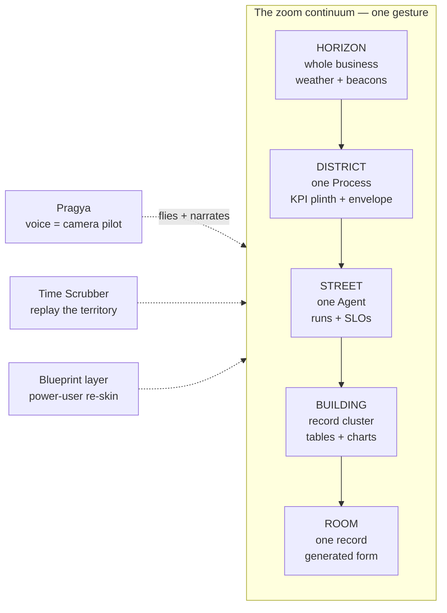

### A.5 Aesthetic Direction

Nocturne cartography: deep indigo ground, gold-leaf light for activity, porcelain-white typography. Closer to a Zurich watch face crossed with a night-flight over a city than to any SaaS dashboard. Motion is expensive-feeling: slow parallax, inertial camera, no bounce.

### A.6 Risks & Honest Notes

- Highest rendering ambition of the five (WebGL scene + a full component registry inside it). The record-level workbench must stay boring-and-fast even though the shell is cinematic.
- Spatial memory helps most users but the metaphor must never *block* — search/teleport and Pragya must always be a faster path than flying.
- Mobile: the zoom grammar survives, but the horizon view needs a purpose-built compact projection.

---

## Concept B — The Chronicle

> *"Your business writes its own story. The interface is that story — and every word of it is alive."*

### B.1 The Essence

The frontend is a **living publication**. Not a dashboard that shows numbers — a beautifully typeset, continuously self-writing *document* about the tenant's business, authored by Pragya, in the tenant's language. The unit of UI is not the widget; it is the **sentence, the figure, and the signature**.

Each morning there is a fresh **Edition**: what happened, what needs you, what's coming. Every noun in every sentence is a live object — tap "₹2.4L collected" and the ledger unfolds inline like an expanding footnote; tap "the AR chaser" and the agent's dossier slides open. Reading *is* navigating. Nobody on Earth needs training to read a document.

### B.2 The Architecture of the Publication

- **The Edition (front page).** Pragya's daily brief. Three columns of the only three questions that matter: *What happened · What needs me · What's next.* Personalized: a solopreneur gets four sentences and two signatures; a power operator gets a dense broadsheet.
- **The Desks (sections).** Standing sections mapped to the starter bundles/arcs: the Growth desk, the Money desk, the Care desk, the People desk, the Trust desk, the Intelligence desk. Each desk is a living report over its Processes — its KPIs are figures *in the text*, always current, always tappable.
- **The Registers (the data itself).** Every HBS module (CRM, Accounting, HRMS…) is a **Register** — an elegant, editable ledger view generated from the tenant schema. Registers are where full CRUD lives: inline edit where the user owns the field (owner-writes), *tracked changes* where an agent proposes (others-propose becomes literal redlining — the platform's write-ownership model rendered as an idiom every professional already knows).
- **The Signatures (HITL).** Approvals arrive as typeset **memos to sign**: context, Pragya's recommendation in the margin, the certified approve/adjust/decline block. The Judgment Desk is an inbox of documents awaiting signature — the oldest trust technology humans have.
- **The Margins (conversation).** Ask anything *of any element* by annotating it — highlight a figure and ask "why did this dip?"; Pragya answers in the margin thread. A margin note can graduate into policy ("never discount below 12%") — annotation becomes governance.
- **The Archive (the growth journey).** Every Edition is kept. Flipping back through the archive is the KPI journey as *narrative*: Volume I, Week 1 — thin, tentative; Volume II, Week 12 — thick, confident, with charts of the climb. The **Quarterly Long Read** is the strategy artifact: a living annual-report where every figure is a live query, co-authored with the founder during nine-stage engagement sessions.
- **The Drafting Room (strategy → design).** Plans are *written* before they are built: a strategy memo drafted with Pragya, with the proposed process design sheet as its appendix. Approving the memo hands the appendix to the Meta-Agent Board; the memo then keeps updating itself with the measured effect. The document trail memo → blueprint → deployment → outcome is one linked, permanent record — decisions carry their own audit history.
- **Show the workings (power users).** Every figure, chart, and table flips over: the query behind it, the schema fields, the runs, the routing attribution, exportable, editable as a data grid. The spreadsheet behind the story is always one flip away.

### B.3 Requirement Coverage

| Requirement | How the Chronicle serves it |
|---|---|
| Dynamic schema CRUD | The Registers — generated ledgers per HBS module + tenant extensions; tracked-changes = agent proposals |
| Entity lifecycle | Agents have *dossiers* (hiring memo = creation, performance reviews = SLOs, promotion letters = autonomy raises, retirement notice = termination) |
| Bird's-eye → granular | Front page → desk → article → figure → register → record → field: typographic hierarchy *is* drill-down |
| Strategy → effect | The Drafting Room's living memos |
| KPI journey | The Archive + the Quarterly Long Read |
| Pragya-driven | She is the author; the entire surface is her voice made durable |

### B.4 Diagram

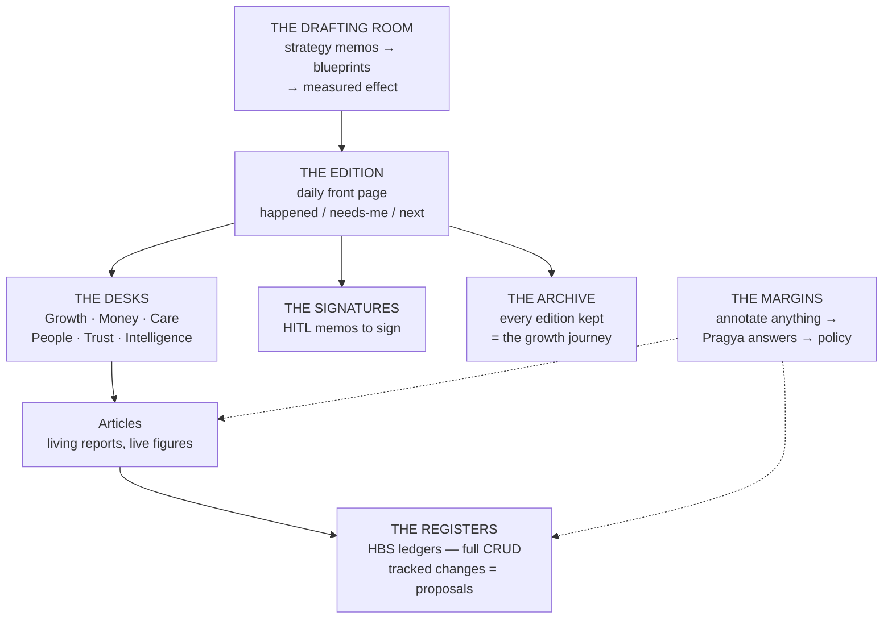

### B.5 Aesthetic Direction

Editorial luxury: the typography of a great broadsheet meets the paper-and-ink restraint of a private bank's annual report. Cream/ivory grounds, one serif of real character, hairline rules, gold accents used only for signatures and milestones. Charts drawn like fine print figures, not neon SaaS widgets. It should feel like something you'd *keep*.

### B.6 Risks & Honest Notes

- Prose generation quality is load-bearing: a wrong or clumsy sentence damages trust faster than a wrong number in a grid. Mitigation: figures always come from deterministic queries; prose only *frames* them.
- Real-time operational monitoring (watching a live call, a running campaign) fits awkwardly in a publication idiom — needs a "live wire" component that breaks the print metaphor gracefully.
- Density ceiling for hardcore power users is lower than A/D/E — "show the workings" must be genuinely excellent, not a token flip.

---

## Concept C — The Sanctum

> *"The most luxurious thing an interface can give a founder is silence."*

### C.1 The Essence

Every other business tool shouts. The Sanctum inverts the KPI: this frontend is measured by **how little it shows you** — because an autonomous workforce that truly works does not need watching. The default state of the entire product is a near-empty, breathing surface with one living line:

> *All is well. ₹2.4L collected this week. Two decisions await you.*

Underneath that stillness is every gram of the platform's depth — reached not through menus but through a single **depth dial**. This is the concept most aligned with the brand's Buddhist soul (Sheel/discipline, Pragya/wisdom, Karuna/compassion): the interface itself practices restraint.

### C.2 The Three Layers of Depth

```
DEPTH 0 — THE STILL SURFACE      one line · the pulse · nothing else
DEPTH 1 — THE THREE QUESTIONS    What happened · What needs me · What's next
DEPTH 2 — THE INSTRUMENTS        per-domain instruments: KPI dials, registers, run views
DEPTH 3 — THE ENGINE ROOM        full density: signals, envelopes, schema, DAGs, traces, JSON
```

The dial is continuous, persistent, and per-user: a novice lives at 0–1 forever and is *complete* there; a power user parks at 3 and is never condescended to. Same product, one grammar: **go deeper**.

### C.3 Signature Interactions

- **The Pulse.** A slow, breathing light — the visual heartbeat of Sheel (literally driven by the loop heartbeat cron). Calm when healthy. It tightens almost imperceptibly under load, and you *feel* something is off before you could say why. The entire monitoring apparatus compressed into one ambient signal.
- **The Tray.** Nothing interrupts. Decisions arrive as **trays, presented one at a time** — the way a great butler brings exactly one thing, fully prepared: what happened, what Pragya recommends and why, the cost of each path, one-tap approve/adjust/decline, "ask her" always available. HITL as hospitality rather than as a ticket queue. The Judgment Desk is a stack of trays, oldest first, SLA-aware.
- **The Three Questions.** The complete information architecture at depth 1 is: *What happened? What needs me? What's next?* Everything the platform knows folds into one of the three. There is nothing to learn because there is nothing else.
- **The Seasons (the growth journey).** One elegant timeline — the business's vital signs over months, annotated with every decision made on a tray and every blueprint approved: *cause and effect on one line*. Scrub it, and Pragya narrates the story of the quarter in thirty seconds. This is the KPI tree rendered as biography, not as charting software.
- **The Instruments (depth 2).** When you *do* go deeper, domains present as **instruments** in the horological sense — complications on a fine watch: a DSO dial, an envelope gauge with the protected reserve marked in red-gold, a pipeline pressure gauge. Registers (full schema CRUD, generated from `tenant_entity_defs`) open as clean focused sheets, one at a time — never seventeen panels.
- **The Engine Room (depth 3).** Deliberately styled as the *inside of the watch*: signal tables, trigger registry, run traces, routing attribution, manifest JSON, budget ledgers. Dense, fast, keyboard-first, ⌘K everywhere. The luxury here is precision, not whitespace.
- **Pragya as the voice of the stillness.** Voice-first by design: the Sanctum is what her office looks like. Most tenants will *speak* to the still surface and never see depth 2. Every tray can be handled entirely by phone call — the frontend and the phone call are the same experience at different fidelities.

### C.4 Requirement Coverage

| Requirement | How the Sanctum serves it |
|---|---|
| Dynamic schema CRUD | Depth-2 Registers: focused, generated sheets; depth-3 grid for bulk work |
| Entity lifecycle | Workforce instrument: each agent a complication with SLO hands; creation/evolution/termination happen as trays ("she proposes hiring a Vendor-Risk agent — here's the design") |
| Bird's-eye → granular | The depth dial: 0 (one line) → 3 (one field) with no discontinuity |
| Strategy → effect | Strategy sessions produce **Resolutions** — pinned on the Seasons timeline; the timeline shows what each resolution did |
| KPI journey | The Seasons — biography over charting |
| No-training | Three questions + one dial + trays: the entire model fits in a sentence |

### C.5 Diagram

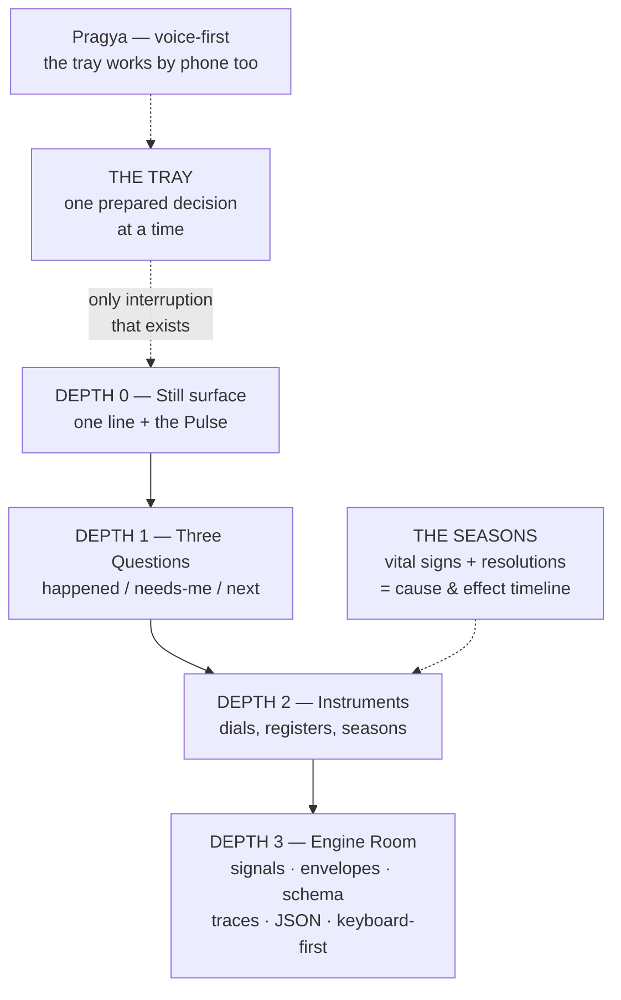

### C.6 Aesthetic Direction

Kyoto-modern: warm off-black or bone-white grounds (day/night), a single humanist typeface, generous ma (negative space), the Pulse as the only permanent motion. Materials over gradients — paper, ink, brushed metal for the engine room. The product should photograph like an object, not a screen.

### C.7 Risks & Honest Notes

- Trust must be *earned* before silence is welcome: in week 1, "all is well" from a system you just met reads as opacity. Mitigation: the depth dial defaults deeper during onboarding and the Sanctum *quietens as trust grows* — the interface itself enacts the autonomy ladder.
- Power users may perceive the still surface as friction; the persistent dial position and ⌘K-from-anywhere must make depth 3 feel first-class, not hidden.
- Ambient states (Pulse, weather-like cues) need rigorous, accessible non-visual equivalents.

---

## Concept D — The Stage

> *"You don't navigate to the interface. You ask, and the interface arrives."*

### D.1 The Essence

The purest reading of "Pragya drives the frontend end-to-end": there are **no pages at all**. There is a conversation rail, and there is **the Stage** — an open surface where Pragya *materializes* interface in response to intent, streamed live, component by component, the way she'd sketch on a whiteboard while talking.

*"Show me overdue invoices above ₹50k by customer"* → a table-and-chart surface assembles in front of you. *"Turn that into a reminder campaign, but let me approve the message"* → the surface **morphs** into a campaign composer with a certified approval block. *"Send me this every Monday"* → the surface becomes a **standing artifact** with a schedule badge.

The UI is not designed in advance. It is *uttered*.

### D.2 The Two Furniture Pieces

- **The Stage** — the ephemeral present: whatever you and Pragya are working on *now*. Surfaces materialize, morph, and dissolve. History is scrubbable — every prior stage-state is retained in the session, so "go back to that table" works by voice.
- **The Desk** — the persistent past: any surface can be **pinned**. Pinned surfaces keep their bindings live and re-render with fresh data forever. Over weeks, each user *accretes* a personal control room — a dashboard nobody configured, assembled entirely from moments of real need, and re-ordered by the Learning System by actual usage. The novice's Desk stays small and calm; the power user's Desk becomes a trading floor. **Same product, self-differentiating.**

### D.3 Signature Interactions

- **Materialization as theatre.** Components stream in with intent-revealing motion (the table draws its columns as Pragya names them). This is not decoration: watching the surface assemble *teaches the user what the parts mean* — the UI narrates its own anatomy. Zero training by construction.
- **Morphing is the verb.** Any surface reshapes by talking *to it*: "add days-overdue", "group by agent", "make it a kanban", "only Maharashtra". Direct manipulation always works too (drag a column, edit a cell) — and every manual act is echoed in the rail as the sentence it *was* ("filtered to region = MH"), which is how users learn the language without being taught. (The Equivalence Principle, made visible.)
- **The Rehearsal (strategy → design → effect).** Building workforce entities is a staged conversation: goal → Pragya materializes the **design surface** (charter, personality, tools, governance as editable cards) → the Board builds → the Stage becomes a **rehearsal room**: simulated runs against representative cases play out in front of the user *before* deployment ("here's how she'd answer this email"), correction by conversation, then deploy. Later, saying "how is she doing?" materializes her SLO surface with the deploy date marked on every chart.
- **Standing surfaces & the Morning Set.** Scheduled artifacts ("every Monday") arrive as prepared sets on the Desk. The Morning Set is Pragya's daily opener: the three-to-five surfaces she has learned this user starts with — the generative equivalent of the Chronicle's Edition.
- **The Manifest Inspector (power users).** Every surface flips to its manifest JSON: inspect, hand-edit, save as a named template, share to teammates, bind to a ⌘K command. Power users effectively *program their own frontend* through conversation + manifests — the ceiling is unbounded.
- **Certified anchors.** Approvals, payments, consent, autonomy raises always materialize as the same fixed certified components, visually distinct (a seal), never generative. Trust surfaces are constant; everything else is fluid.

### D.4 Requirement Coverage

| Requirement | How the Stage serves it |
|---|---|
| Dynamic schema CRUD | Any object, any filter, any form — materialized on demand from `tenant_entity_defs`; bulk edit surfaces on request |
| Entity lifecycle | The Rehearsal covers create→test→deploy; monitoring/evolution/termination are materialized dossiers and certified actions |
| Bird's-eye → granular | "Show me the whole business" materializes an overview surface; every element morphs deeper on request — drill-down is conversational recursion |
| Strategy → effect | Rehearsal + deploy-markers on every later chart |
| KPI journey | "Tell me the story of this quarter" → a narrated, scrolling chronicle surface; standing KPI surfaces keep history |
| Novice→power | The Desk accretes to each user's true level; Manifest Inspector gives power users a real ceiling |

### D.5 Diagram

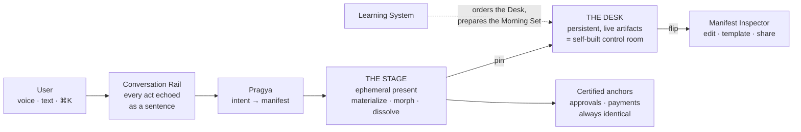

### D.6 Aesthetic Direction

Gallery minimalism: a dark, depthless void as the Stage (surfaces feel *lit*, like objects on black velvet), warm-white cards with real material presence, one accent (burnished gold) reserved for certified seals. Motion is the brand: everything arrives and departs with intention; nothing pops.

### D.7 Risks & Honest Notes

- Latency is existential: materialization must begin < 300ms (streamed manifests, optimistic scaffolds) or the theatre becomes a wait.
- Blank-canvas anxiety: first-time users need the Morning Set and Pragya's proactive openers so the void is never actually blank.
- Reproducibility discipline: "the same ask yields the same surface" matters for muscle memory — manifests must be cached per intent-shape, not freshly hallucinated each time.

---

## Concept E — The Mandala

> *"Sheel, drawn the way the tradition would draw it."*

### E.1 The Essence

The platform's own names carry its design language: Sheel (discipline), Pragya (wisdom), Karuna (compassion). The Mandala takes that inheritance seriously: the entire business renders as a single **living mandala** — a radial, breathing figure with Pragya at the center (she *is* `loop_config.hub_agent`), and the five-tier hierarchy as concentric rings:

```
        CENTER      Pragya — the hub, the voice, the one relationship
        RING I      Sheel's arcs — the seven functional sectors
        RING II     the 19 Processes, arranged within their arcs
        RING III    Agents (Karuna gateways stand at the outer gates)
        RING IV     Skills & Actions — the fine outer filigree
        THE FIELD   beyond the rings: the data — 27 object constellations
```

Signals are points of light entering from the Field through the Karuna gates, traveling the spokes inward and outward. The whole figure **breathes** with the loop heartbeat; hibernating regions dim to ember. It is the bird's-eye view as a *sacred diagram of the business* — and it is fractal.

### E.2 Signature Interactions

- **Bloom is the only gesture.** Touch any sector and it **blooms** — unfolds into its own mandala with the same radial grammar (a Process blooms into its agents/steps/KPIs; an Agent blooms into skills, runs, SLO petals). One grammar at every tier: learn it once at the horizon, use it down to a single Action. Breadcrumbs are rings you fold back.
- **Autonomy has geometry.** An agent's autonomy level (A0→A3) is its **distance from the rim**: new hires sit at the outer edge under the HITL ring (a thin gold circle of checkpoint markers); as trust is earned they migrate inward, visibly. An autonomy promotion is a small ceremony — the ring shifts while Pragya states the evidence. Governance is not a settings page; it is the *shape of the figure*.
- **Envelopes as arc-fill.** Each sector's budget envelope draws as the arc's fill level; the protected reserve (P14/P17) is a permanent gold seam that never drains. Budget health is readable across the whole business in half a second.
- **The Sand Mandala (evolution & termination).** The tradition's deepest idea, used honestly: nothing here pretends to be permanent. Terminated entities **dissolve** — grain by grain — into the Archive ring, where every version that ever ran remains inspectable (the version ledger as memorial). Self-evolution appears as the figure redrawing a region of itself, with the diff narrated by Pragya and gated by the certified approval seal.
- **The Turning of the Wheel (the growth journey).** Time-lapse the mandala across weeks: rings thicken, new petals appear (schema growth adds constellations to the Field; new agents add filigree), regions steady from flicker to glow. Strategy Resolutions are engraved on the rim at the date they were made — scrub past one and watch its region transform. Week 12 > Week 1 as *visible ornamentation of the figure*.
- **The Field (schema & records).** Beyond the rim, each canonical object is a constellation; its records are stars. Touch a constellation → a clean workbench sheet rises (standard generated tables/forms — the mandala is the **navigation shell**, the workbench is deliberately conventional and fast). Links between objects (`tenant_record_links`) draw as faint threads: the Signal→Lead→…→Payment lifecycle is a visible path across the Field.
- **Pragya at the center.** Speaking to her makes the center glow; her attention is a beam that illuminates whatever she is narrating. "Why is Care flickering?" — the beam sweeps to the Care arc as she answers. The user's eye and her voice always agree.

### E.3 Requirement Coverage

| Requirement | How the Mandala serves it |
|---|---|
| Dynamic schema CRUD | The Field's constellations → conventional generated workbench sheets; new defs = new constellations appearing |
| Entity lifecycle | Bloom (inspect) · redraw (evolve) · ring migration (autonomy) · dissolve (terminate) · Archive ring (versions) |
| Bird's-eye → granular | Fractal bloom: one grammar from whole-business to single action/field |
| Strategy → effect | Rim engravings + time-lapse regions |
| KPI journey | The Turning of the Wheel |
| Uniqueness | No product on the market looks remotely like this, and for this brand it is *earned*, not appliqué |

### E.4 Diagram

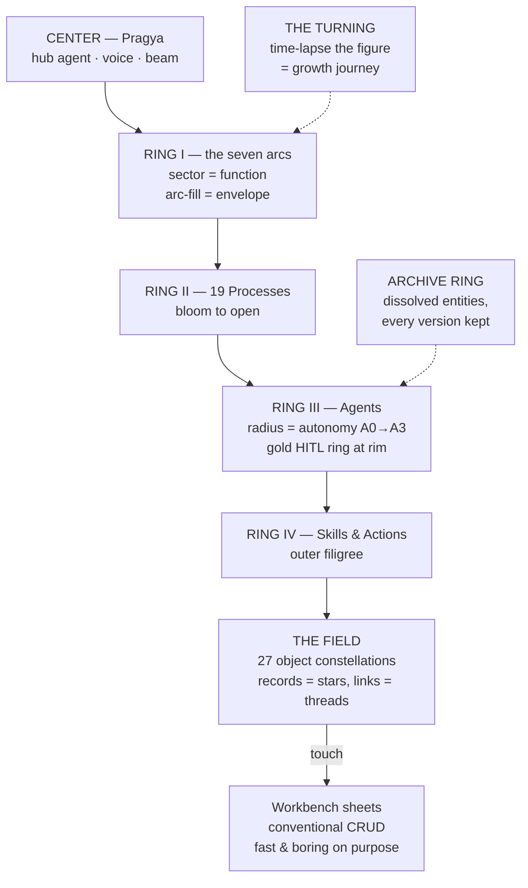

### E.5 Aesthetic Direction

Lacquer-black ground; the figure drawn in luminous mineral pigments (lapis, saffron, bone-white, burnished gold) with genuine radial geometry — constructed, not decorated. Line weight does the hierarchy; glow does the life. Typography minimal and reverent. The result should feel like an instrument of contemplation that happens to run a company.

### E.6 Risks & Honest Notes

- Weakest of the five at *dense tabular work* if taken literally everywhere — hence the deliberate rule: the mandala navigates, conventional sheets do the work. The seam between the two must be flawless.
- Radial layouts fight small screens; mobile likely gets a "petal list" projection (same grammar, vertical).
- The sacred register must be handled with taste and cultural respect — evocation, not imitation; this needs an explicit art-direction pass with the owner.

---

## Concept F — The Firm

> *"The oldest interface on Earth is another person."*

### F.1 The Essence

A business owner has mastered exactly one interface in their life: **colleagues**. They know how to brief someone, check in on someone, review someone, promote someone, and let someone go. The Firm makes that the entire product: the AI workforce renders as an actual firm of **named colleagues** — stylized portraits (deliberately illustrated, never photoreal, never pretending to be human), presence, desks, moods of work. You don't open a "process detail page"; you *check in with the person running it*. Pragya is not a widget — she is your **chief of staff**, standing beside you in every room.

The platform's own concepts map onto management idioms with almost no translation:

| Platform reality | The Firm renders it as |
|---|---|
| Autonomy ladder A0→A3 | The career ladder: **shadow → associate → manager → partner** — promotions earned with evidence |
| Agent SLOs (Blueprint §10.2) | The performance dossier — reviewed at promotion time |
| HITL checkpoint | A colleague **raising their hand** — "waiting on you" |
| Meta-Agent Board (7 roles) | **The Talent Office** — it recruits, screens, and trains |
| Entity versioning & rollback | The personnel file — every version of the role ever held |
| Termination + retained memory | The **exit interview and handover memo** — institutional memory never leaves (the inverse of human attrition, stated in the docs, made visible) |

### F.2 Signature Interactions

- **The Floor.** The bird's-eye view is a calm overview of everyone at work: presence dots, "on a call with a customer," "reconciling," "waiting on you." Activity is legible the way an office is legible at a glance. Zoom out: the whole firm; zoom in: one desk.
- **The Standup.** A daily 90-second ritual: the team reports — each report one sentence, spoken by Pragya or read as cards, each tappable to drill into the runs behind it. The Standup *is* the daily brief, in the social format every owner already knows.
- **One-on-ones.** Sit down with any agent: a conversational inspection of its recent decisions, memory, and workload. "Show me how you handled the Meera case" → the run replays as a told story with the trace one flip away. Feedback given here becomes charter/policy input — *management as the editing interface*.
- **Hiring (creation).** Need a new capability? You brief the Talent Office: goal in, **candidate designs** out (the Board's iterations rendered as a shortlist). You *interview* the candidate — a live rehearsal Q&A against your real cases — then hire into **probation** (A0/A1 shadow mode). Confirmation to associate follows evidence. The entity lifecycle is a story every employer has lived.
- **The Org Chart.** The five tiers as a real org chart — Sheel at top, processes as departments, agents reporting into them, skills/actions as each colleague's listed competencies. Walking the chart is the hierarchy drill-down. One toggle flips it to the raw entity graph for power users.
- **The Boardroom (strategy → effect).** Strategy sessions convene Pragya plus the relevant "leads." Decisions leave the room as **mandates assigned to named colleagues**; every mandate reappears in its owner's next review with measured results. Accountability — the deepest management instinct — becomes the strategy-to-effect trail.
- **The Back Office (schema CRUD).** Records are what colleagues *bring you* ("ask the bookkeeper for March invoices" → the register sheet arrives) — but the door is always open: power users walk into the Back Office and open the generated HBS registers directly.

### F.3 Requirement Coverage

| Requirement | How the Firm serves it |
|---|---|
| Dynamic schema CRUD | The Back Office registers — generated sheets, reachable by asking *or* walking in |
| Entity lifecycle | Hire → probation → promote → review → exit: the complete lifecycle as employment idiom |
| Bird's-eye → granular | The Floor → department → desk → one-on-one → run trace → record |
| Strategy → effect | Boardroom mandates tracked into reviews |
| KPI journey | The annual review + the firm's "class photo" growing richer over quarters |
| No-training | Management is the one skill the buyer certifiably has |

### F.4 Diagram

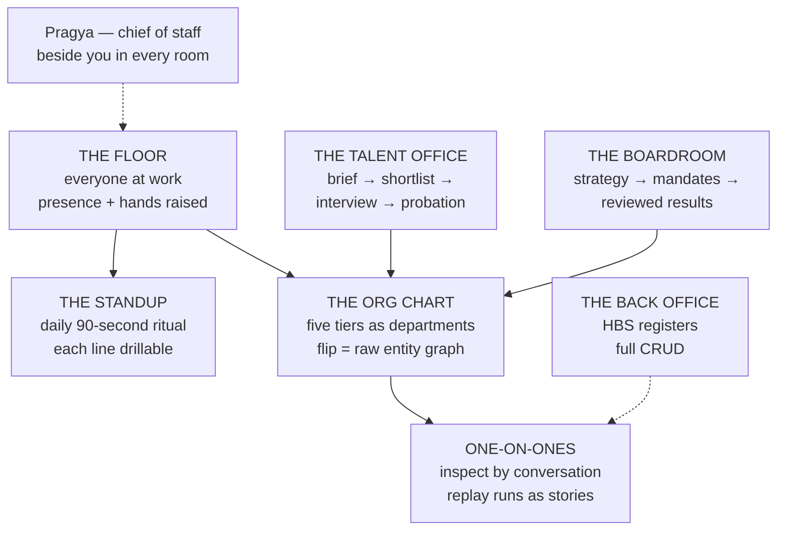

### F.5 Aesthetic Direction

The partners' floor of a discreet private firm: walnut, brass, warm directional light, a single engraved-illustration style for every portrait (consistent, dignified, unmistakably non-human). Motion is composed and unhurried. It should feel like belonging to an institution that predates you.

### F.6 Risks & Honest Notes

- **The non-deception rule is load-bearing:** personification is an interface idiom, disclosed as such — stylized portraits, no photorealism, no claimed feelings. Slipping here costs trust and possibly compliance (disclosure obligations in the Karuna profile apply inward too).
- Personification can obscure mechanics: "one colleague" may be 14 parallel runs. The flip-to-truth (traces, graphs) must be one gesture away everywhere.
- Art direction is the make-or-break investment; a cheap portrait style collapses the entire register from *firm* to *chatbot farm*.

---

## Concept G — The Continuum

> *"A business is not a state. It is a story with a now in it."*

### G.1 The Essence

Every dashboard ever built is **state-first**: it answers "what is." But a founder lives **event-first**: what happened, what's happening, what's next. The Continuum makes time the *only* axis. The entire product is one infinite, zoomable timeline. The **Now-line** — a gold hairline — sits at center screen, always.

To its left, the immutable past: every signal, run, decision, conversation, and edition, compressing into strata as you zoom out (a minute → a day → a quarter → the life of the company). To its right, the future — **and the future is editable**: scheduled campaigns, planned deployments, envelope refreshes, renewal dates, and Pragya's forecasts render as ghost events you can grab, move, reshape, or cancel. Dragging a planned campaign two weeks out *actually reschedules it* (Chronos). The future lane is the product's soul: no other tool shows a founder their business's future as a manipulable object.

### G.2 Signature Interactions

- **Lanes are the KPI tree.** The Loop lane on top; process lanes beneath; each expandable into agent lanes — the exact §10.2 hierarchy, laid out temporally. Analytics draw *inside* the lanes as area fills; zooming out turns events into density and density into trend — the chart *is* the history, not a picture of it.
- **The Wake.** Select any decision-event — an autonomy raise, a deployed process, a price change — and its downstream effects **highlight forward** along the lanes, with KPI deltas annotated at intervals. Strategy → design → effect becomes a first-class *visual query*: "show me the wake of the March collections policy."
- **Forecast ghosts.** The cashflow forecaster and pipeline projections render as translucent continuations of each lane; opacity encodes confidence. Every week, yesterday's ghost is graded against what actually happened — replaying *the forecasts themselves* shows the Learning System getting better at predicting this business. Week 12 > Week 1, applied to foresight.
- **Time-travel audit.** Scrub to any past instant and the side panel shows the business **as of then** — records, envelopes, charters, org — reconstructed from CAS versioning and the ledger. Auditability as a place you can stand.
- **Deadlines are places.** Everything awaiting the user — HITL SLAs, renewals, envelope refreshes, compliance dates — sits at its true position ahead of the Now-line. The to-do list and the calendar collapse into one honest object.
- **The Now.** At maximum zoom the Now-line becomes live: signals arriving, runs stepping, a voice call's transcript scrolling word by word. Live-ops is just the finest zoom level of the same axis.
- **Records & CRUD.** Any event opens its object's workbench sheet; any object opens *its own lane* — the record's full lifecycle as a personal timeline. Conventional register views are one flip away for bulk work.

### G.3 Requirement Coverage

| Requirement | How the Continuum serves it |
|---|---|
| Dynamic schema CRUD | Event → sheet; object → its lifecycle lane; registers one flip away |
| Entity lifecycle | Every entity's lane: born → runs → promotions → evolutions → retirement, in sequence |
| Bird's-eye → granular | Zoom years → quarter → day → one run → one word of one call |
| Strategy → effect | The Wake |
| KPI journey | Native — the product *is* the journey |
| No-training | Past-left / future-right and pinch-zoom are near-universal instincts (RTL locales get a mirrored build) |

### G.4 Diagram

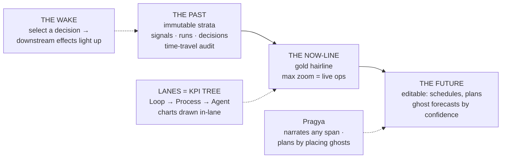

### G.5 Aesthetic Direction

Horological-astronomical: the restraint of a grand complication. Graphite and parchment grounds, sediment-like strata, the Now-line in gold, futures like breath on glass. Zoom easing tuned like a fine tourbillon — weighty, precise, silent.

### G.6 Risks & Honest Notes

- Strata design at wide zoom is the whole game: compressing a quarter of a business into legible bands without noise requires ruthless information design.
- The editable future must visually separate **scheduled fact** (will happen) from **forecast guess** (might happen) — conflating them once destroys trust in both.
- Pure state browsing ("show me all active leads") is not time-shaped; the flip-to-register must feel native, not like leaving the product.

---

## Concept H — The Twin

> *"Every consequential question a founder asks begins with 'what if.' Give that question a room."*

### H.1 The Essence

The product renders **two businesses side by side**: the real one — and its living mirror, a sandboxed twin seeded from the same state. (The platform makes this honest: the tenant's business *is* a portable volume, the Board already simulates candidate entities against representative cases, the eval harness grades outcomes, and the budget machinery can price a hypothetical.) The primary verb is **try**.

*"What if we chased invoices at 7 days instead of 14?"* → the twin forks, replays last quarter's ledger under the new rule, runs the forecast forward, and the two businesses **diverge on shared dials**: +₹1.8L collected, 2 complaint-risk flags, DSO −6. Like what you see → **promote**: the change flows through governance (certified approval, canary, A1 start) into the real business — and the UI tracks predicted-vs-realized effect forever after. *The system grades its own advice in public.*

This is stage 5 of Pragya's nine-stage flow — solution engineering *with* the user — turned from a conversation into a **place**.

### H.2 Signature Interactions

- **The Mirror.** Real business left (warm material), twin right (cool silvered glass) — same layouts, unmistakably different material, so the eye can never confuse them. A **divergence ribbon** between them quantifies the gap: revenue, cost, risk, workload.
- **Levers.** In the twin, everything consequential is a draggable lever: envelope sizes, autonomy levels, charter lines, dunning ladders, process wiring, model allow-lists. The real side is **read-only from this room** — safety by construction, not by warning dialog.
- **Three honesty grades, always labeled.** Every twin result carries its epistemic class: **Replay** (this *did* happen under new rules — counterfactual over the actual ledger), **Forecast** (modeled projection with confidence), **Unknown** (market response we cannot simulate — Pragya says so plainly). The twin's credibility rests on never blurring these.
- **The Scenario Shelf.** Named experiments — "aggressive collections," "Hindi-first support," "second voice line" — kept, re-run as fresh data arrives, and compared in a tournament view. Pragya seats herself here as an analyst: she proposes scenarios unprompted when she sees an opportunity ("I ran your pricing question three ways overnight — want the results?").
- **The Promotion Pipeline.** Experiment → design diff (human-readable: what changes, what it costs, what could go wrong) → certified approval → Board build → **canary** (the shipped EVX machinery) → GA. Then the long tail: the deployed change's chart carries its twin-predicted curve as a permanent ghost — prediction and reality, side by side, forever.
- **Drill-down.** A simulated run inspects exactly like a real one — same trace viewer, same cost attribution. The twin's data browses through the same generated sheets. Nothing to relearn.

### H.3 Requirement Coverage

| Requirement | How the Twin serves it |
|---|---|
| Dynamic schema CRUD | Twin data browsable/editable through the same generated registers (edits = scenario inputs) |
| Entity lifecycle | Evolution happens *here*: every consequential change is an experiment before it is a deployment |
| Bird's-eye → granular | Inherits its paired view shell on both panes; drill into any simulated run/trace |
| Strategy → effect | The concept's entire reason to exist — including the permanent predicted-vs-realized record |
| KPI journey | History annotated with every promoted experiment and its grade |
| Novice → power | Novices: "try it and see," Pragya drives. Power: levers, scenario shelf, replay queries |

### H.4 Diagram

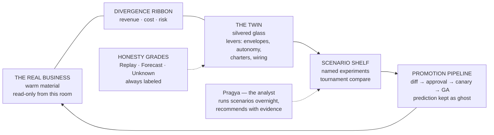

### H.5 Aesthetic Direction

A materials story: the real business in warm walnut-and-ivory tones; the twin in cool glass and silver — identical layouts, different physics of light. The divergence ribbon in gold. The room should feel like a naval architect's tank-testing basin: serious play.

### H.6 Risks & Honest Notes

- Simulation honesty is existential. The three-grade labeling must be enforced by the manifest layer (certified), not by convention — one overclaimed forecast poisons the room.
- Twin compute costs real money; it runs under the platform-initiated budget class with its own envelope, visible to the tenant ("your analyst spent ₹40 thinking last night").
- The Twin is an **organ, not a shell** — it needs a host concept for everyday operation. Paired, it is arguably the strongest strategic differentiator in this document.

---

## Concept I — The Loom

> *"The seam is where businesses leak. Here, there are no seams — only threads."*

### I.1 The Essence

The Blueprint's deepest claim is that Sheel is *one fabric* — no departmental seams, one object graph, `Signal → Lead → Opportunity → Quote → Contract → Order → Invoice → Payment → Ledger Entry` chaining without translation. The Loom renders that claim literally. Every canonical object's life is a **thread**. Every process is a **loom** the thread passes through. And the business itself is the **cloth** those threads weave — growing, day by day, into a fabric whose texture *is* the state of the company.

Where the Atlas starts from geography, the Mandala from hierarchy, and the Continuum from time, the Loom starts from **the work itself**: the individual customer journey, invoice, hire, dispute — followable end to end, from first touch to money in the bank, across every agent that ever handled it.

### I.2 Signature Interactions

- **The Cloth.** The bird's-eye view: the current period's fabric. Warp = time; weft = object journeys; color = domain (revenue in zari gold, care in jade, money in copper, trust in indigo); sheen = margin. A healthy business weaves dense and even. Seasonality is *visibly* a pattern in the cloth. Nobody needs a legend to see that this quarter's fabric is finer than last's.
- **Follow the thread.** Tap any thread and follow it: every event, every agent that touched it, every wait-state, cost accruing along the strand, its links (`tenant_record_links`) branching to sibling threads. A counterparty's whole relationship is a **braid** — their calls, emails, orders, and disputes plied together (the per-counterparty episodic memory doctrine, made visible).
- **The Snag view (operations).** Daily work = finding snags. Stuck quotes, aging invoices, unanswered tickets surface as physical pulls in the cloth, ranked by value-at-risk, each with Pragya's prepared resolution options. Parked signals sit on the **selvage** — the platform's "no dropped signals" guarantee has an address you can visit.
- **The Pattern Library (analytics).** The Learning System's discoveries render as comparative swatches: "threads that begin on WhatsApp close 2.3× faster" is two pieces of fabric you can *see* differ. Conventional charts remain one flip away; the swatches are for insight, the charts for precision.
- **The Bolt Archive (the growth journey).** At each month's close, the cloth is **cut and rolled**. The shelf of bolts is the company's history; unroll Week-1's bolt beside Week-12's and the Learning System's promise is tactile — coarse and gappy then, dense and lustrous now. Strategy decisions are woven in as pattern changes, dated in the selvage.
- **Re-threading (design).** Reconfiguring a process = re-threading its loom, with Pragya: which signals enter, which agents shuttle, where the HITL stops sit. Watching a loom work — shuttles moving, thread taking up — *is* live process monitoring.
- **Thread-end sheets (CRUD).** Any thread opens into its object's conventional generated workbench. The cloth navigates; the sheets work — the same honest split as the Mandala.

### I.3 Requirement Coverage

| Requirement | How the Loom serves it |
|---|---|
| Dynamic schema CRUD | Thread-end sheets over `tenant_entity_defs`; new defs = new thread colors appearing in the cloth |
| Entity lifecycle | Looms are processes: built (threaded), observed (weaving), evolved (re-threaded), retired (last bolt cut) |
| Bird's-eye → granular | Cloth → pattern → thread → event → field |
| Strategy → effect | Pattern changes woven in and dated; compare fabric before/after |
| KPI journey | The Bolt Archive — history you can unroll and touch |
| Uniqueness | The one concept whose metaphor *is* the product's core architectural claim |

### I.4 Diagram

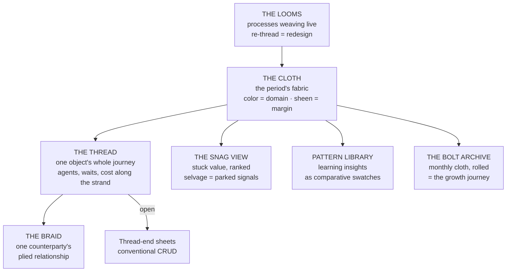

### I.5 Aesthetic Direction

Textile luxury with Indian heritage worn proudly: silk-thread light on deep indigo grounds, zari gold for revenue, real material physics (sheen, thread shadow, take-up). Jacquard precision, khadi honesty. The most tactile concept of the ten — it should make people want to touch the screen.

### I.6 Risks & Honest Notes

- Bespoke rendering at scale: tens of thousands of live threads need aggregate strands at distance that resolve individually on zoom — a real engineering commitment, comparable to the Atlas.
- Non-linear journeys (a support ticket braided into an order, a dispute forking) must braid gracefully; the metaphor covers it, but the interaction design is delicate.
- Like the Mandala, dense state browsing is delegated to sheets — the seam between cloth and sheet must be invisible.

---

## Concept J — The Private Line

> *"The other nine concepts assume the tenant comes to the product. This one goes where the tenant already is."*

### J.1 The Essence

The Solo Pack customer is not at a desk. They run their business from a phone — between site visits, in the car, at dinner. The Private Line makes the primary product surface **a conversation thread with Pragya** that behaves like the private line to the best chief of staff money can buy: voice notes both ways, briefings as swipeable stories, decisions as certified cards in-thread, documents as beautiful attachments. Not a companion app — **the center of gravity**, with the full desktop canvas (any other concept in this document) as its second screen.

The luxury register here is not marble — it is **intimacy**: the feeling of a brilliant person on your personal line, 24/7, who never wastes a word of your attention. Its philosophy is the Sanctum's, applied to the pocket: silence by default, and every notification earned.

### J.2 Signature Interactions

- **The Morning Story.** The daily brief as a swipeable story sequence — ten seconds a card, Pragya's voice over each: *what happened → what needs you → what's ahead*. Finish the story, and you are fully briefed. (Format familiarity is total; production values are private-bank, not social-media.)
- **In-thread trays.** HITL decisions arrive as certified cards in the conversation: context, recommendation, cost of each path, approve with biometrics. The impact-tiered auth of technical §11.3 maps natively — T1 reads flow freely, T2 approvals take Face ID step-up, T3 criticals trigger the second-channel confirmation. The thread is not a toy; it is the **authenticated command line of the business**.
- **Voice as a first-class citizen.** Dictate policy while driving; Pragya replies with a 20-second voice summary plus a card for the record. Anything longer becomes a call — same realtime stack, same session, zero context loss (the cross-channel continuity the docs promise, experienced daily).
- **Rich pulls.** Ask anything, get a **live card**: a mini-register, a chart, a run status — generated from the same manifest substrate, staying live in the thread. Pin cards to the top: the pocket Desk, accreted from real moments of need.
- **The scroll-back is the ledger.** Every decision ever made sits in-context in the thread — searchable, permanent. The audit trail and the relationship are the same object.
- **Hiring by phone.** New-agent flows run as guided threads — brief the need, review the shortlist card, then **call the candidate**: a live rehearsal conversation with the not-yet-deployed agent before approving the hire. (The Board's simulation, experienced as a phone screen.)
- **Depth on demand.** Any card opens full-screen into the generated sheets — complete schema CRUD, entity dossiers, envelope views. And the desktop canvas mirrors the same session live (the Equivalence Principle across devices): start on the phone, finish at the desk, nothing repeated.
- **The WhatsApp mirror.** Where trust and regulation allow, a **read-and-notify** mirror runs on WhatsApp for tenants who live there — briefings and alerts, never approvals (bound-channel rules hold; certified surfaces exist only in the native app).

### J.3 Requirement Coverage

| Requirement | How the Private Line serves it |
|---|---|
| Dynamic schema CRUD | Live cards → full-screen generated sheets; bulk work deferred to the mirrored desktop |
| Entity lifecycle | Guided hiring threads + rehearsal calls; reviews and promotions as story cards |
| Bird's-eye → granular | Morning Story + pinned vitals card → any card → sheet → field |
| Strategy → effect | Boardroom mode: a scheduled call with shared cards; decisions minuted in-thread, results reported back in later stories |
| KPI journey | Weekly retrospective stories; a quarterly "year so far" film Pragya cuts from the data |
| No-training | It is messaging — the most universally held computer literacy on Earth, and *the* literacy of this product's first market |

### J.4 Diagram

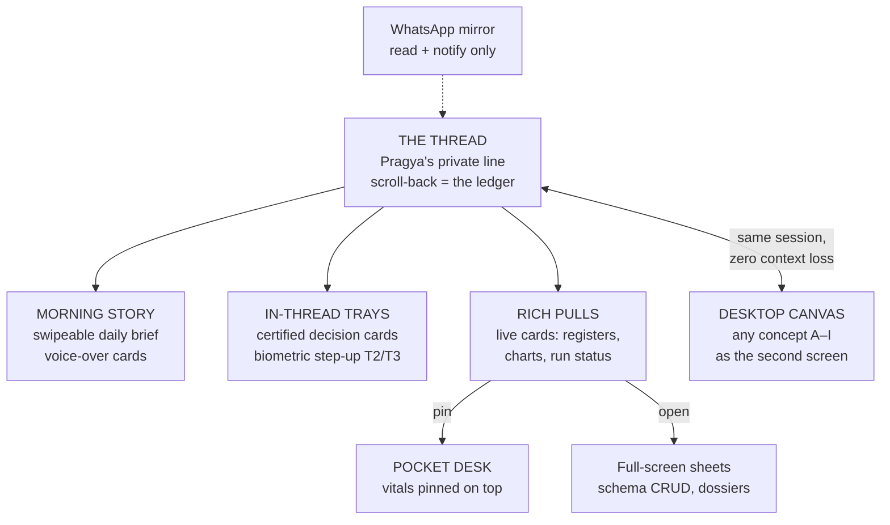

### J.5 Aesthetic Direction

The warmth of a personal thread with the finish of a private bank's app: ivory and graphite, typography-first cards, gold seals reserved for certified surfaces, story sequences art-directed like film title cards. Every notification written like a telegram — because each one spends the scarcest luxury there is, the owner's attention.

### J.6 Risks & Honest Notes

- Thread UIs bury state; the pinned Pocket Desk and full-screen sheets are the mitigation, and they must be excellent.
- Notification discipline is the product: one lazy ping and the private line becomes another noisy app. Silence-by-default is a hard design law here.
- The power-user ceiling on the phone is real; this concept honestly *requires* pairing with a desktop concept — it is the strongest **pocket face**, not a complete shell.

---

## 3. Comparison Matrix

| Dimension | A · Atlas | B · Chronicle | C · Sanctum | D · Stage | E · Mandala | F · Firm | G · Continuum | H · Twin | I · Loom | J · Line |
|---|---|---|---|---|---|---|---|---|---|---|
| Zero-training intuitiveness | ★★★★ | ★★★★★ | ★★★★★ | ★★★★ | ★★★★ | ★★★★★ | ★★★★ | ★★★★ | ★★★★ | ★★★★★ |
| Power-user ceiling | ★★★★ | ★★★ | ★★★★ | ★★★★★ | ★★★★ | ★★★ | ★★★★★ | ★★★★★ | ★★★ | ★★ (alone) |
| Pragya-centricity | ★★★★ | ★★★★★ | ★★★★★ | ★★★★★ | ★★★★★ | ★★★★★ | ★★★★ | ★★★★★ | ★★★★ | ★★★★★ |
| Bird's-eye → granular | ★★★★★ | ★★★★ | ★★★★ | ★★★ | ★★★★★ | ★★★★ | ★★★★★ | ★★★ | ★★★★★ | ★★★ |
| Growth-journey storytelling | ★★★★★ | ★★★★★ | ★★★★ | ★★★ | ★★★★★ | ★★★★ | ★★★★★ | ★★★★ | ★★★★★ | ★★★★ |
| Strategy → effect traceability | ★★★★ | ★★★★ | ★★★ | ★★★ | ★★★★ | ★★★★ | ★★★★★ | ★★★★★ | ★★★★ | ★★★ |
| Live-ops monitoring | ★★★★★ | ★★★ | ★★★★ | ★★★★ | ★★★★★ | ★★★★ | ★★★★ | ★★ | ★★★★★ | ★★★ |
| Mobile fit | ★★★ | ★★★★★ | ★★★★★ | ★★★★★ | ★★★ | ★★★★ | ★★★★ | ★★★ | ★★★ | ★★★★★ |
| Engineering risk / cost | Highest | Medium | Med-low | Medium | High | Medium | Medium | High | High | Low-med |
| Uniqueness / luxury | ★★★★★ | ★★★★★ | ★★★★★ | ★★★★ | ★★★★★ | ★★★★★ | ★★★★ | ★★★★★ | ★★★★★ | ★★★★ |

*One-word keys — A: spatial zoom, camera-pilot Pragya. B: everyone reads. C: three questions + depth dial. D: manifest programming ceiling. E: brand-native geometry. F: management is the buyer's native skill. G: time-travel audit + editable future. H: what-if with honesty grades. I: the architecture's own metaphor. J: messaging literacy; requires a desktop partner.*

## 4. Hybridization Notes (these compose better than they compete)

The ten concepts fill different *slots* in one product. A useful frame: a complete frontend needs exactly one **world-picture** (the primary grammar of "where am I"), a set of **organs** (reporting, deciding, experimenting, tracing), a **mechanics layer**, and a **pocket face**:

- **World-pictures — pick exactly one:** Atlas (territory), Mandala (radial figure), Loom (cloth), Continuum (time), Firm (organization), Chronicle (publication). Two competing world-pictures confuse; one must win the "whole business at a glance" slot.
- **Shell & mechanics — compatible with any world-picture:** the Sanctum (stillness, trays, depth dial) and the Stage (materialize/morph/pin, equivalence echoes) are *how the product behaves*, not what it depicts — either or both can wrap any world-picture above. The Stage is the closest concept to the raw manifest substrate.
- **Organs that slot into anything:** the Chronicle's editions & signatures (reporting + HITL), the **Twin** (the what-if room — the natural home of nine-stage stage-5 solution engineering), the Continuum's time-travel audit (the archive organ), the Firm's one-on-ones (the workforce-inspection idiom), the Loom's follow-the-thread (object-lifecycle tracing — worth having in *any* concept).
- **The pocket face:** the **Private Line** composes with everything — it is the Sanctum's philosophy applied to the phone, and for the Solo Pack customer it is arguably table stakes regardless of which desktop concept wins.
- **Mutual exclusions:** Atlas / Mandala / Loom compete for the same spatial-grammar slot; the Continuum and the Chronicle's archive overlap on history (pick one as canonical); the Firm and the Mandala both want to *be* the workforce view (choose the idiom).

**Three concrete strong hybrids:**

1. **The composed flagship** — Sanctum shell + Stage mechanics + Chronicle editions & signatures + Mandala as the depth-1 home view + **Private Line as the pocket face + the Twin as the what-if room**. Each part covers the others' weakest dimension; this is the full-luxury build.
2. **The maximal-differentiation build** — Loom world-picture + Continuum time-travel audit + Stage mechanics. Nothing on the market would look remotely like it.
3. **The most-human build** — Firm world-picture + Chronicle reporting + Private Line pocket. The lowest-concept-risk path to "no training required," strongest for the least tech-savvy buyer.

## 5. My Read (one recommendation, as asked)

If a single concept must be chosen as the spine: **C · The Sanctum**, with **D · The Stage** as its interior mechanics — because:

1. It is the only concept whose *core promise is the product's core promise*: an autonomous business you don't have to watch. The UI's restraint is proof of the platform's competence.
2. It carries the lowest structural risk (the depth dial and trays are buildable with the manifest substrate as-specified in technical §8) while leaving the door open to adopt the Mandala home view or Chronicle editions later without re-architecture.
3. It is the most voice-native — and voice is Pragya's home field.
4. Its novice story ("three questions, one dial, one tray at a time") and its power story (a genuinely excellent engine room) don't compromise each other.

**The five additions (F–J) don't change that spine — they complete it.** The **Private Line** is the same philosophy in the pocket, and for the Solo Pack buyer it is close to non-optional whichever desktop concept wins. The **Twin** is the organ I would add as soon as Increment-6's LEARN/EVX machinery matures — it turns Pragya's stage-5 solution engineering into the product's strongest strategic differentiator.

Among the remaining world-pictures: the **Mandala** and the **Loom** are now the two boldest brand-true statements (choose the Loom if the differentiator should be the *architecture's own* one-fabric claim; the Mandala if it should be the brand's soul); the **Atlas** is the most demoable and investor-stunning; the **Chronicle** is the most universally legible; the **Continuum** is the power-user's and auditor's favorite; the **Firm** is the safest zero-training bet for the least technical buyer.

---

## 6. Gate Decision Record (2026-07-24) — the Selected Direction

**Owner selection (Rahul):** a five-part hybrid — **C · Sanctum** (shell) + **F · Firm** (cast) + **A · Atlas** (world-picture) + **H · Twin** (what-if organ) + **J · Private Line** (pocket face).

**Decisions locked in the selection round:**

1. **The Sanctum owns depth 0** — the still surface is the resting state; the Firm proceeds beneath it.
2. **One voice** — Pragya is the single point of contact; colleagues raise hands *to her*; she delivers every tray.
3. **The Line is Pragya's thread only** — colleague output arrives as cards "prepared by" that colleague, relayed by her.
4. **Simulated people are permitted in the Twin** (owner override of the de-personification rule). The two honesty invariants stand: Replay/Forecast/Unknown labels are never softened, and the real/twin panes keep distinct material treatment.
5. **The Firm inhabits the Atlas** — one unified geography: districts are departments, colleagues work visibly inside their districts, the org chart is a flip-lens of the same structure.
6. **The Atlas sits at depth 1** — leaving the still surface lands on the territory; the Three Questions render as beacons on the map.
7. **Art direction: living day–night** — the territory follows real time; interiors stay warm-material throughout.
8. **Build: full flagship at once** (owner decision, against the phased recommendation) — one coherent launch before GenUI replaces the React app, de-risked by internal integration gates and the parallel-run doctrine.

**The spec that exits the gate:** [genui_design_gate_spec.md](./genui_design_gate_spec.md).

---

*Prepared for the Design Gate. Selection made 2026-07-24 (§6); the detailed specification round proceeds in the spec document.*
