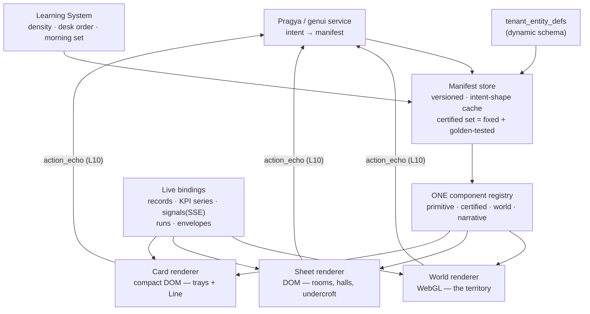

# GenUI — Full Design Specification (Design Gate Exit Artifact, v1.0)

> **Document class:** Design Gate specification — the "detailed, unique design" the Increment-6 charter requires before any GenUI development begins
> **Author:** Buddha Cognitive Lab (drafted by Claude, decisions by Rahul)
> **Created:** 2026-07-24 · **Status:** v1.3 — spec ratified; all §14 items closed; §15 key journeys added; **twin-spend attribution corrected (§12.1) and the build moved to Increment 7** with a design phase ahead of G0
> **Parent:** [genui_design_gate_concepts.md](./genui_design_gate_concepts.md) §6 (decision record) · [build_roadmap.md](./build_roadmap.md) §4 Inc-6 GENUI · functional doc §11 · technical doc §8
> **Selection:** **Sanctum** (shell) + **Firm** (cast) + **Atlas** (world) + **Twin** (what-if organ) + **Private Line** (pocket face), unified per the eight locked decisions of concepts §6.

---

## 0. The Name — *Vihara* (ratified 2026-07-24)

The frontend carries a name of the same lineage as Sheel (śīla, discipline), Pragya (prajñā, wisdom), and Karuna (karuṇā, compassion): **Vihara** (vihāra) — *the dwelling place*: in the tradition, the residence where the community lives and works in discipline and calm; in Sanskrit usage, also *to walk, to roam*. It is precisely this product: a calm estate you can walk, inhabited by a working community, kept by a wise steward.

Alternatives considered and declined: *Aangan* (courtyard), *Nivaas* (residence), *Darbar* (court).

---

## 1. Product Definition

**Vihara is the tenant's estate.** One continuous world with four properties:

1. **At rest, it is silent.** The default state of the entire product is a still surface with one living line and a breathing pulse. Silence is the proof that the workforce is working.
2. **Beneath the silence, it is a place.** One living territory — the business rendered as an estate with districts, gatehouses, roads, and weather — inhabited by the workforce as **named colleagues** you can visit, brief, review, promote, and let go.
3. **Beside the real, there is a glass room.** The **Glasshouse** — a mirrored twin of the estate where every consequential idea is tried before it is bet on, graded honestly, and promoted through governance into reality.
4. **In the pocket, it is a private line.** The whole estate, reachable as a conversation thread with Pragya — briefing stories, prepared cards, certified decisions under biometric step-up.

Pragya is the **steward of the estate**: the only voice that ever interrupts, the guide who walks you anywhere, the relay through whom every colleague reaches you, and the single point of contact across every device and channel — one session, zero repeated context.

---

## 2. The Binding Laws

These ten laws resolve every inter-concept tension identified in the selection round. They are constitutional: any later design or implementation choice that violates one is wrong by definition.

| # | Law | Source |
|---|---|---|
| L1 | **The Sanctum owns the resting state.** Depth 0 — the still line and the Pulse — is the default of every session on every device. Nothing else is ever the home screen. | Owner decision §6.1 |
| L2 | **One voice.** Only Pragya interrupts the user. Colleagues raise hands *to her*; she delivers every tray, on desktop and on the Line. | Owner decision §6.2 |
| L3 | **The Line is Pragya's thread only.** No per-agent threads. Colleague output arrives as cards "prepared by" that colleague, relayed by her. | Owner decision §6.3 |
| L4 | **The Firm inhabits the Atlas.** One geography: districts are departments; colleagues work visibly inside their districts; the org chart is a flip-lens of the same structure, never a separate place. | Owner decision §6.5 |
| L5 | **Certified surfaces are deterministic.** Approvals, payments, consent, autonomy changes, step-up render from fixed, versioned manifests — pixel-identical in trays, Line cards, and sheets. The Glasshouse can *simulate* but never *execute* a certified action. | Substrate principle |
| L6 | **Glasshouse honesty.** Every twin result carries its epistemic grade — **Replay / Forecast / Unknown** — enforced by the manifest layer, never softened. Real and twin panes keep distinct material treatment (warm vs silvered glass). Simulated people are permitted (owner override §6.4). | Owner decision §6.4 + invariants |
| L7 | **Non-deception.** Portraits are stylized illustrations, disclosed as AI, never photoreal, never claiming feelings. Applies in the real estate and the Glasshouse alike. | Firm F.6 |
| L8 | **Notification discipline.** Silence by default. A push is either a tray-worthy event or it does not exist. No digests, no engagement pings, ever. | Sanctum + Line |
| L9 | **Every world view has a sheet equivalent.** Any information visible in the territory is also reachable as a conventional generated sheet — serving accessibility, low-end devices, and power preference with one guarantee. | Atlas A.6 / a11y |
| L10 | **Equivalence.** Every UI action has a sentence; every sentence has a UI action; every manual act is echoed as the sentence it was. The UI teaches the language by demonstrating it. | Substrate principle |

---

## 3. The Depth Ladder (canonical information architecture)

One vertical axis organizes the entire product. The dial position is per-user, persistent, learned by the Learning System, and always user-overridable (L1 fixes only the *session start* at depth 0).

```
DEPTH 0 — THE STILL SURFACE
   The living line · the Pulse · hands-raised count
   "All is well. ₹2.4L collected this week. Two colleagues are waiting for you."

DEPTH 1 — THE TERRITORY  (the Atlas horizon — owner decision §6.6)
   The estate at dusk or daylight (real time) · districts · weather · signal traffic
   The Three Questions rendered as beacons ON the map:
     WHAT HAPPENED   → amber trail-lights along today's completed routes
     WHAT NEEDS ME   → gold hand-raised beacons (each opens its tray)
     WHAT'S AHEAD    → ghost-lights beyond the Now on the horizon rim
   The Time Scrubber on the rim · the Gallery door (history) · the Glasshouse door

DEPTH 2 — THE PLACES  (where work happens)
   Districts (process rooms) · colleague dossiers & one-on-ones · Registry Halls
   (HBS sheets/CRUD) · the Boardroom · the Talent Office · the Gallery · the Glasshouse

DEPTH 3 — THE UNDERCROFT  (the engine room)
   Signals · triggers · envelopes · runs & traces · schema browser · routing
   attribution · manifest inspector · keyboard-first, ⌘K everywhere
```

**Navigation grammar (complete):** *go deeper / rise* (the dial) · *zoom & pan* (within the territory) · *teleport* (search or ask — anything, from anywhere) · *meet* (tap a colleague) · *flip* (any view ⇄ its lens: map⇄org-chart, chart⇄query, sheet⇄JSON) · *try* (take anything into the Glasshouse). Six verbs; nothing else exists.

The **Private Line** is not a level — it is the whole ladder projected to cards: the still line is the pinned vitals card, depth 1 is the Morning Story, depth 2 is full-screen sheets, depth 3 is desktop-only.

---

## 4. The World: One Geography (L4)

The unified projection of the platform ontology onto the estate. This table is the world's contract — the World renderer is a pure function of platform state through this mapping:

| Platform reality | Territory rendering | Firm rendering |
|---|---|---|
| Sheel (the root Loop) | **The estate itself** — its bounds, its heartbeat (the Pulse is Sheel's heartbeat cron) | The firm as a whole |
| Starter bundles / arcs | **Quarters** of the estate (Growth quarter, Money quarter, Care, People, Trust, Intelligence) | Divisions |
| The 19 Processes | **Districts** within quarters | Departments |
| Agents | **Colleagues at their workplaces** inside their district (studio, hall, desk) | Named colleagues with portraits |
| Karuna gateways (KAR-01/02/03…) | **The Gatehouses** at the estate's edge — voice, email, WhatsApp gates; every inbound signal visibly *enters through a gate* | The front-of-house staff |
| Skills / Actions | Craft and instruments visible *inside* a colleague's workplace on inspection | A colleague's listed competencies |
| Signals (the bus) | **Light traffic on the roads** between gatehouses, districts, and halls; parked signals wait at the **siding** with review timers | Work in motion |
| HBS records (27 objects, tenant DB) | **Registry Halls** — one hall per HBS module (CRM, Accounting, HRMS, ERP, Legal, Marketing, Planning); object lifecycles are the roads between halls | The Back Office |
| Budget envelopes | District **treasury gauges**; the protected reserve (P14/P17) is a gold seam that never drains | The department budget |
| KPI tree | District **plinths**; the Loop-level KPIs on the **Terrace** — the estate's highest viewpoint, where depth 1 opens | The scoreboard |
| HITL checkpoints | A **gold beacon** above the colleague whose hand is raised | A hand raised to Pragya |
| Runs / traces | Activity within a workplace; the full trace one *flip* away | A colleague's work in progress |
| Autonomy ladder A0→A3 | Workplace position: probationers work beside the HITL beacon line; partners work deep in the district | shadow → associate → manager → partner |
| The Meta-Agent Board | **The Talent Office** building | Recruitment |
| Strategy decisions | **Monuments** — dated markers placed where the decision landed | Boardroom mandates |
| The Twin | **The Glasshouse** — a silvered conservatory on the estate grounds | The rehearsal room |
| Connector bindings (CRM / ERP / Accounting / HRMS — Inc-4 CONN+SOR) | **The Bridges** — each binding is a bridge from its Registry Hall to the neighboring system; sync traffic visibly crosses it; a `sync.conflict` is a dispute *at the bridge* (tray); expired credentials render as a bridge under repair | The firm's trade relationships |
| Social & ad platforms (LinkedIn, Instagram, X, Google Ads) | **Broadcast gates** in the Marketing quarter — outward channels operated by the Karuna social gateway colleagues | Front-of-house, marketing side |
| Knowledge base & documents (control-plane KB + generated artifacts) | **The Library** — the estate's archive: collections, provenance, influence, staleness; Pragya is the librarian | The firm's institutional knowledge |
| Version ledger / terminated entities | **The Gallery** — portraits of colleagues past, every version inspectable | The personnel archive |
| Engine room | **The Undercroft** — the machine floor beneath the estate | — |
| Health | **Weather** — fog (KPI trouble), heat-shimmer (budget burn), storm cell (circuit breaker), moonlit stillness (hibernation) | A department having a hard week |

**The org chart is a flip, not a place:** from any territory view, *flip* renders the same subtree as a clean org chart (and back). Same data, two lenses, zero relearning. A second flip reaches the raw entity graph for power users.

**Day–night (owner decision §6.7):** the territory follows the tenant's local time — warm daylight cartography through the workday, lamplit gold-on-indigo at night. Interiors (rooms, sheets, trays, cards) are warm-material at all hours. Weather and beacons read identically in both; the palette is specified for both in §11.

---

## 5. Surface Inventory

The complete first-class surface list — what replaces the 59 hand-built React screens. Renderers: **W** = World (WebGL), **S** = Sheet (DOM), **C** = Card (compact DOM, used by trays + Line). Every W surface has an S equivalent (L9).

| Surface | Depth | Renderer | Purpose |
|---|---|---|---|
| The Still Surface | 0 | S | The line, the Pulse, hands-raised count |
| The Terrace (territory horizon) | 1 | W (+S list equivalent) | Whole-estate view, Three-Question beacons, weather, traffic, Time Scrubber |
| The Tray | any | **C, certified** | One prepared decision: context, Pragya's recommendation + why, cost of each path, approve/adjust/decline/ask — delivered only by Pragya (L2) |
| District room | 2 | W+S | One Process: KPI plinth, treasury gauge, colleagues at work, live runs, signal in/out |
| Colleague dossier / one-on-one | 2 | S | Charter, personality, competencies, SLO dials, recent decisions replayed as told stories (trace one flip away), feedback → charter/policy input |
| Registry Halls (per HBS module) | 2 | S | Full generated CRUD over `tenant_entity_defs`: registers (tables), record sheets (forms), saved views, bulk grid; agent proposals as **tracked changes**; analytics room per hall (charts ⇄ queries by flip) |
| The Boardroom | 2 | S (+W setting) | Strategy sessions with Pragya (nine-stage stages 4–6 re-entry); output = **mandates** assigned to named colleagues; each mandate leaves a monument and reappears in reviews |
| The Talent Office | 2 | S | Brief → Board-generated shortlist → **interview** (live rehearsal against real cases — a scoped Glasshouse session) → hire to probation → confirmation. Termination = exit interview + handover memo; portrait moves to the Gallery |
| The Standup | 1–2 | C sequence | Daily 90-second ritual: each colleague's one-line report (relayed by Pragya, L2), each drillable; on the Line this *is* the Morning Story |
| The Gallery | 2 | S+W | The growth journey: the Seasons timeline (vital signs + monuments + mandates = cause and effect), quarters past, colleagues past, predicted-vs-realized ghosts of every promoted experiment |
| The Glasshouse | 2 | W+S, silvered | The Twin: mirror view + divergence ribbon, levers, Scenario Shelf, tournament compare, promotion pipeline (diff → certified approval → Board build → canary → GA) |
| The Library | 2 | S | Documents & KB (§15.4): collections by source (uploads · connected drives · generated artifacts · conversation-derived), viewer + provenance + **influence** ("which colleagues cite this, how often retrieval used it"), staleness flags, the scoping view (which colleagues can read what), citations from Pragya's answers open the source; chunks/embeddings one flip away |
| The Bridges & Gates board | 2 | S (+W at the estate edge) | Connection management (§15.2): the §6.6 catalog as available bridge sites, certified OAuth connect cards (T2), mastering-declaration trays (propose→confirm→apply), sync health, scope & credential audit |
| The Undercroft | 3 | S, dense | Signals inspector, trigger registry, envelope ledgers, run traces, schema browser, routing attribution, consent/DNC registry, manifest inspector, feature flags |
| The Private Line: thread | — | C | Pragya's thread (L3): voice notes, cards, certified trays with biometric step-up |
| The Private Line: Morning Story | — | C sequence | Swipeable daily brief, Pragya's voice over each card |
| The Private Line: Pocket Desk | — | C | Pinned live cards (vitals on top) |
| Wizard/onboarding surfaces | — | *retired* | Onboarding is Pragya's nine-stage flow staged in the world itself (§10) |

**Scope call (owner may veto, §14):** this spec covers the **tenant product**. Partner and platform-admin consoles (4-level tenancy) are a separate track built later from the same Sheet/Card registries in Undercroft styling — they do not get territories.

---

## 6. The Interaction Grammar

### 6.1 Trays (the decision system)

The only interruption that exists (L2, L8). Anatomy, in order: **what happened** (one sentence + the object, linked) → **what Pragya recommends and why** (with the honesty grade if a Glasshouse result informs it) → **the paths** (each with cost/consequence) → **certified action block** (L5) → **"talk to me about it"** (voice/text, resolves in-thread). Trays queue oldest-first with checkpoint-SLA awareness (`sla_seconds` surfaces as a quiet countdown, never an alarm). Every tray is deliverable by phone call with zero loss: Pragya reads it, the user decides by voice, step-up per tier (§8).

### 6.2 Echoes (L10)

Every manual act emits its sentence into the ambient session record — visible as a quiet one-line ribbon ("filtered Invoices to overdue > ₹50k"), tappable to undo, and identically visible to Pragya. Echoes are the training set for both sides: the user learns the language by seeing their clicks named; Pragya learns the user's intent shapes.

### 6.3 Density

One persistent per-user density scalar (novice ↔ operator), learned, overridable, applied by every surface: prose-first vs grid-first registers, one-action vs multi-action trays, plinth summaries vs full KPI trees, motion easing length. Density never gates *capability* — only presentation (a novice can reach the Undercroft; it simply isn't offered first).

### 6.4 Keyboard & command

⌘K everywhere at depth ≥ 1: a command palette accepting the same intent language as Pragya (same parser, same echo). Power users get full keyboard traversal of sheets and the Undercroft; the territory is mouse/touch-first with keyboard teleport.

## 7. Pragya Integration Contract (frontend ↔ runtime)

One session across all devices and channels (`account_manager_sessions` + episodic/CORTEX continuity). The frontend contract, event-shaped:

**Server → client:** `deliver_tray(tray_manifest, sla)` · `focus(target_ref, narration?)` — the steward-walk: camera flight on W, sheet-open on S, card on Line · `materialize(surface_manifest)` · `narrate(text, audio_ref, anchors[])` — anchors highlight world/sheet elements as she speaks · `echo_ack` · `presence(state)` — listening / speaking / working / away.

**Client → server:** `utterance(audio|text)` · `action_echo(sentence, action_ref)` (L10 — every manual act) · `depth_change(level)` · `viewport(context_ref)` — what the user is looking at, so conversation is always about what's on screen · `step_up_result(tier, ok)`.

**Presence rendering:** Pragya has no avatar hovering permanently. At depth 0 she *is* the line. In the territory she is the **beam** — a soft light that walks where she narrates. In rooms she is the voice + a subtle presence mark. On the Line she is the thread itself. (The steward is everywhere; she is never a mascot.)

## 8. Authentication & Certified Actions

Impact-tiered per technical doc §11.3, mapped to surfaces: **T0/T1** — bound session; reads and routine assignment flow freely. **T2** (payment approvals, autonomy raises, pause/resume, bulk ops) — step-up: passkey/FIDO2 on desktop, biometric+passkey on the Line; elevates the session 10 minutes; certified block renders the elevation state. **T3** (kill-switch, above-band payouts, filings) — step-up **plus** out-of-band confirmation on a second registered channel; the certified block explicitly shows the second-channel wait. PolicyGate-raised checkpoints route to trays (the Judgment Desk) — never to a spoken confirmation on the same channel (per §11.3: Pragya can never satisfy her own checkpoint).

## 9. The Manifest & Component System (technical §8, made real)

### 9.1 Architecture



### 9.2 Component classes

- **Primitive:** table/register, form (schema-derived), chart set (per the KPI tree), kpi-dial, timeline, kanban, document, diff, trace-viewer, gauge.
- **Certified (L5):** approval, payment, consent, autonomy-change, step-up, second-channel-wait. Fixed manifests, versioned, golden-rendered in CI.
- **World:** district, workplace+colleague, gatehouse, road/traffic, beacon, weather, monument, plinth, treasury-gauge, glasshouse-pane.
- **Narrative:** story card, standup line, review, season marker, mandate.

### 9.3 Manifest contract (sketch — full JSON-schema is a build-time artifact)

`{surface_id, version, renderer: W|S|C, layout, components: [{type, props, bindings, density_variants, certified?, honesty_grade?}], context_ref}`. Rules: certified components may not carry generative props; `honesty_grade ∈ {replay, forecast, unknown}` is **required** on any Glasshouse-derived component (L6, enforced at schema level); manifests are cached per intent-shape so the same ask yields the same surface (muscle memory); schema-derived forms/tables re-derive automatically when `tenant_entity_defs` versions — new fields appear without any frontend change.

### 9.4 Bindings

Record queries (tenant DB via the record service, CAS + owner-writes/others-propose surfaced as editability + tracked changes), KPI series (the §10.2 tree), signal subscriptions (SSE), run traces, envelope ledgers. All bindings company-scoped; the frontend holds no cross-tenant capability by construction.

## 10. Zero-Training System

1. **Onboarding is world-building.** First run opens on an *empty plot* — and Pragya's nine-stage engagement literally builds the estate in front of the tenant: stages 1–5 (research, assumptions, ingestion, analysis, solution engineering) happen in conversation on the Terrace while the Registry Halls fill; stage 6 raises the blueprint as **ghost architecture**; stage 8's test-and-deploy is the construction; stage 9 is life in the estate. The product's onboarding and the platform's onboarding are the same event — nothing to teach because the user *watched it being built*.
2. **Narration protocol.** Anything on screen can be asked about; Pragya's beam highlights while she explains. There are no tooltips, no tours, no help center — she is the help system, with perfect knowledge of the manifest currently rendered (she composed it).
3. **Recognition over recall.** Estates, colleagues, hands raised, documents to sign, weather — every idiom is pre-verbal or professionally universal. The six navigation verbs (§3) are the entire learned surface.
4. **The zero-training test (gate exit criterion, §13):** five naive users (non-tech-savvy, never seen the product) each complete six canonical tasks — read the morning state, approve a tray, find and edit a record, review a colleague, ask for an analysis, try a what-if — with no assistance except Pragya. Pass = all tasks completed, no external help.

## 11. Art Direction (the visual bible's brief)

- **Mood:** living day–night (owner decision §6.7). Daylight: parchment ground, warm cartographic ink, soft long shadows. Night: deep indigo ground, lamplit gold, porcelain-white type. Interiors always warm-material: walnut, brass, paper, linen.
- **Portraits (L7):** one commissioned engraved-illustration style for every colleague — dignified, consistent, unmistakably non-human. The single highest-leverage art investment in the product; style samples are a §14 open item.
- **The Glasshouse:** silvered glass and cool light — identical layouts to the real side, different physics of light (L6). Gold only for the divergence ribbon and certified seals.
- **Typography:** one serif of real character for narrative/prose surfaces; one humanist sans for sheets and the Undercroft; certified blocks always in the sans with the gold seal.
- **Motion:** inertial, weighty, silent — camera flights ease like aircraft, never bounce; trays slide like paper; nothing pops. Motion always communicates causality (where a thing came from, where it went). Full reduced-motion path: every flight becomes a crossfade; the world remains fully usable without animation.
- **Sound:** none by default. (Optional ambient layer is a §14 open item — off unless ratified.)
- **Accessibility standard:** WCAG 2.2 AA across S and C renderers; the W renderer's L9 sheet-equivalence is the accessibility guarantee for the territory (screen readers and low-end devices get first-class sheets, not a degraded map). Color never carries meaning alone (weather has iconographic + textual doubles).

## 12. Build Plan — Full Flagship (owner decision §6.8)

One coherent launch; the shipped React app remains the operating surface until cutover (roadmap directive). De-risked by **internal integration gates** — sequential proofs inside the single launch, each a working checkpoint, none shipped separately:

| Gate | Proof | Contents |
|---|---|---|
| G0 | Substrate stands | Manifest service + one registry + three renderers + echo bus + certified set with golden renders |
| G1 | The estate is walkable | World renderer over the §4 ontology: territory, districts, gatehouses, traffic, weather, day–night; L9 sheet equivalents |
| G2 | The daily driver works | Depth ladder + trays + Registry Halls (full CRUD) + dossiers + Standup + Boardroom + Talent Office + Undercroft |
| G3 | The steward is present | Full §7 Pragya contract: voice, beam, narration anchors, cross-device session, T2/T3 step-up |
| G4 | The pocket works | Private Line app: thread, Morning Story, Pocket Desk, biometric certified cards, WhatsApp read-mirror |
| G5 | The Glasshouse opens | Twin: mirror, levers, honesty machinery (L6 at schema level), Scenario Shelf, promotion pipeline into canary/EVX |
| G6 | Launch quality | Onboarding-as-world-building, zero-training test passed, a11y audit, performance floor (§12.1), art bible applied everywhere |

**Sequencing dependencies:** G5 consumes Inc-6 LEARN/EVX (build GENUI last within Inc-6, per the charter order LEARN → SEGA → GENUI). G4 can proceed in parallel from G0. Cutover criteria: zero-training test passed · feature-parity checklist against the 59 legacy screens (or explicit retirement of each) · 30-day parallel-run with pilot tenants · owner sign-off.

**Stack recommendation (engineering decision, not gate-blocking):** TypeScript throughout; React for S/C renderers (team familiarity); Three.js/WebGL (via react-three-fiber) for W; one shared design-token + component package consumed by all three renderers and the Line app (React Native or high-quality PWA — decide at G0 with a spike).

### 12.1 Risk register

| Risk | Mitigation |
|---|---|
| Big-bang integration risk (owner accepted) | The G0–G6 gates are hard internal checkpoints with demos; parallel-run doctrine unchanged |
| WebGL performance floor on cheap devices | Device matrix at G1; L9 sheet fallback is a *first-class* product, not an apology |
| Portrait/territory art direction fails the luxury bar | Commission early (pre-G1); two style rounds with owner sign-off before mass production |
| Manifest latency breaks the theatre | <300ms first-scaffold budget; streamed manifests; intent-shape cache; optimistic skeletons |
| Voice latency breaks the steward | Reuse the shipped realtime stack; barge-in <200ms; beam decoupled from audio so narration never blocks rendering |
| Glasshouse overclaims | L6 at manifest-schema level + honesty-grade goldens in CI; twin spend attributed to the **tenant** (see the v1.3 correction below) |
| Prose quality (lines, stories, standups) | Figures always from deterministic queries; prose frames, never asserts numbers; eval-harness goldens for narrative surfaces |

> **Correction (v1.3, 2026-07-24 — owner decision, Increment-6 charter decision 7):** the row above originally read *"twin spend visible under the platform-initiated budget class"*. That is **wrong**. A tenant running a what-if is tenant-asked-for work, and the B13 convention is explicit that such work must stay out of `PLATFORM_INITIATED_ATTRIBUTIONS` — otherwise ordinary tenant activity exhausts the cap whose entire purpose is protecting tenants *from* platform work (re-chunking, model admission, connector sync). **Twin spend is tenant-initiated**, exactly like RETR's `rerank`. The product consequence is real and TWIN's design must answer it: a Glasshouse that visibly costs money is a Glasshouse people use less, so keeping a what-if cheap (bounded replay windows, cached baselines, no re-embedding) is a design requirement, not an optimisation.

> **Increment note (v1.3):** this spec is now built in **Increment 7**, not Increment 6 — GenUI was split into its own increment on 2026-07-24 because it consumes every other Increment-6 workstream. Increment 7 opens with a **design phase** producing what this document deliberately defers: wireframes for the §5 surfaces, the §9.3 component-registry JSON schema, the manifest and backend API contracts, the §14.5 art bible and portrait style boards, and the device matrix behind §12.1. See [increment-7/00_charter.md](./increment-7/00_charter.md).

## 13. Design Gate Exit Criteria

Per the Inc-6 charter's open question 1 ("what artifact exits the gate"), proposed: the gate is exited when **(a)** this spec is owner-ratified, **(b)** the art-direction bible (palettes, portrait style, type, motion) exists with owner-approved samples, and **(c)** one motion prototype of the spine loop — still surface → territory → district → tray → approve — demonstrates the feel at target quality. Evaluation for admission to build: owner sign-off plus the §10.4 zero-training test executed on the prototype's script (paper/Wizard-of-Oz acceptable at this stage).

> **v1.1 amendment (2026-07-24):** with the spec ratified and every §14 item closed, criterion **(c)** folds into gate **G1** — the first walkable-territory demo doubles as the gate's quality proof — and criterion **(b)** is satisfied by the in-house style-sample round (§14.5) signed off before G1 visuals begin. **Development may start at G0 immediately**; nothing aesthetic ships before (b) passes.

## 14. Open Items — ALL CLOSED (owner ratifications, 2026-07-24)

1. **Name** — ✅ **Vihara** ratified (§0).
2. **Partner / platform-admin console scope** — ✅ **tenant-first confirmed**: the flagship launch is the tenant product; partners and platform admins keep the legacy React screens (which run until cutover regardless), and their consoles are rebuilt later from the same Sheet/Card registries in Undercroft styling.
3. **WhatsApp read-mirror** — ✅ **in scope at launch, India-first**: read + notify only; approvals never on WhatsApp (certified surfaces exist only in the native Line app, per §11.3 channel rules); reuses the shipped Twilio/Tata infrastructure.
4. **Ambient sound layer** — ✅ **dropped for launch** (accepted recommendation, keep-it-simple; may be revisited post-cutover as an optional layer).
5. **Portrait style** — ✅ **in-house samples first**: generated style boards (3–4 candidate directions in the engraved-illustration register) produced early in Inc-6 for owner sign-off; an external illustrator is commissioned only if the in-house bar isn't met. Must complete before G1 visuals (§13 amendment).

---

## 15. The Four Key Journeys (added v1.2, answering owner questions 2026-07-24)

### 15.1 Onboarding — the estate is built in front of you

Onboarding **is** Pragya's nine-stage engagement (functional §4.3), staged in the world per §10.1. There are no setup forms; the Inc-2 wizard step APIs (already authored as Pragya's stage contract) are driven conversationally. The tenant's first session:

| Nine-stage flow | What the tenant sees |
|---|---|
| 1. Baseline research | An **empty plot** and Pragya's voice. She researches the company (website, public record) while narrating; first landmarks sketch themselves as she learns |
| 2. Working assumptions | A **ghost estate** — her hypothesis rendered: which districts (of the 19 processes) she believes this business needs, which gatehouses (channels). The tenant corrects by talking: "we don't do outbound" → that ghost district dims. Assumptions are visibly ghosts, never facts |
| 3. Deep ingestion | Drag-and-drop documents anywhere; connect drives (SharePoint/Notion/Google Drive). **The Library fills and the Registry Halls populate on screen** — watching your data take its place is the tour |
| 4. Revised analysis | The ghost estate corrects itself against the evidence; open questions surface as Pragya's questions, not silent guesses |
| 5. Solution engineering | The first **Boardroom session** (§15.3): priorities, pains, KPIs, the budget envelope — owner decides, Pragya proposes |
| 6. Blueprint finalization | The Solo Pack (or chosen bundles) appears as **candidates in the Talent Office** — the tenant meets the twelve colleagues before they're hired. Governance defaults confirm as the **first certified trays** (teaching the tray idiom on day one) |
| 7. Integration | The **Bridges & Gates** flow (§15.2) for exactly the systems the blueprint demands — no blanket setup |
| 8. Test & deploy | **Construction**: ghosts become solid; then the **rehearsal** — the tenant watches colleagues handle representative cases (Board TestDriver suites) and corrects by conversation. Everything starts at A1 |
| 9. Operate | **The still surface appears for the first time** — the interface earns its silence only after the estate exists. The depth dial defaults deeper for the first weeks (trust not yet earned) and quietens as the autonomy ladder climbs |

Stages pause/resume across sessions and channels — start at the desk, continue on the Line. Re-engagement (stages 4–6 revisited as the business evolves) re-enters the same surfaces.

### 15.2 Connecting external systems — Bridges and Gates

Two classes, two idioms (both entered conversationally or from the Bridges & Gates board):

**Systems of record — CRM, Accounting, ERP, HRMS, Invoicing → Bridges.** "Connect my Zoho Books" (or a tap on an unbuilt bridge site — the §6.6 catalog rendered at the estate's edge) →
1. a **certified connection card** (T2 step-up — credentials are a certified surface) → OAuth redirect → scope confirmation;
2. the **mastering declaration** as a tray, per Inc-4's propose→confirm→apply: *"Zoho Books remains the master of Invoices and Payments; I'll mirror them here and write back through the bridge — confirm?"* (per-object SoR, technical §21);
3. the bridge goes live: sync traffic visibly crosses it; mirrored records appear in their Registry Hall marked with their master's seal; write-backs pass the 19th checkpoint (`before_external_system_write`).
Ongoing: a `sync.conflict` is a **dispute at the bridge** — a tray with both versions and master-wins as the default; an expired credential renders the bridge **under repair** (tray to re-authenticate); every binding, scope, and sync event is auditable in the Undercroft. Pragya proposes bridges proactively at stage 7 and later ("your quoting would go faster bridged to your CRM — shall I prepare it?").

**Channels & platforms — LinkedIn, Instagram, X, Google Ads, YouTube → Broadcast gates.** These are outward faces, not record masters: OAuth-connected gates in the Marketing quarter, operated by the Karuna social gateway colleagues (KAR-05 family; the shipped social integrations). Campaign activity flows out through the gates and engagement signals flow back in as gate traffic; consent/DNC and the Karuna profile govern everything outbound. Connecting one is the same certified-card flow, minus mastering (channels master nothing).

### 15.3 Strategy — from brainstorm to built, one traceable thread

The pipeline runs **Minutes → Propositions → Resolutions → Mandates → Construction → Review**, and every link is navigable in both directions:

1. **Brainstorm (the Boardroom).** Voice-first sessions with Pragya, who arrives prepared: the KPI tree, the Seasons, anomalies and opportunities (P19 Sense-Decide-Optimize feeds her agenda). Mid-conversation, any analysis materializes on the Boardroom wall on request ("show me margin by service line" — Stage mechanics). Everything is captured as **Minutes** — a Library document, automatically.
2. **Strategize (Propositions).** Options crystallize into **Proposition cards**. Any proposition can be *taken to the Glasshouse* and tried as a scenario — graded Replay/Forecast/Unknown (L6), compared in the tournament view.
3. **Decide (Resolutions).** An adopted proposition becomes a **Resolution** — a certified act (T2), minuted, engraved as a **monument** at the relevant district, pinned on the Seasons timeline. Plans persist as **records in the Planning Registry Hall** (the HBS Planning module: budgets, targets, forecasts, KPIs) — strategy is data, not prose.
4. **Convert to design (Mandates).** A Resolution decomposes into **Mandates**: assigned to existing colleagues (charter/target changes via design diff → certified approval → Board build → canary), or to the **Talent Office** when the capability doesn't exist yet (hiring flow → ghost architecture → construction). Tasks only a human can do land as tray items positioned in "What's ahead" with due dates.
5. **Close the loop (Reviews).** Each mandate carries KPI targets and a review date; it returns to the owner **only** at review time or on exception (L8 silence). The review shows predicted-vs-realized (if Glasshouse-graded) and writes the outcome back onto the Seasons — so "why does this process exist?" walks back through mandate → resolution → minutes, and "did that decision work?" walks forward to measured effect.

### 15.4 The Library — documents and knowledge

The estate's archive, at depth 2, holding everything the business *knows* (distinct from the Registry Halls, which hold what it *records*):

- **Collections by source:** uploads · connected drives (SharePoint, Notion, Google Drive — live-syncing) · **generated artifacts** (every quote, contract, report a colleague produces — filed here *and* linked to its record in the Registry Hall) · conversation-derived knowledge (what CORTEX promoted from calls and threads).
- **Every document carries:** a proper viewer (PDF/DOCX/sheet), **provenance** (who ingested it, when, from where), and **influence** — which colleagues cite it and how often retrieval actually used it ("this pricing sheet answered 40 customer questions this month"). Influence is the owner's signal for what knowledge is load-bearing.
- **Staleness & contradiction flags:** Pragya flags documents that contradict newer evidence or age past their content's shelf life; superseding keeps versions.
- **Scoping made visible:** the Library shows which sections which colleagues can read (the KB domain viewport from RETR) — knowledge access is inspectable, not implicit.
- **In and out:** add by dragging anywhere in Vihara, or by forwarding a file to Pragya on the Line; ask the librarian anything — Pragya answers from the KB **with citations that open the source document** at the passage. Chunks, embeddings, and retrieval traces are one flip away (Undercroft, power users).

---

## Change Log

| Date | Change |
|---|---|
| 2026-07-24 | v1.0 — first full specification of the selected hybrid (Sanctum + Firm + Atlas + Twin + Private Line), per the eight locked decisions in concepts doc §6. Working name *Vihara* proposed. G0–G6 internal gate plan under the owner's full-flagship decision. |
| 2026-07-24 | v1.1 — **spec ratified; cleared to build.** All five §14 open items closed by owner decision: *Vihara* ratified; tenant-first scope confirmed; WhatsApp read-mirror in at launch (India-first, read+notify only); ambient sound dropped for launch; portraits via in-house style boards first. §13 amended: motion-prototype criterion folds into G1; art bible via the §14.5 sample round before G1 visuals; G0 may start immediately. |
| 2026-07-24 | v1.3 — **two corrections after the Increment-6 clarifying round.** (a) **Twin spend is tenant-initiated**, not platform-initiated — §12.1's risk row contradicted the B13 convention and would have let tenant experimentation exhaust the cap that protects tenants from platform work. (b) **Vihara builds in Increment 7**, its own increment, opening with the design phase this spec defers (wireframes · component schema · manifest + API contracts · art bible · device matrix); GenUI consumes every other Increment-6 workstream, so it is a successor rather than a peer. Neither correction reopens the §6.8 full-flagship decision. |
| 2026-07-24 | v1.2 — **§15 Key Journeys added** (owner questions): onboarding as the staged nine-stage world-build; external connections as **Bridges** (SoR systems, certified OAuth + mastering trays) vs **Broadcast gates** (social/ad channels); the strategy pipeline **Minutes → Propositions → Resolutions → Mandates → Reviews** with plans persisted in the Planning Registry Hall; and **the Library** (documents/KB with provenance, influence, staleness, scoping). Ontology (§4) and surface inventory (§5) extended accordingly — the Library and the Bridges & Gates board were missing surfaces. |
