# Pragya — The End-State Architecture

> **Document class:** Architecture reference — the consolidated end-state design of the Pragya account-manager subsystem, drawn from every road-map document and verified against the shipped code.
> **Author:** Buddha Cognitive Lab (compiled by Claude, decisions by Rahul)
> **Created:** 2026-07-24 · **Status:** v1.0
> **Baseline:** `master` @ `78f2a61` (Increments 1–5 merged; Increment 6 in charter + prerequisite hardening)
> **Sources walked:** [functional §4.2–§4.4, §8.1](./product_functional_documentation.md) · [technical §11, §12.1, §20.3, §17.6](./product_technical_documentation.md) · [Blueprint v2.3 §2.2, §7.3, §14](./Unified%20Business%20Process%20%26%20Agent%20Template%20Blueprint%20v2.md) · [Inc-3 AUTH](./increment-3/01_auth_inward_channel.md) · [Inc-3 PRAGYA](./increment-3/02_pragya_v1.md) · [Inc-3 VOICE](./increment-3/04_voice_realtime.md) · [Inc-4 PRAGYA-RT](./increment-4/01_pragya_runtime.md) · [Vihara spec v1.2 §7, §15](./genui_design_gate_spec.md) · [Inc-6 gap analysis](./increment-6/00a_genui_backend_gap_analysis.md) · [gap register](./roadmap_gap_register.md)
> **Code walked:** `backend/src/ai/pragya/` (4,682 LOC) · `backend/src/ai/inward_auth/` (2,424) · `backend/src/ai/voice_loop/` (1,189) · `backend/src/voice/` (11,199)

**Maturity legend used throughout:** ✅ built and verified in code · ◐ partially built (seam exists, wiring pending) · ⬜ designed, no code · ✳ specified only in the Vihara spec or a charter stub, not yet in an increment plan.

---

## Table of Contents

1. [The one-paragraph answer](#1-the-one-paragraph-answer)
2. [What Pragya is — and the four things she deliberately is not](#2-what-pragya-is--and-the-four-things-she-deliberately-is-not)
3. [The end-state at a glance](#3-the-end-state-at-a-glance)
4. [Position in the platform ontology](#4-position-in-the-platform-ontology)
5. [The turn loop — the fork and what it does not fork](#5-the-turn-loop--the-fork-and-what-it-does-not-fork)
6. [Governance — two gates, one taxonomy](#6-governance--two-gates-one-taxonomy)
7. [Authentication and the impact-tier ladder](#7-authentication-and-the-impact-tier-ladder)
8. [The nine-stage engagement](#8-the-nine-stage-engagement)
9. [Child entities — the capability surface](#9-child-entities--the-capability-surface)
10. [Channels — one loop, many transports](#10-channels--one-loop-many-transports)
11. [Voice and telephony — the reuse ledger](#11-voice-and-telephony--the-reuse-ledger)
12. [Data model](#12-data-model)
13. [Cost, metering and admission](#13-cost-metering-and-admission)
14. [Memory, context and retrieval](#14-memory-context-and-retrieval)
15. [Reflection and the learning loop](#15-reflection-and-the-learning-loop)
16. [Reporting — KPIs, HITL and demotions](#16-reporting--kpis-hitl-and-demotions)
17. [The Vihara frontend contract](#17-the-vihara-frontend-contract)
18. [Federation — group Pragya at scale](#18-federation--group-pragya-at-scale)
19. [Build state — what exists, what is a seam, what is unscoped](#19-build-state--what-exists-what-is-a-seam-what-is-unscoped)
20. [Invariants and risk register](#20-invariants-and-risk-register)
21. [Appendix A — file and route map](#appendix-a--file-and-route-map)
22. [Appendix B — divergences found between docs and code](#appendix-b--divergences-found-between-docs-and-code)

---

## 1. The one-paragraph answer

Pragya is the tenant's **account manager and single point of contact** — one conversational relationship through which the entire platform is operated. In the end state she runs her **own turn loop** (a conversation engine, not a task engine), reachable on **console, phone, WhatsApp and the Private Line**, authenticated by **impact-tiered step-up** so that the blast radius of a command decides how hard the human must prove who they are. She holds **no tools of her own**: her entire capability surface is the set of **child entities** she may hand work to, each of which executes under its own governance. She walks the tenant through a **nine-stage consulting engagement** (research → assumptions → ingestion → analysis → solution → blueprint → integration → deploy → operate), and thereafter operates the estate — reporting KPIs, surfacing HITL cards, taking commands. Her voice face is **ASR → LLM → TTS**, distinct from KAR-01's realtime speech-to-speech, and it **reuses roughly 70% of the shipped voice/telephony stack by volume** — the carrier webhooks, media streams, audio conversion, session store, number pool, transcripts and metering — replacing only the realtime engine layer with a 579-line pipeline of her own.

---

## 2. What Pragya is — and the four things she deliberately is not

### 2.1 The definition

| Facet | Statement | Source |
|---|---|---|
| **Organisational** | An `AGENT`-tier `hierarchical_entities` row, registered as Sheel's `loop_config.hub_agent`. Not a peer of the workforce — "the axle's voice". | Blueprint §2.2 |
| **Relational** | The **one relationship** a tenant maintains. Everything else in the platform is reachable through her without the owner touching it directly. | Functional §4.1/§4.4 |
| **Runtime** | Her **own** eight-step conversation loop, forked from the task AgentLoop in Increment 4 — with exactly **one** model call on the latency path against the task loop's four. | Inc-4 §4 |
| **Temporal** | Her unit of work is a **months-long relationship**, not a bounded task. This single fact is why the fork exists. | Inc-4 §1 |
| **Governed** | `A1` autonomy, **no authority bands** — every categorised act she proposes raises a HITL card rather than resolving against a band. Not tenant-tunable. | Inc-4 decision 10, `runtime.py:154` |
| **Steward (end state)** | In Vihara she is the **steward of the estate**: the only voice that ever interrupts, the relay through whom every colleague reaches the owner, the guide who walks the user anywhere. | Vihara §1, L2, L3 |

### 2.2 The four negations

These are load-bearing. Each closes a specific failure mode.

```mermaid
graph LR
    subgraph NEG["What Pragya is NOT — and why"]
        N1["❌ Not a second governance path<br/><i>She calls the shared PolicyGate.<br/>A second copy is register finding D1 rebuilt.</i>"]
        N2["❌ Not a tool holder<br/><i>Decision 6 — her surface is child entities,<br/>which carry autonomy, bands and SoD.<br/>A tool allowlist carries none of that.</i>"]
        N3["❌ Not an approver<br/><i>She can never satisfy her own checkpoint.<br/>Approvals are console artifacts at the<br/>Judgment Desk, never spoken confirmations.</i>"]
        N4["❌ Not a promoter<br/><i>execute_command runs demotion but refuses<br/>'promote X' — raising autonomy needs §9.7<br/>evidence plus a random deep-audit sample.</i>"]
    end
    style N1 fill:#2d1f1f,stroke:#a33
    style N2 fill:#2d1f1f,stroke:#a33
    style N3 fill:#2d1f1f,stroke:#a33
    style N4 fill:#2d1f1f,stroke:#a33
```

The negations are enforced structurally, not by convention:

* **N1** is a CI import-boundary test (`tests/unit/test_pragya_gate_containment.py`) — exactly one module in `ai/pragya/` may reach the tool executor, none may reimplement `CATEGORY_RULES`, and `acting` must import the platform gate. It was *verified to fail on an injected violation*, not merely to pass.
* **N2** is enforced by schema generation: `child_schemas()` builds a single `ask_colleague` tool whose `colleague` parameter is an **enum over the entities that actually exist**. A model that cannot name a thing cannot promise it.
* **N3** is `commands.APPROVAL_REDIRECT` — an owner asking Pragya to approve something is redirected to `/ai/approvals`, never accommodated.
* **N4** is a refusal inside `execute_command`.

---

## 3. The end-state at a glance

The master diagram. Everything below is a magnification of one region of this.

```mermaid
graph TB
    subgraph HUMAN["The owner — one relationship, many surfaces"]
        CONSOLE["Vihara console<br/>Sanctum · Terrace · rooms"]
        PHONE["Phone<br/>Pragya's own number"]
        WA["WhatsApp<br/>read-mirror + thread"]
        LINE["Private Line<br/>Morning Story · Pocket Desk"]
    end

    subgraph ADAPT["Channel adapters — transport only, zero policy"]
        A1["api.py<br/>SSE console"]
        A2["channels/voice.py<br/>ASR→LLM→TTS"]
        A3["WhatsApp adapter ⬜"]
        A4["Line adapter ✳"]
    end

    LOOP["<b>runtime.run_turn</b><br/>Pragya's 8-step conversation loop<br/>ONE model call on the latency path"]

    subgraph SHARED["🔒 The shared substrate — called, never wrapped"]
        GOV["PolicyGate<br/>governance/policy_gate.py"]
        AUTH["inward_auth<br/>tiers · require_tier · bindings"]
        EXEC["Tool executor + sandbox"]
        BILL["usage_logs · wallet holds · envelopes"]
        MEM["CORTEX v2 + retrieval"]
        SIG["Signal bus"]
        HITL["Judgment Desk / approvals"]
        RTR["Model router<br/>ai/intelligence/"]
    end

    subgraph HERS["Pragya-specific"]
        ENG["Engagement + 9-stage machine"]
        ART["Artifact extraction"]
        ADV["Stage advancement"]
        REF["Stage reflection"]
        DEL["Delegation: dispatch→promise→report"]
        CHILD["children.py<br/>capability surface"]
    end

    subgraph WORK["The workforce — child entities"]
        META["Meta-Agent<br/>Architecture Board"]
        RESEARCH["Deep-research child ⬜"]
        RECORDS["Records/docs child ⬜"]
        SCHED["Scheduling child ⬜"]
        AGENTS["12 Solo Pack agents<br/>AGT-013 · AGT-038 · …"]
    end

    subgraph GATE["Karuna gateways — the outward face"]
        K1["KAR-01 voice<br/>realtime S2S"]
        K2["KAR-02 email"]
        K3["KAR-03 WhatsApp"]
    end

    CONSOLE --> A1
    PHONE --> A2
    WA --> A3
    LINE --> A4
    A1 & A2 & A3 & A4 --> LOOP

    LOOP <--> SHARED
    LOOP <--> HERS
    CHILD -->|"ask_colleague"| DEL
    DEL -->|"ExecutionRun<br/>under the child's governance"| WORK
    WORK -->|"completion signal"| SIG
    SIG -->|"report back"| LOOP

    GATE -->|"voice.inbound<br/>email.inbound<br/>whatsapp.inbound"| SIG
    SIG --> AGENTS

    GOV -->|"RAISE_HITL"| HITL
    HITL -.->|"never routes back<br/>to the issuing channel"| CONSOLE

    style LOOP fill:#1f2d3d,stroke:#4a90d9,stroke-width:3px
    style SHARED fill:#1f2d1f,stroke:#4a9
    style HERS fill:#2d2a1f,stroke:#d9a
```

---

## 4. Position in the platform ontology

### 4.1 The five tiers, and where she sits

```mermaid
graph TD
    LOOP["<b>LOOP — Sheel</b><br/>one root Loop per tenant · never terminates<br/>owns P01–P19 · loop_config.hub_agent = Pragya"]

    LOOP --> PRAGYA["<b>HUB-PRAGYA</b> (AGENT tier)<br/>the inward face"]
    LOOP --> KAR["<b>KAR-01…05</b> (AGENT tier)<br/>the outward face — Karuna gateways"]
    LOOP --> PROC["<b>PROCESS</b> × 19<br/>P01…P19"]

    PRAGYA --> PCHILD["Pragya's children<br/>Meta-Agent · research · records · scheduling"]
    PROC --> WAGT["<b>AGENT</b> × 94<br/>the workforce"]
    WAGT --> SKILL["<b>SKILL</b> × 62"]
    SKILL --> ACTION["<b>ACTION</b> × 37<br/>thin wrappers on registered Tools"]

    style PRAGYA fill:#1f2d3d,stroke:#4a90d9,stroke-width:3px
    style KAR fill:#2d1f2d,stroke:#a4a
    style LOOP fill:#2d2a1f,stroke:#d9a
```

**The asymmetry that matters:** Pragya and the Karuna gateways are both `AGENT`-tier children of Sheel, but they face opposite directions and reach the platform by different mechanisms.

| | **Pragya (inward)** | **Karuna gateways (outward)** |
|---|---|---|
| Counterparty | the **authenticated owner** | an **untrusted** third party |
| Entry mechanism | a conversational turn on her own loop | a **signal** onto the bus (`voice.inbound`, `email.inbound`, `whatsapp.inbound`) |
| Trust posture | inward auth: bindings + impact tiers (register **D1**) | Karuna profile: counterparty verification, DNC/consent, prompt-injection posture (SKL-X04) |
| Loop | Pragya turn loop (8 conversation steps) | collapsed realtime profile (register **B7**) |
| Governance | `A1`, no bands, every categorised act raises a card | per-template governance with bands |
| Relationship to each other | **siblings, not parent/child.** Pragya does not own or drive a gateway; she observes their traffic through the signal bus and reports on it. | |

### 4.2 The three planes she spans

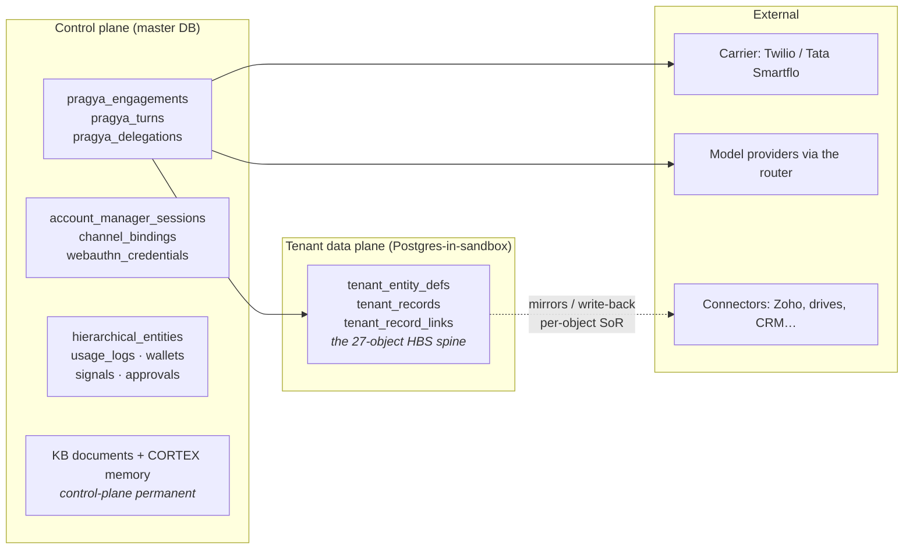

Pragya **reads and writes control-plane state directly** (her engagement, turns, delegations, sessions). She reaches **tenant records only through child entities** and the record service — she never issues a raw record write, because that write would carry no entity-level ownership under §23.1's owner-writes/others-propose rule.

---

## 5. The turn loop — the fork and what it does not fork

### 5.1 Why the fork exists

The shipped eight-stage AgentLoop is a **task** engine over a bounded unit of work. Increment 3 ran Pragya on it because it was there, and four symptoms appeared that looked like separate bugs and were not:

```mermaid
graph TD
    CAUSE["<b>ONE CAUSE</b><br/>a task loop was asked to run<br/>a months-long relationship"]
    CAUSE --> S1["Post-call deferred runs needed<br/><b>Strategize</b> and <b>Decide</b> — stages with<br/>no post-hoc meaning"]
    CAUSE --> S2["Stage advancement had nowhere to live —<br/>Decide decides about a <i>task</i>,<br/>not an engagement"]
    CAUSE --> S3["Artifact extraction had no home,<br/>same reason"]
    CAUSE --> S4["Reflection over a <i>conversation</i> ≠<br/>reflection over a <i>task</i> → an<br/>undrainable queue"]
    S1 & S2 & S3 & S4 --> FIX["<b>Fork the orchestration.<br/>Keep everything else.</b>"]
    style CAUSE fill:#2d1f1f,stroke:#a33
    style FIX fill:#1f2d1f,stroke:#4a9
```

### 5.2 The eight steps

```mermaid
flowchart TD
    IN["Turn(text, channel_kind, channel_address)"] --> S1

    S1["<b>1. Resolve</b><br/>session + engagement<br/><code>get_or_create_session</code> · <code>get_or_create_engagement</code>"]
    S1 --> UNB{"channel<br/>resolved?"}
    UNB -->|no| REF1["UNBOUND_REFUSAL<br/><i>nothing about this tenant is computed<br/>for someone we cannot identify</i>"]
    UNB -->|yes| ADM{"wallet ≥<br/>$0.02?"}
    ADM -->|no| REF2["OUT_OF_CREDIT<br/><i>admission before the model call —<br/>spending first is how a wallet goes negative</i>"]
    ADM -->|yes| S2

    S2["<b>2. Assemble context</b><br/>recent_turns(20) + engagement artifacts<br/>+ CORTEX retrieval"]
    S2 --> S3["<b>3. Classify intent → tier</b><br/><code>_extract_command</code> (model)<br/>+ <code>screen_text</code> (keyword, can only raise)"]
    S3 --> S4["<b>4. Authorise</b><br/><code>require_tier(session, tier)</code>"]
    S4 --> AUTHOK{"allowed?"}
    AUTHOK -->|no| REF3["refusal_copy(decision, command)<br/>+ needs_step_up / needs_oob"]
    AUTHOK -->|yes| S5

    S5["<b>5. LLM turn</b> ← <i>the ONLY model call on the path</i><br/>tools = child_schemas(available_children)"]
    S5 --> TOOLS{"tool calls?"}
    TOOLS -->|ask_colleague| DELEG["delegate() → ExecutionRun<br/>under the <b>child's</b> governance"]
    TOOLS -->|direct tool| GATE["PolicyGate → shared executor"]
    TOOLS -->|none| S6
    DELEG --> S6
    GATE --> S6

    S6["<b>6. Extract artifacts</b><br/>per-stage schema from the script<br/><i>second, cheap model call OFF the reply path</i>"]
    S6 --> S7["<b>7. Maybe advance the stage</b><br/><code>evaluate_eligibility</code>"]
    S7 --> S8["<b>8. Meter</b><br/><code>usage_logs</code> · PRAGYA_TURN · tenant-initiated"]
    S8 --> OUT["TurnOutcome → channel adapter"]

    style S5 fill:#1f2d3d,stroke:#4a90d9,stroke-width:2px
    style S4 fill:#2d2a1f,stroke:#d9a,stroke-width:2px
    style REF1 fill:#2d1f1f,stroke:#a33
    style REF2 fill:#2d1f1f,stroke:#a33
    style REF3 fill:#2d1f1f,stroke:#a33
```

> **Ordering is a safety property, not a style choice.** Classify and authorise **before** generating. A model that has already promised to pause a process, and only then discovers it may not, has to be corrected in front of the owner. The same reason drives SSE: `/chat/stream` streams a **resolved** turn, chunked to the client — streaming generation directly would let tokens reach the wire before the tier was checked, so a refusal could arrive mid-sentence.

### 5.3 Task loop vs conversation loop — the cost comparison

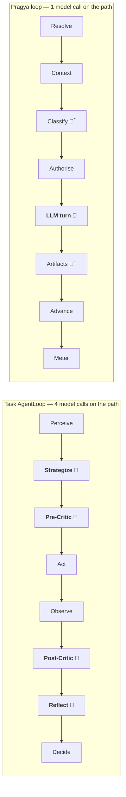

<sup>*</sup> the classification call is small, temperature-0, tool-only. <sup>†</sup> artifact extraction runs **after** the reply is fixed, so its latency is invisible to the owner and its failure costs state, not a response.

### 5.4 A complete console turn, in sequence

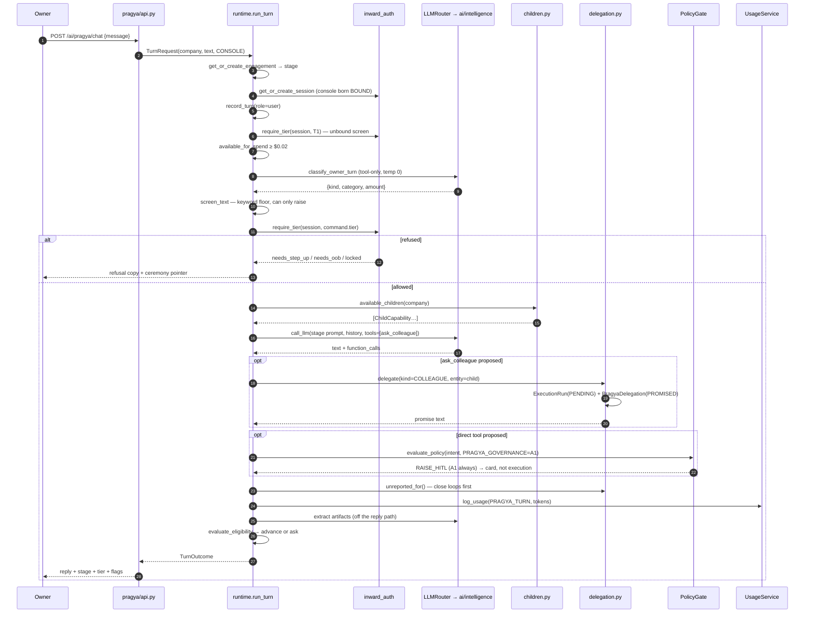

### 5.5 The seam — locked rows (Inc-4 §3)

Every 🔒 row is a charter decision. Changing one is an amendment, not a refactor.

```mermaid
graph TB
    subgraph FORKED["✅ Forked — Pragya-specific"]
        F1["Turn orchestration"]
        F2["Engagement / stage state"]
        F3["Channel adapters"]
        F4["Context assembly"]
        F5["Artifact extraction"]
        F6["Stage advancement"]
    end
    subgraph LOCKED["🔒 Shared — called, never wrapped, subclassed or shadowed"]
        L1["PolicyGate + authority matrix"]
        L2["inward_auth — tiers, require_tier, bindings"]
        L3["Tool registry + executor + sandbox"]
        L4["Billing — usage_logs, holds, envelopes"]
        L5["CORTEX / memory + retrieval"]
        L6["Signal bus"]
        L7["Meta-Agent (Architecture Board)"]
        L8["HITL / Judgment Desk"]
    end
    NOTE["<i>If a shared component needs a change to serve her,<br/>the change lands in the shared component<br/>and both callers get it.</i><br/><br/>Worked example: <code>available_for_spend</code> was<br/><b>extracted</b> into <code>loop/wallet_holds</code>, not copied<br/>into Pragya's module."]
    LOCKED --- NOTE
    style LOCKED fill:#1f2d1f,stroke:#4a9,stroke-width:2px
    style FORKED fill:#2d2a1f,stroke:#d9a
```

---

## 6. Governance — two gates, one taxonomy

This is the single most misunderstood part of the design, so it gets its own diagram. **There are two gates and they ask different questions.**

```mermaid
graph TB
    CAT["<b>governance/authority.py</b><br/>CATEGORY_RULES — ONE taxonomy<br/>payout · refund · discount · contract · price_change<br/>vendor_creation · data_deletion · employment_offer<br/>public_statement · regulatory_filing · email_dispatch"]

    CAT --> G1
    CAT --> G2

    subgraph G1["Gate 1 — the AGENT gate"]
        Q1["<b>May this agent do this?</b>"]
        PG["<code>PolicyGate.evaluate_policy(intent, governance)</code><br/>pure function · microseconds<br/>PASS | RAISE_HITL | BLOCK"]
        Q1 --- PG
    end

    subgraph G2["Gate 2 — the HUMAN gate"]
        Q2["<b>Did this human prove enough to ask?</b>"]
        TC["<code>inward_auth.tiers.classify(intent) → T0…T3</code><br/>pure · IntEnum · every rule can only <b>raise</b><br/>then <code>sessions.require_tier(session, tier)</code>"]
        Q2 --- TC
    end

    G1 --> ACT["agent acts / card raised"]
    G2 --> CMD["command runs / step-up demanded"]

    MEET["<b>Where they meet:</b> both read CATEGORY_RULES.<br/>Nothing else is shared — and that is the point.<br/><i>A payout approval must pass BOTH: the agent's<br/>gate raised the card; the human's gate decides<br/>whether the click that answers it counts.</i>"]
    ACT --- MEET
    CMD --- MEET

    style G1 fill:#1f2d3d,stroke:#4a90d9
    style G2 fill:#2d1f2d,stroke:#a4a
    style CAT fill:#2d2a1f,stroke:#d9a,stroke-width:2px
```

### 6.1 The act path — four steps, one auditable route

```mermaid
flowchart LR
    LLM["LLM proposes<br/>a tool call"] --> GP["<code>acting.gate_proposal</code><br/>→ <code>evaluate_policy</code>"]
    GP -->|PASS| EX["shared ToolExecutor<br/>→ observe → continue"]
    GP -->|RAISE_HITL| CARD["raise the card<br/>tell the owner<br/><b>do NOT execute</b>"]
    GP -->|BLOCK| DEC["decline plainly"]
    CARD --> JD["Judgment Desk<br/>/ai/approvals"]
    JD -.->|"never returns over<br/>the issuing channel"| CARD

    style GP fill:#2d2a1f,stroke:#d9a,stroke-width:2px
    style CARD fill:#2d1f1f,stroke:#a33
```

At `A1` with no authority bands — Pragya's permanent governance — the gate's answer for **any** categorised act is `RAISE_HITL`. So the practical shape of her act path is: *propose → card → tell the owner → settle at the desk*.

### 6.2 Structural containment (T2, revised during build)

The original design made `GateDecision` a **required argument** of the shared executor. Investigation found six existing call sites (`step_executor` ×4, `voice`, `resilience`), *all* already gated upstream by `gate_and_maybe_stop` inside the critic pipeline. Threading a parameter through the Solo Pack's revenue path would have been a large, risky change defending a risk that does not exist.

The risk that **does** exist is a second call site appearing inside `ai/pragya/` that skips `acting.run_tool_calls`. T2 therefore became an **import-boundary test**:

```mermaid
graph LR
    subgraph BOUND["Import boundary over ai/pragya/ — CI-enforced"]
        R1["exactly ONE module<br/>may reach ToolExecutor"]
        R2["NO module may reimplement<br/>CATEGORY_RULES"]
        R3["<code>acting</code> must import the platform gate,<br/>never a local one"]
    end
    BOUND --> PROOF["Verified to <b>fail on an injected violation</b>,<br/>not merely to pass.<br/><i>A checker never observed to fail<br/>is a function that returns True.</i>"]
    style PROOF fill:#1f2d1f,stroke:#4a9
```

---

## 7. Authentication and the impact-tier ladder

**The shape:** *channel identity routes, verification authorizes.* Identity is never carried further than its proof strength.

### 7.1 The ladder

```mermaid
graph TB
    T0["<b>T0</b> — general questions, no tenant data<br/>🔓 no verification"]
    T1["<b>T1</b> — reads, reports, routine work assignment<br/>🔑 bound channel identity + session continuity"]
    T2["<b>T2</b> — payment approvals · autonomy raises · pause/resume<br/>bank details · bulk data ops · <b>connector bindings</b><br/>🔐 step-up: WebAuthn passkey (TOTP fallback) → 10-min elevation"]
    T3["<b>T3</b> — loop kill-switch · above-band payouts · regulatory filings<br/>🔐🔐 step-up <b>plus</b> out-of-band confirmation on a <i>second</i> registered channel"]

    T0 --> T1 --> T2 --> T3

    RULE["<b>Tier = max() of every floor that applies.</b><br/>Tier is an IntEnum, so 'ambiguous → the highest tier it could be'<br/>falls out of the structure rather than being a special case<br/>a later edit can forget.<br/><br/>Three fail-up paths are pinned by goldens:<br/>unknown intent kind · category outside the §20 matrix ·<br/>high-impact category with an unknown amount."]
    T3 --- RULE
    style RULE fill:#2d2a1f,stroke:#d9a
    style T3 fill:#2d1f1f,stroke:#a33
```

### 7.2 The session state machine

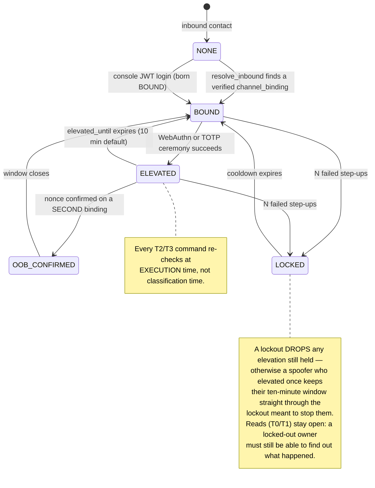

### 7.3 Channel ceilings — the same session, different reach

```mermaid
graph TB
    subgraph CEIL["Per-channel tier ceilings"]
        C1["<b>Console</b> — up to T3<br/>the browser IS the authenticator surface"]
        C2["<b>Voice</b> — ceiling T1<br/>can NEVER self-elevate · T3 unavailable entirely"]
        C3["<b>WhatsApp</b> ⬜ — T1 + step-up link<br/>certified surfaces never render here (Vihara §14.3)"]
        C4["<b>Private Line</b> ✳ — T2 via biometric + passkey<br/>T3 shows the second-channel wait explicitly"]
    end
    ORD["<b>The ceiling is checked BEFORE the session state.</b><br/>Checked second, an elevation earned in the console<br/>would carry onto the next phone call.<br/><code>test_an_elevation_earned_elsewhere_does_not_reach_the_phone</code>"]
    CEIL --- ORD
    style C2 fill:#2d1f1f,stroke:#a33
    style ORD fill:#2d2a1f,stroke:#d9a
```

### 7.4 A T2 command over voice — the full ceremony

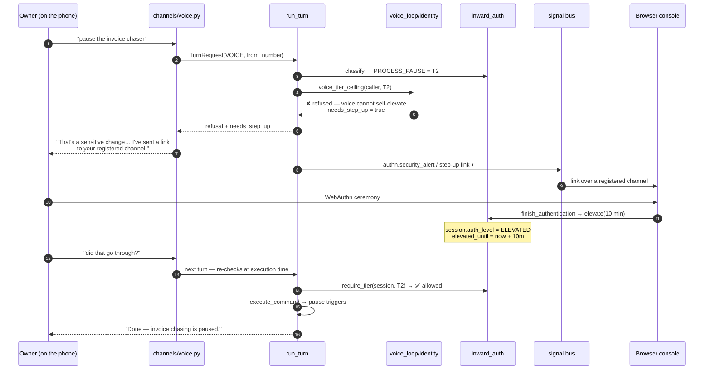

> **Note on the pause semantics (Inc-3 delta 4):** pausing **disarms triggers; it does not delete them.** Inbound work still arrives and *parks*, so resuming picks up rather than starting from a gap — the same parked-not-dropped posture as C5's read-only dunning state.
>
> **And on scope (Inc-3 delta 3):** an unscoped pause **asks instead of assuming "everything"**. Only the kill switch and an owner who literally said "everything" reach `ALL_TRIGGERS`. Resolving ambiguity toward the broadest destructive action is the worst available guess.

### 7.5 The REST half — VG-05, closing now

Increment 3 wired `require_tier` into **Pragya**, so *asking* for a sensitive act in conversation cost a ceremony. Nothing wired it into the **HTTP surface**, so *clicking* the same act cost nothing.

```mermaid
graph LR
    subgraph BEFORE["Before (the live gap)"]
        B1["Pragya: 'approve that payout'<br/>→ T2 → step-up ceremony ✅"]
        B2["Console: click Approve<br/>→ get_current_user only ❌"]
    end
    subgraph AFTER["After — inward_auth/guard.py"]
        A1["<code>enforce_tier(db, user, intent)</code><br/>a reusable FastAPI dependency"]
        A2["POST /ai/approvals/{id}/respond → intent_for_approval(snapshot)"]
        A3["POST /ai/connectors/{id}/bind → CONNECTOR_BINDING (T2)"]
        A4["PUT /ai/entities/{id} → raises_autonomy? → AUTONOMY_RAISE (T2)"]
        A5["POST /ai/onboarding/activate → BULK_DATA_OPERATION"]
    end
    BEFORE --> AFTER
    style B2 fill:#2d1f1f,stroke:#a33
    style AFTER fill:#1f2d1f,stroke:#4a9
```

The supporting change is small and precise: `GateDecision` now carries the **`amount`** it compared against the band, and the PolicyGate writes it into the approval's `context_snapshot`. Without the amount, a high-impact approval would fail up to T3 *by artifact* rather than by policy — the human gate would demand out-of-band confirmation for a within-band refund simply because it could not see the number the agent gate already had.

**Status:** in the working tree at time of writing (`inward_auth/guard.py` new; `policy_gate.py`, `tiers.py`, `intents.py`, `router.py`, `service.py`, `connectors/router.py`, `intelligence/api.py` modified). This is Inc-6 charter decision 5 — *pulled forward as standalone hardening*.

---

## 8. The nine-stage engagement

### 8.1 The machine

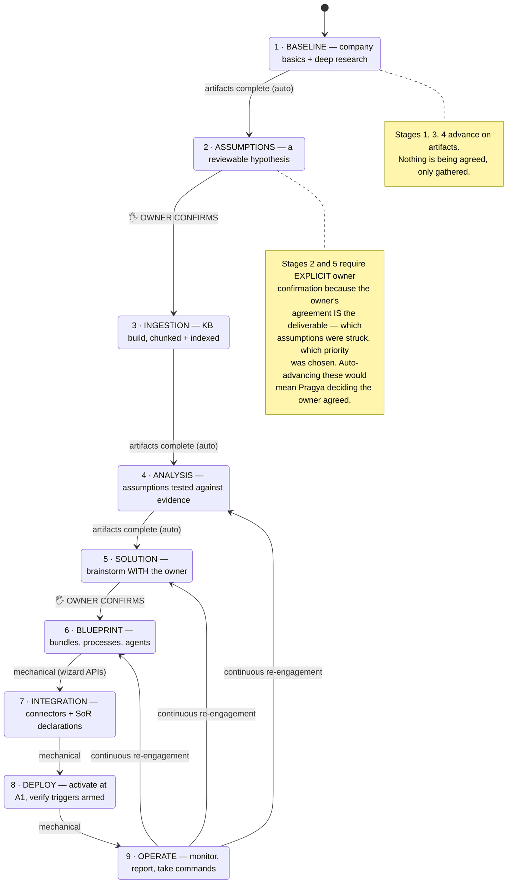

### 8.2 Stage → backend map

Pragya's stages are **a conversation over the Inc-2 wizard's step APIs, not a rebuild.** `solo_pack/onboarding.py` was authored as her stage contract; Increment 3 was a conversation over it (Inc-2 decision 4 — no contract fork).

| Stage | Backend she drives | Primary artifact key | Advancement |
|---|---|---|---|
| 1 Baseline | company profile + Web Intelligence Suite (via a `RESEARCH` delegation ◐) | `baseline.research_summary` | auto |
| 2 Assumptions | conversation state (session artifacts) | `assumptions.list` | 🖐 confirm |
| 3 Ingestion | shipped documents/KB + RETR chunking | `ingestion.received` | auto |
| 4 Analysis | KB retrieval + session artifacts | `analysis.verdicts` | auto |
| 5 Solution | conversation + envelope admin view | `solution.priorities` | 🖐 confirm |
| 6 Blueprint | `list_bundles` + `governance_preview` | blueprint selection | mechanical |
| 7 Integration | connection routers (wizard step 2) + SoR declarations | readiness | mechanical |
| 8 Deploy | `activate_for_company` + `onboarding_status` | activation | mechanical |
| 9 Operate | signals, approvals, `ai/kpi/business` | — (continuous) | re-enterable |

> **Decision 9 (Inc-4):** *Stage 3's primary artifact stays `ingestion.received`.* Asking for documents is not ingestion; getting them is. A stage 3 in which the owner shares nothing does not auto-advance — that is the intended behaviour, not a bug.

### 8.3 The advancement predicate

```mermaid
flowchart TD
    T["turn completes"] --> EX["extract artifacts<br/>(model call, off the reply path)"]
    EX --> EV["<code>evaluate_eligibility(stage, artifacts)</code><br/><b>deterministic — no model call</b>"]
    EV --> P{"primary key has<br/><code>_has_substance</code>?"}
    P -->|no| WAIT["stay in stage"]
    P -->|yes| SEC{"secondary keys have<br/><code>_has_content</code>?"}
    SEC -->|no| WAIT
    SEC -->|yes| CONF{"stage ∈<br/>CONFIRM_STAGES<br/>{2, 5}?"}
    CONF -->|yes| ASK["append <code>advancement_prompt(stage)</code><br/>awaiting_confirmation = true"]
    CONF -->|no| REFL["<code>reflect_on_stage</code> FIRST<br/><i>a closing stage is the only moment its<br/>conversation is complete and still current</i>"]
    REFL --> ADV["<code>advance()</code> → next stage"]

    NOTE["<b>Two content bars, deliberately asymmetric</b> (Inc-4 delta 3):<br/><code>_has_content</code> (secondary) accepts an empty list —<br/>'which assumptions did the owner strike? none' is a complete answer.<br/><code>_has_substance</code> (primary) does not —<br/>'my assumptions about this business: none' is a stage that produced nothing."]
    SEC --- NOTE
    style EV fill:#1f2d1f,stroke:#4a9
    style NOTE fill:#2d2a1f,stroke:#d9a
```

> **The split that keeps this honest:** the prose `exit_criteria` in each script stay what they are — instructions the model reads. The **artifact keys** are the machine-checkable half. A predicate over prose would be an LLM grading itself.

### 8.4 Onboarding as world-building (the Vihara end state)

In the end state, the nine stages are not a wizard at all — they are **the estate being built in front of the tenant** (Vihara §15.1). There are no setup forms; the same step APIs are driven conversationally while the world renders.

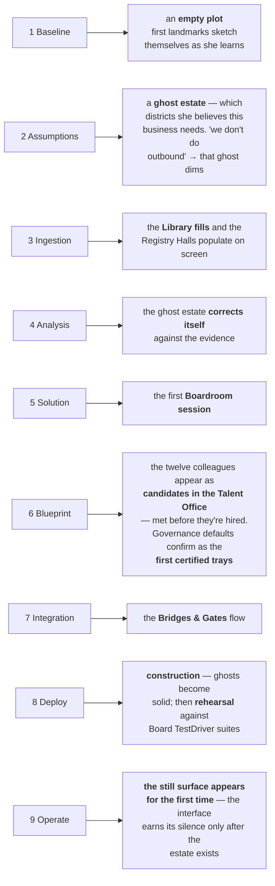

**Status:** ✳ specified in Vihara §15.1, gated behind G0–G6. The *backend* it drives is ✅ built (the step APIs, the stage machine, the artifact extraction).

---

## 9. Child entities — the capability surface

This is the architectural centre of the end state, and the answer to *"how will she interact with the child entities."*

### 9.1 Decision 6 — she proposes no raw tools

> **Pragya proposes no raw tools. Her surface is her child entities.** (Rahul, 2026-07-22, mid-build)

She does not get a curated allowlist of platform tools. She gets the ability to **call child entities** that *wrap* tools. Three properties fall out, and they are why this beats an allowlist:

```mermaid
graph TB
    subgraph OPT_A["❌ Option A — a curated tool allowlist"]
        A1["web_search · scraper · record_read ·<br/>record_write · calendar · document_get"]
        A2["Governance carried: <b>none</b>.<br/>A tool list has no autonomy level,<br/>no authority band, no SoD class,<br/>no memory domain."]
        A3["Would need a second, weaker governance<br/>story bolted beside the real one."]
        A4["Extending her = editing her loop."]
    end
    subgraph OPT_B["✅ Option B — child entities (chosen)"]
        B1["one <code>ask_colleague</code> tool over<br/>the tenant's actual entities"]
        B2["Governance carried: <b>all of it</b>.<br/>A child is a hierarchical_entities row<br/>with autonomy, bands, SoD class<br/>and memory domains."]
        B3["'Tools' and 'delegation' collapse into<br/><b>one mechanism</b> — calling a child<br/><i>is</i> dispatching a run."]
        B4["Extending her = <b>a new entity</b>.<br/>Nothing in her loop changes when the<br/>deep-research child ships."]
    end
    style OPT_A fill:#2d1f1f,stroke:#a33
    style OPT_B fill:#1f2d1f,stroke:#4a9
```

### 9.2 How the surface is generated — per tenant, per turn

```mermaid
flowchart TD
    START["run_turn step 5, before the model call"] --> FIND["<code>available_children(db, company_id)</code>"]
    FIND --> P{"tenant has a<br/>Pragya entity?"}
    P -->|yes| Q1["children = entities WHERE<br/>parent_id = pragya.id"]
    P -->|no| Q2["children = entities WHERE<br/>name ILIKE '%meta%agent%'"]
    Q1 --> FILT
    Q2 --> FILT
    FILT["filter: type ∈ {AGENT, PROCESS} AND status = ACTIVE<br/><i>a SKILL or ACTION is a fragment of work,<br/>not a colleague with a job</i>"]
    FILT --> EMPTY{"any?"}
    EMPTY -->|no| NONE["<code>child_schemas</code> returns <b>[]</b><br/>→ she is handed <b>no capability tool at all</b>,<br/>rather than one she cannot use"]
    EMPTY -->|yes| SCHEMA["ONE tool: <code>ask_colleague</code><br/>colleague: <b>enum</b>[handles]<br/>task: string · subject: string"]
    SCHEMA --> WHY["<b>Why one tool with an enum, not one tool per child:</b><br/>the enum makes proposing a non-existent colleague<br/><i>impossible at the schema level</i>, instead of<br/>something to validate after the fact."]

    style NONE fill:#2d2a1f,stroke:#d9a
    style WHY fill:#1f2d1f,stroke:#4a9
```

> **Forgiving resolution, deliberately.** A tenant with a seeded Pragya entity has children parented to her; one without still has a Meta-Agent. Requiring a particular tree shape would mean Pragya silently losing every capability on a tenant whose hierarchy was seeded slightly differently.

### 9.3 The delegation lifecycle

```mermaid
stateDiagram-v2
    [*] --> PROMISED: delegate() — ExecutionRun(PENDING) + row written
    PROMISED --> DONE: the run completes
    PROMISED --> FAILED: the run errors
    DONE --> REPORTED: mark_reported — the owner was TOLD
    FAILED --> REPORTED: reported as plainly as a success
    REPORTED --> [*]
    note right of PROMISED
        The promise is a ROW, not a sentence.
        A model that says "I'm building that"
        has committed the platform to something
        CHECKABLE.
    end note
    note right of DONE
        reported_at is separate from completed_at
        ON PURPOSE. Work that finished but was
        never reported back is the failure this
        table is designed to make visible.
    end note
```

The five kinds are a **closed set** — "delegate anything" would make her a general job-submission surface, which is a much larger thing to reason about than an account manager who can start five known operations.

| Kind | What it starts | Status |
|---|---|---|
| `RESEARCH` | stage-1 deep company research | ◐ dispatches/promises/reports, **no executor** — nothing calls `web_search`/`scraper_tool`, so it sits `PROMISED` |
| `CAPABILITY_BUILD` | the Meta-Agent Architecture Board | ✅ |
| `BULK_INGEST` | stage-3 connected-source pull | ◐ |
| `ACTIVATION` | stage-8 bundle activation | ✅ |
| `COLLEAGUE` | work handed to a named child entity (decision 6) | ✅ |

### 9.4 Dispatch → promise → report, in sequence

```mermaid
sequenceDiagram
    autonumber
    participant O as Owner
    participant RT as run_turn
    participant CH as children.py
    participant DG as delegation.py
    participant DB as execution_runs
    participant W as arq worker
    participant CHILD as Child entity (own governance)
    participant PG as PolicyGate
    participant SIG as signal bus

    O->>RT: "can you find out what our competitors charge?"
    RT->>CH: available_children
    CH-->>RT: [meta_agent, research_desk, records_clerk]
    RT->>RT: LLM turn with ask_colleague(enum)
    RT-->>RT: function_call: {colleague: research_desk,<br/>task: "…", subject: "competitor pricing"}
    RT->>CH: resolve_child(children, "research_desk")
    alt handle unknown
        CH-->>RT: None → the proposal is DROPPED
        Note over RT: Handing work to a plausible-looking<br/>wrong entity is worse than handing it to none.
    else resolved
        CH-->>RT: ChildCapability
        RT->>DG: delegate(COLLEAGUE, entity, task, subject)
        DG->>DB: ExecutionRun(entity_id=child, status=PENDING)
        Note over DG,DB: the SAME run shape the signal dispatcher creates —<br/>starting work from a conversation is indistinguishable<br/>from starting it from a signal
        DG->>DG: PragyaDelegation(PROMISED, promise text)
        DG-->>RT: "I've put competitor pricing to a colleague…"
        RT-->>O: reply + the promise
    end

    Note over DG,W: enqueued by the caller AFTER commit —<br/>enqueueing inside the transaction races the worker,<br/>which can pick the job up before the row is visible

    W->>CHILD: drive the run
    CHILD->>PG: evaluate_policy under the CHILD's governance
    Note over CHILD,PG: Pragya's A1 does NOT apply here.<br/>She is the caller, not the actor.
    CHILD->>SIG: completion signal
    SIG->>DG: complete(delegation_id, result)

    O->>RT: (next turn — anything)
    RT->>DG: unreported_for(company)
    DG-->>RT: [the finished delegation]
    RT->>RT: report prefixed to the reply — the loop she<br/>opened closes FIRST
    RT->>DG: mark_reported
    RT-->>O: "Update on competitor pricing: …" + the answer to whatever was just asked
```

### 9.5 The governance handover — the crucial property

```mermaid
graph TB
    P["<b>Pragya</b><br/>governance: A1, authority = None"]
    P -->|"delegate()"| RUN["ExecutionRun<br/>entity_id = child.id"]
    RUN --> C["<b>Child entity</b><br/>its OWN governance:<br/>autonomy_level · authority bands<br/>SoD class · memory_domains"]
    C --> GATE["PolicyGate evaluates against<br/>the <b>child's</b> governance"]

    X1["❌ Pragya's authority is NOT lent downward.<br/>She has none to lend."]
    X2["❌ The child's authority is NOT borrowed upward.<br/>Pragya cannot do through a child<br/>what she may not do herself, because<br/>the child's gate is evaluated on the<br/><i>child's</i> act, not on her request."]
    X3["✅ The tier ceiling of the ASKING channel<br/>still bounds what she may ask for.<br/>A T1 voice session cannot commission<br/>a T2 act by phrasing it as delegation."]

    GATE --- X1
    GATE --- X2
    GATE --- X3
    style X1 fill:#2d1f1f,stroke:#a33
    style X2 fill:#2d1f1f,stroke:#a33
    style X3 fill:#1f2d1f,stroke:#4a9
```

### 9.6 The Meta-Agent — the special child

The Architecture Board is seven sequential roles. That is **minutes, not a conversational turn**, so it can never run inline.

```mermaid
sequenceDiagram
    autonumber
    participant O as Owner
    participant P as Pragya
    participant B as Architecture Board (7 roles)

    O->>P: "I need something that watches for GST rate changes"
    P->>P: recognise: no capability exists
    P->>B: dispatch as a normal execution run<br/>(implementation UNTOUCHED)
    P-->>O: "You don't have anything that does that yet,<br/>so I'm having it built. That takes a few minutes<br/>and it gets reviewed before it goes anywhere<br/>near your data — I'll tell you when it's ready."
    Note over B: RequirementChat → Curator → Architect →<br/>Critic → Validator → TestDriver → Promoter
    B->>B: anti-sprawl guard · registry search (reuse-before-create)<br/>hostile/boundary suites · golden capture
    B-->>P: completion signal
    P-->>O: (next turn) "That GST watcher is ready. It starts at A1,<br/>so it'll propose and you'll approve until it earns more."
```

**"Promise, don't complete" is the general form**, and the same mechanism covers **every** long operation: deep research (stage 1), bundle activation, board builds, bulk ingestion. One mechanism, not four.

### 9.7 The end-state child family

Today the family is effectively `{Meta-Agent}` plus whatever AGENT/PROCESS entities the tenant has under her. The designed end state (Inc-4 decision 6, "designed in a later pass"):

```mermaid
graph TB
    P["<b>HUB-PRAGYA</b>"]
    P --> M["<b>Meta-Agent</b><br/>Architecture Board ✅<br/><i>builds capabilities that don't exist</i>"]
    P --> R["<b>Research Desk</b> ⬜<br/><i>wraps the Web Intelligence Suite;<br/>the missing executor for<br/>DelegationKind.RESEARCH</i>"]
    P --> D["<b>Records &amp; Documents Clerk</b> ⬜<br/><i>wraps tenant_record read/write and<br/>the KB — under owner-writes/others-propose</i>"]
    P --> S["<b>Scheduling &amp; Assignment</b> ⬜<br/><i>assigns work to other agents;<br/>the routine-work-assignment path (T1)</i>"]
    P -.->|"NOT children —<br/>reached via the signal bus"| K["KAR-01/02/03<br/>Karuna gateways"]
    P -.->|"NOT children —<br/>observed, reported on,<br/>paused/demoted by command"| WF["The 12 Solo Pack<br/>workforce agents"]

    style M fill:#1f2d1f,stroke:#4a9
    style R fill:#2d2a1f,stroke:#d9a
    style D fill:#2d2a1f,stroke:#d9a
    style S fill:#2d2a1f,stroke:#d9a
```

### 9.8 The four relationships she has with entities — a summary table

| Relationship | Mechanism | Governance evaluated against | Status |
|---|---|---|---|
| **Delegate to** (children) | `ask_colleague` → `delegate()` → `ExecutionRun` | the **child's** | ✅ |
| **Command** (any entity) | `execute_command` behind `require_tier` — pause/resume triggers, demote one level | the **owner's tier**, then the platform's demotion policy | ✅ |
| **Observe** (any entity) | signal bus subscriptions, `execution_runs`, `usage_logs`, `/ai/kpi/business` | n/a — reads | ✅ |
| **Report on** (any entity) | stage-9 operating report: KPIs, HITL queue, `governance.autonomy_demoted` | n/a | ✅ |

And the two she structurally **cannot** have: **approve** for an entity (Judgment Desk only) and **promote** an entity's autonomy (needs §9.7 evidence + a random deep-audit sample).

---

## 10. Channels — one loop, many transports

### 10.1 The adapter contract

```mermaid
graph LR
    subgraph IN["Inbound normalisation"]
        I1["console: JWT + JSON body"]
        I2["voice: audio → ASR → final transcript"]
        I3["whatsapp: webhook payload ⬜"]
        I4["Line: thread message ✳"]
    end
    TR["<b>TurnRequest</b><br/>company_id · text · user_id<br/>channel_kind · channel_address · session?"]
    LOOP["<b>run_turn</b> — the ONE loop"]
    TO["<b>TurnOutcome</b><br/>reply · stage · auth_level · tier · command<br/>decision · tool_results · needs_step_up · needs_oob<br/>raised_approval · cost_usd · artifacts_written<br/>advanced_to · awaiting_confirmation<br/>reported_delegations · delegated"]
    subgraph OUT["Outbound rendering"]
        O1["console: JSON / SSE chunks"]
        O2["voice: TTS stream + barge-in"]
        O3["whatsapp: text + step-up link ⬜"]
        O4["Line: cards + certified trays ✳"]
    end
    I1 & I2 & I3 & I4 --> TR --> LOOP --> TO --> O1 & O2 & O3 & O4

    RULE["<b>A channel is a transport, not a policy.</b><br/><code>channels/voice.py</code> contains no authorisation logic at all.<br/>Every authorisation question is answered where it already was."]
    LOOP --- RULE
    style LOOP fill:#1f2d3d,stroke:#4a90d9,stroke-width:3px
    style RULE fill:#1f2d1f,stroke:#4a9
```

### 10.2 Cross-channel continuity

`account_manager_sessions` + `pragya_turns` + CORTEX episodic memory make a conversation **portable**: started at the desk, continued on the Line, finished on a call — with zero repeated context. `pragya_turns` is persisted rather than held in memory precisely because *the engagement spans months and channels*, and stage 4's re-entry needs to know what was already said.

---

## 11. Voice and telephony — the reuse ledger

### 11.1 The headline

> **Pragya's voice face reuses roughly 70% of the shipped `src/voice/` module by volume** — the entire carrier, media, session, number, transcript and metering plane. She replaces the ~19% that is the **realtime speech-to-speech engine layer** with a **579-line** ASR-LLM-TTS pipeline of her own. The remaining ~9% (WhatsApp) is available and not yet adapted.

LOC is a rough proxy, but the *shape* of the split is exact and deliberate.

### 11.2 The layer diagram — what is shared and what forks

```mermaid
graph TB
    subgraph CARRIER["① Carrier plane — 100% SHARED ✅"]
        C1["webhook_router.py (1,166)<br/>Twilio + Tata inbound webhooks, TwiML,<br/>status callbacks, WhatsApp webhooks"]
        C2["twilio_api.py (77) · tata_auth.py (120)<br/>carrier auth, JWT (incl. the hangup token)"]
        C3["voice/main.py (278)<br/>the :8002 streaming service"]
    end

    subgraph MEDIA["② Media plane — 100% SHARED ✅"]
        M1["websocket_handler.py (2,015)<br/>BaseStreamHandler → Twilio / Tata<br/>20 ms PCM frames, backpressure cap, disk-streamed recording"]
        M2["audio_processor.py (226)<br/>μ-law 8 kHz ↔ PCM16 16 kHz ↔ PCM24 24 kHz"]
    end

    subgraph SESSION["③ Session &amp; number plane — 100% SHARED ✅"]
        S1["session_manager.py (415) — VoiceSession + Redis"]
        S2["phone_pool_models.py (75) + routers (1,524)<br/>phone_numbers: available → claimed → assigned"]
        S3["conversation_logger.py (266) · transcript_api.py (158)"]
        S4["usage_logger.py (334) — call minutes → usage_logs"]
        S5["call_guards.py (275) — voicemail, activity, end-call tool"]
    end

    subgraph ENGINE["④ Engine plane — THE FORK ⚡"]
        direction LR
        E1["<b>KAR-01 (outward)</b><br/>gemini_live.py (348)<br/>azure_realtime.py (360)<br/>live_client_factory.py (200)<br/>agent_loader.py (574)<br/><i>realtime speech-to-speech</i>"]
        E2["<b>Pragya (inward)</b><br/>channels/speech.py (194)<br/>channels/voice.py (199)<br/>channels/routing.py (165)<br/><i>ASR → LLM → TTS</i>"]
    end

    subgraph GOV["⑤ Governance plane — DIFFERENT, by design"]
        G1["<b>KAR-01:</b> voice_loop/ (1,189)<br/>collapsed profile · live_gate · handoff<br/>deferred post-call run"]
        G2["<b>Pragya:</b> pragya/runtime.py<br/>full turn loop, unchanged from console"]
    end

    CARRIER --> MEDIA --> SESSION --> ENGINE --> GOV
    style CARRIER fill:#1f2d1f,stroke:#4a9
    style MEDIA fill:#1f2d1f,stroke:#4a9
    style SESSION fill:#1f2d1f,stroke:#4a9
    style ENGINE fill:#2d2a1f,stroke:#d9a,stroke-width:3px
```

### 11.3 The reuse ledger in detail

| Plane | Component | LOC | Pragya's use |
|---|---|---|---|
| Carrier | `webhook_router.py` | 1,166 | ✅ **reused unchanged** — same inbound webhook, same TwiML, same status callbacks; the Pragya branch is added *inside* it |
| Carrier | `twilio_api.py`, `tata_auth.py` | 197 | ✅ reused — including the Smartflo hangup-token path |
| Carrier | `voice/main.py` | 278 | ✅ reused — same `:8002` streaming service, same `/stream/{provider}/{session_id}` URL scheme |
| Media | `websocket_handler.py` | 2,015 | ◐ **to be reused** — `BaseStreamHandler`'s frame pump is exactly what `drive_call` needs; **the wiring is the open piece** |
| Media | `audio_processor.py` | 226 | ✅ reused — μ-law↔PCM is codec work, identical for both engines |
| Session | `session_manager.py` | 415 | ✅ reused — `VoiceSession` rows and Redis keys are engine-agnostic |
| Session | `phone_pool_models.py` + `phone_pool_router.py` + `phone_number_router.py` | 1,599 | ✅ **reused as the routing discriminator** — Pragya's number is a normal `phone_numbers` row assigned to her entity |
| Session | `conversation_logger.py`, `transcript_api.py` | 424 | ✅ reused for call transcripts |
| Session | `usage_logger.py` | 334 | ✅ reused for call-minute cost; her *model* tokens meter separately under `PRAGYA_TURN` |
| Session | `call_guards.py` | 275 | ✅ partially reused — barge-in and end-call semantics; the voicemail/disposition logic is outbound-campaign-specific |
| Session | `sessions_router.py`, `models.py` | 826 | ✅ reused — session admin and ORM |
| Engine | `gemini_live.py`, `azure_realtime.py`, `live_client_*.py`, `gemini_mock.py`, `agent_loader.py` | 1,869 | ❌ **not used** — this is the realtime S2S layer Pragya deliberately does not take |
| Engine | `gemini_text.py` | 228 | ❌ not used by voice (WhatsApp-side) |
| Messaging | `whatsapp_handler.py`, `whatsapp_messaging.py`, `messaging_router.py` | 1,038 | ⬜ **available, not yet adapted** — her WhatsApp face is the next channel adapter |
| **New for Pragya** | `pragya/channels/{speech,voice,routing}.py` | **579** | the entire inward voice face |

**Totals:** ~7,860 LOC reused · ~2,100 LOC deliberately not taken · ~1,040 LOC available for the next adapter · **579 LOC new**.

### 11.4 Two faces, two engines — the decision table

```mermaid
graph TB
    CALL["📞 Inbound call arrives"]
    CALL --> ROUTE{"<b>route_for_number(dialled_number)</b><br/>which number was DIALLED?"}

    ROUTE -->|"assigned to the tenant's<br/><b>Pragya entity</b>"| PF["<b>VoiceFace.PRAGYA</b> — inward"]
    ROUTE -->|"assigned to any other<br/>business-facing agent"| GF["<b>VoiceFace.GATEWAY</b> — outward"]
    ROUTE -->|"not assigned / no company"| UF["<b>VoiceFace.UNKNOWN</b><br/><i>fails to UNKNOWN rather than guessing —<br/>an unassigned number reaching the inward<br/>pipeline would offer an account-manager<br/>conversation on a line nobody owns</i>"]

    PF --> P1["engine: <b>ASR → LLM → TTS</b>"]
    PF --> P2["loop: Pragya turn loop (full)"]
    PF --> P3["caller: the authenticated owner"]
    PF --> P4["identity: verified channel_bindings"]
    PF --> P5["ceiling: <b>T1</b> — can never self-elevate"]
    PF --> P6["session: long, considered"]

    GF --> G1["engine: <b>realtime speech-to-speech</b>"]
    GF --> G2["loop: collapsed 8-stage profile (B7)"]
    GF --> G3["caller: untrusted counterparty"]
    GF --> G4["identity: Karuna verification (SKL-X04)"]
    GF --> G5["governance: per-template bands"]
    GF --> G6["session: short, latency-critical"]

    WHY["<b>Why route by DESTINATION, not by caller:</b><br/>the caller is the untrusted half.<br/>A discriminator that depended on <i>who called</i><br/>would be a discriminator an attacker chooses;<br/>the number they dialled is not."]
    ROUTE --- WHY
    style PF fill:#1f2d3d,stroke:#4a90d9
    style GF fill:#2d1f2d,stroke:#a4a
    style UF fill:#2d1f1f,stroke:#a33
    style WHY fill:#2d2a1f,stroke:#d9a
```

### 11.5 Why ASR-LLM-TTS for the inward face

```mermaid
graph LR
    subgraph R1["Reason 1 — the obvious one"]
        A["Realtime sessions <b>cap out</b><br/>well short of a months-long<br/>relationship. A mid-conversation<br/>reconnect with your account<br/>manager is a bad experience."]
    end
    subgraph R2["Reason 2 — the architectural one"]
        B["<b>A text-boundaried turn is what<br/>the platform can govern.</b><br/><br/>ASR-LLM-TTS produces a discrete<br/>text-in / text-out unit, so the tier<br/>classifier, the PolicyGate and the<br/>artifact extractor all work on a voice<br/>turn <b>unchanged</b>.<br/><br/>A realtime model <i>owns</i> the<br/>conversation and never surfaces a<br/>gateable boundary — voice would have<br/>become a parallel universe with its<br/>own rules."]
    end
    R1 --> CONC["Voice becomes a <b>channel adapter<br/>over the same loop</b>,<br/>not a second product."]
    R2 --> CONC
    style R2 fill:#1f2d1f,stroke:#4a9,stroke-width:2px
```

### 11.6 The latency tax, stated honestly

| Segment | Realistic |
|---|---|
| Endpointing (silence detection) | 200–400 ms |
| ASR final transcript | 100–200 ms |
| LLM time-to-first-token | 300–600 ms |
| TTS time-to-first-byte | 100–250 ms |
| **Total to first audio** | **~0.8–1.4 s** |
| *(KAR-01 realtime, for comparison)* | *~300 ms* |

```mermaid
graph LR
    subgraph MIT["Mitigations — mandatory, not optional"]
        M1["<b>Streaming ASR</b> with good endpointing<br/><i>partials drive barge-in detection</i>"]
        M2["<b>Streaming TTS</b><br/><i>non-streaming will feel broken<br/>regardless of LLM speed</i>"]
        M3["<b>Barge-in</b><br/><i>a partial while Pragya speaks<br/>= the caller interrupting →<br/>synthesis stops immediately</i>"]
        M4["<b>Acknowledgement tokens</b><br/>THINKING_FILLER after 1.2 s —<br/><i>~1 s of silence on a phone reads<br/>as a dropped call</i>"]
    end
    style MIT fill:#1f2d1f,stroke:#4a9
```

The regression is real, on a real axis, **accepted deliberately for the inward face and rejected for the outward one** — which is exactly what decisions 3 and 4 encode.

### 11.7 The end-state call, in sequence

```mermaid
sequenceDiagram
    autonumber
    participant O as Owner's phone
    participant TW as Twilio / Tata
    participant WH as webhook_router.py
    participant WS as websocket_handler.py
    participant AP as audio_processor.py
    participant DC as pragya/channels/voice.drive_call
    participant SP as speech.py (registry-resolved)
    participant ID as voice_loop/identity
    participant RT as run_turn
    participant UL as usage_logger

    O->>TW: dials Pragya's number
    TW->>WH: POST /voice/twilio/incoming
    WH->>WH: find_customer_by_number → credit check ≥ $0.10
    WH->>WH: create_voice_session
    WH->>WH: route_for_number → VoiceFace.PRAGYA
    WH->>WH: emit voice.inbound onto SIG (subscription-gated, SID-deduped)
    WH-->>TW: TwiML &lt;Connect&gt;&lt;Stream url=".../stream/twilio/{id}"/&gt;
    TW->>WS: WebSocket — 20 ms μ-law frames
    WS->>AP: mulaw_to_pcm16
    AP->>DC: audio_in: AsyncIterator[bytes]

    DC->>SP: voice_ready(company) — ASR + TTS registry entries?
    alt not configured
        SP-->>DC: SpeechConfigError
        DC-->>O: NOT_CONFIGURED (spoken)
        Note over DC: Checked BEFORE answering. A caller who hears<br/>silence has been failed worse than one who is told.
    else configured
        DC->>ID: identify_caller(company, from_number)
        alt unbound number
            ID-->>DC: bound = false
            DC-->>O: UNKNOWN_CALLER_GREETING
            Note over DC: Never CONFIRMS whose account it might be —<br/>"yes, that number is registered to Acme" is<br/>already something worth having.
        else bound
            loop each utterance
                SP-->>DC: (partial, is_final=false) → state.interrupted = true (barge-in)
                SP-->>DC: (text, is_final=true)
                DC->>RT: TurnRequest(VOICE, from_number)
                RT-->>DC: TurnOutcome
                opt needs_step_up / needs_oob
                    DC->>DC: append "I've sent a link to your registered channel"
                end
                DC->>SP: speaker.stream(reply)
                SP-->>AP: PCM24 chunks (stop on interrupt)
                AP-->>WS: pcm_to_mulaw
                WS-->>TW: outbound frames
            end
        end
    end
    TW->>WH: status callback — call ended
    WH->>UL: log call minutes → usage_logs
```

### 11.8 The three wires that are not connected

The Inc-4 build is explicit and honest about this: **T5 built the seam and proved it against fakes. No live ASR or TTS call has been made.**

```mermaid
graph TB
    SEAM["✅ <b>The seam — built and tested</b><br/>provider resolution · number routing · barge-in ·<br/>turn plumbing · unbound-caller refusal ·<br/>not-configured path · <code>test_pragya_voice_channel.py</code>"]
    SEAM --> W1["❌ <b>Wire 1 — registry rows</b><br/><code>pragya-asr-whisper-vertex</code><br/><code>pragya-tts-gemini</code><br/>project · region · credentials · cost"]
    SEAM --> W2["❌ <b>Wire 2 — concrete adapters</b><br/>the <code>Transcriber</code> / <code>Speaker</code> protocols<br/>have no Vertex/Gemini implementations behind them"]
    SEAM --> W3["❌ <b>Wire 3 — carrier media</b><br/><code>drive_call</code> consumes and emits audio frames;<br/>nothing connects it to the Twilio/Tata<br/>websocket stream.<br/><i>webhook_router.py:114 currently <b>logs</b> the<br/>Pragya route — it does not branch the pipeline.</i>"]
    W1 & W2 & W3 --> GATE["<b>Voice go-live is now a hard Increment-6 prerequisite</b><br/>(VG-08 / VR-11): G3 'the steward is present'<br/>cannot pass on a tested seam.<br/>Ops-coupled — schedule against a credentialed environment."]
    style SEAM fill:#1f2d1f,stroke:#4a9
    style W1 fill:#2d1f1f,stroke:#a33
    style W2 fill:#2d1f1f,stroke:#a33
    style W3 fill:#2d1f1f,stroke:#a33
    style GATE fill:#2d2a1f,stroke:#d9a,stroke-width:2px
```

This was deliberate: the seam is right and tested, and the wire-level work is a distinct piece **better done with credentials in hand than guessed at**. Tracked as its own follow-up, not smuggled into "done".

### 11.9 The KAR-01 side, for contrast — the collapsed loop (register B7)

Pragya does *not* use this profile, but her voice face lives beside it, and the reuse story only makes sense against it.

```mermaid
graph TB
    subgraph LIVE["✅ LIVE — inside the ~500 ms turn budget"]
        L1["Perceive — session context already warm"]
        L2["<b>PolicyGate</b> — pure function, microseconds<br/><i>the load-bearing line of the whole profile</i>"]
        L3["Act — the realtime model IS the act"]
        L4["Observe — parse the tool result"]
    end
    subgraph DEF["⏸ DEFERRED — post-call, over the transcript"]
        D1["Post-Critic — alignment over the whole conversation"]
        D2["Reflect — CORTEX write + learning signal"]
        D3["Pre-Critic — <i>calibration only</i>, gates nothing"]
    end
    subgraph SKIP["⊘ SKIPPED — no post-hoc meaning at all"]
        S1["Strategize — you cannot plan a conversation that ended"]
        S2["Decide — a call that has ended has already decided"]
    end
    INV["<b>The invariant, asserted in goldens:</b><br/>no stage with <code>model_call=True</code> may be LIVE.<br/><br/><b>Governance is not what gets skipped.</b><br/>Realtime means <i>fewer model calls</i>; the guardrails<br/>that survive are the ones that were never model calls."]
    LIVE --- INV
    style LIVE fill:#1f2d1f,stroke:#4a9
    style INV fill:#2d2a1f,stroke:#d9a,stroke-width:2px
    style SKIP fill:#2d1f1f,stroke:#a33
```

> **The honest consequence:** *a voice turn may not complete a governed external action synchronously. It may promise one.* What the caller hears is *"I've put that through for approval — you'll have it within the hour"*, which is both true and what a competent human assistant would say.
>
> **The Inc-3 error, corrected in Inc-4:** the original deferred set included Strategize and Decide, which is why `voice_deferred_runs` filled and never drained — *the queue could not be drained because it was specified to run stages that cannot run.* `deferred_runner.py` + two crons now drain it, and a reaper bounds the table.

---

## 12. Data model

### 12.1 The entity-relationship view

```mermaid
erDiagram
    COMPANIES ||--o| PRAGYA_ENGAGEMENTS : "exactly one"
    COMPANIES ||--o{ PRAGYA_TURNS : has
    COMPANIES ||--o{ PRAGYA_DELEGATIONS : has
    COMPANIES ||--o{ ACCOUNT_MANAGER_SESSIONS : has
    USERS ||--o{ CHANNEL_BINDINGS : enrolls
    USERS ||--o{ WEBAUTHN_CREDENTIALS : registers
    USERS ||--o{ TOTP_SECRETS : enrolls
    USERS ||--o{ ACCOUNT_MANAGER_SESSIONS : owns
    ACCOUNT_MANAGER_SESSIONS ||--o{ WEBAUTHN_CHALLENGES : issues
    ACCOUNT_MANAGER_SESSIONS ||--o{ OOB_CONFIRMATIONS : issues
    PRAGYA_DELEGATIONS }o--o| EXECUTION_RUNS : dispatches
    EXECUTION_RUNS }o--|| HIERARCHICAL_ENTITIES : "runs as"
    HIERARCHICAL_ENTITIES ||--o{ HIERARCHICAL_ENTITIES : parents
    HIERARCHICAL_ENTITIES ||--o{ PHONE_NUMBERS : "assigned to"
    EXECUTION_RUNS ||--o{ USAGE_LOGS : meters
    PRAGYA_TURNS ||--o{ USAGE_LOGS : "PRAGYA_TURN"
    VOICE_SESSIONS ||--o{ VOICE_HANDOFFS : records
    VOICE_SESSIONS ||--o{ VOICE_DEFERRED_RUNS : queues

    PRAGYA_ENGAGEMENTS {
        uuid id PK
        uuid company_id FK "UNIQUE"
        int stage "1..9"
        jsonb artifacts "keyed by script-declared names"
        jsonb stage_history "how it got here"
    }
    PRAGYA_TURNS {
        uuid id PK
        uuid company_id FK
        uuid user_id FK
        int stage
        string role "user|pragya"
        text content
        string intent_kind
        string tier "T0..T3"
        string outcome "answered|raised|refused_*"
    }
    PRAGYA_DELEGATIONS {
        uuid id PK
        uuid company_id FK
        string kind "research|capability_build|bulk_ingest|activation|colleague"
        string status "promised|done|failed|reported"
        text promise "what she SAID"
        jsonb params
        jsonb result
        uuid run_id FK
        int stage
        timestamp completed_at
        timestamp reported_at "separate ON PURPOSE"
    }
    ACCOUNT_MANAGER_SESSIONS {
        uuid id PK
        uuid company_id FK
        uuid user_id FK
        string channel_kind
        string auth_level "none|bound|elevated|oob_confirmed"
        timestamp elevated_until
        int failed_stepups
        timestamp locked_until
    }
    CHANNEL_BINDINGS {
        uuid id PK
        uuid user_id FK
        string channel_kind "voice|whatsapp|email|console"
        string address "E.164, STRICT normalisation"
        timestamp verified_at
        timestamp last_seen_at
    }
    PHONE_NUMBERS {
        uuid id PK
        string phone_number "UNIQUE"
        string provider "twilio|tata_tele"
        string status "available|claimed|assigned|retired"
        uuid company_id FK
        uuid agent_id FK "= Pragya's entity → inward face"
        string label
    }
```

### 12.2 Migration lineage

```mermaid
graph LR
    RETR3["retr003<br/>document memory domain"] --> IAUTH["<b>iauth001</b><br/>6 tables: channel_bindings ·<br/>account_manager_sessions ·<br/>webauthn_credentials · webauthn_challenges ·<br/>totp_secrets · oob_confirmations"]
    IAUTH --> PRAG1["<b>prag001</b><br/>pragya_engagements<br/>pragya_turns"]
    IAUTH --> VOICE1["<b>voice001</b><br/>voice_handoffs<br/>voice_deferred_runs"]
    PRAG1 --> PRAG2["<b>prag002</b><br/>pragya_delegations"]
    PRAG2 --> REG["reg001 → rtr001 → fleet001<br/><i>(head)</i>"]
    style IAUTH fill:#2d1f2d,stroke:#a4a
    style PRAG1 fill:#1f2d3d,stroke:#4a90d9
    style PRAG2 fill:#1f2d3d,stroke:#4a90d9
```

> **Why `webauthn_challenges` and `oob_confirmations` exist as tables** (two more than the design planned): the security property depends on **single use**, which needs server-side state. A challenge signed into a client-carried token can only be time-boxed, so a captured ceremony stays replayable for its whole lifetime — which defeats the point of a WebAuthn challenge.

---

## 13. Cost, metering and admission

```mermaid
flowchart TD
    T["a turn begins"] --> ADM["<b>Admission FIRST</b><br/><code>available_for_spend(db, company) ≥ $0.02</code>"]
    ADM -->|below| OUT["OUT_OF_CREDIT — everything discussed is saved;<br/>she picks up exactly where you left off"]
    ADM -->|ok| CALLS["model calls:<br/>① classify ② the turn ③ artifacts ④ reflection"]
    CALLS --> RTR["<b>ai/intelligence/router</b><br/>complexity score · wallet-aware downshift ·<br/>next-best fallback · <code>routing_decisions</code> row"]
    RTR --> METER["<code>UsageService.log_usage</code><br/>sku = <code>pragya-conversation</code><br/>attribution = <b>PRAGYA_TURN</b><br/>metadata = {surface, stage}"]
    METER --> CLASS{"in<br/>PLATFORM_INITIATED_<br/>ATTRIBUTIONS?"}
    CLASS -->|"NO — tenant-initiated"| TEN["counts against the <b>tenant</b> envelope<br/><i>the owner asked for this conversation</i>"]
    CLASS -.->|contrast| PLAT["META_REVIEW · DREAMING · SANDBOX ·<br/>TEST_DRIVER · CONNECTOR_SYNC · MODEL_ADMISSION<br/>→ the <b>platform-initiated</b> budget class (B13)"]

    FAIL["<i>Metering failures are logged, never raised:<br/>a metering problem must not cost the owner their reply.<br/>But metering shipped WITH T1, not as a follow-up —<br/>an unmetered turn is free compute the wallet cannot see.</i>"]
    METER --- FAIL
    style ADM fill:#2d2a1f,stroke:#d9a,stroke-width:2px
    style METER fill:#1f2d1f,stroke:#4a9
```

**Voice adds a second meter:** call minutes flow through the shipped `VoiceUsageLogger` into the same `usage_logs` table, resolved through the same `IntegrationRegistry`. ASR and TTS resolve as registry entries (`pragya-asr-whisper-vertex`, `pragya-tts-gemini`) precisely so that **provider, credentials and cost attribution work the way every other metered service does, and swapping a provider is a registry row rather than a code change** (decision 7).

> **The parity suite is the billing canary.** Any change on the LLM cost path — including Pragya's — runs `tests/parity tests/eval` before it is believed safe.

---

## 14. Memory, context and retrieval

```mermaid
graph TB
    subgraph ASSEMBLE["Context assembly — step 2 of the loop"]
        A1["<b>Stage script</b><br/><code>stage_system_prompt(stage, engagement)</code><br/>role · must_cover · guardrails · exit_criteria"]
        A2["<b>Engagement artifacts</b><br/>everything the engagement has established"]
        A3["<b>Recent turns</b> — last 20, cross-channel"]
        A4["<b>CORTEX retrieval</b> — hybrid lexical+vector,<br/>RRF-fused, structure-aware chunks,<br/>domain-scoped viewport"]
    end
    ASSEMBLE --> PROMPT["the one model call"]

    subgraph CORTEX["CORTEX v2 — 4 domains, §24 scoping matrix"]
        C1["<b>Knowledge</b> — tenant-shared"]
        C2["<b>Episodic</b> — tenant-shared, per <i>counterparty</i>"]
        C3["<b>Experience</b> — per-entity"]
        C4["<b>Intelligence</b> — per-entity, Dreaming-promoted"]
    end
    C1 & C2 --> A4
    C3 & C4 -.->|"lessons land on the<br/>EXECUTING entity"| WORK["child entities"]

    RULE["<b>'Share knowledge, not habits.'</b><br/>Pragya reads the same memory the dashboards read —<br/>a 🔒 seam row, because a private memory would make<br/>her answers drift from what the estate reports."]
    CORTEX --- RULE
    style RULE fill:#1f2d1f,stroke:#4a9
```

---

## 15. Reflection and the learning loop

```mermaid
graph TB
    subgraph WRONG["❌ Increment 3 — per-CALL reflection"]
        W1["a call is an <b>arbitrary slice</b> of a relationship"]
        W2["two calls may complete one stage"]
        W3["the task loop's Reflector takes an<br/>AgentState + Observation — task-step shapes"]
        W4["→ a queue nobody could drain"]
    end
    subgraph RIGHT["✅ Increment 4 — per-STAGE reflection"]
        R1["<code>reflect_on_stage</code> fires when a stage <b>closes</b>"]
        R2["<i>the only moment its conversation is<br/>complete and still current</i>"]
        R3["runs BEFORE <code>advance()</code>"]
        R4["off the reply path — a failure costs<br/>future context, not correctness"]
    end
    WRONG --> RIGHT
    RIGHT --> OUT["CORTEX write + the §7 learning signal"]
    OUT --> LEARN["<b>LEARN (Inc 6)</b> ⬜<br/>unified learning store on the signal bus<br/>+ charter tuning under EVX gates<br/>+ B10 risk policy"]
    OUT --> ECHO["<b>the echo bus (L10)</b> ✳<br/>every manual UI act echoed as the sentence it was —<br/>simultaneously the richest input LEARN will have"]
    style WRONG fill:#2d1f1f,stroke:#a33
    style RIGHT fill:#1f2d1f,stroke:#4a9
```

### 15.1 Testing the scripts without pinning prose

The trap: asserting on model wording gives either brittle string-matching or vacuous checks. The solution is to grade **behavioural properties of a transcript**, drawn from each script's own `must_cover` and `guardrails`:

* Stage 1 asked **zero** questions answerable from public research.
* Stage 2's output carries numbered items **with confidence labels**.
* Stage 4 marked at least one verdict **"still open"** when evidence was thin.
* No stage collected an approval in chat.

**Negative fixtures are mandatory.** Every check has a transcript written to violate it, the mapping is asserted total, and each fixture must break *only* its own check. *A checker never observed to fail is a function that returns `True`.*

> **The honest limit:** these test **adherence**, not whether the conversation was any good. Only a human reading real transcripts tells you that — so the gate is paired with periodic manual review of sampled live transcripts, the same discipline C4 imposes on agents through deep-audit sampling. And today **the goldens grade hand-written fixtures**; regression value arrives when live transcripts are piped through them.

---

## 16. Reporting — KPIs, HITL and demotions

Stage 9 is where Pragya spends most of the relationship. Three feeds:

```mermaid
graph LR
    subgraph FEEDS["What she reports on"]
        F1["<b>KPIs</b> — <code>/ai/kpi/business</code><br/>10 definitions with formula, prerequisites,<br/>baseline method, <code>captured_today</code>"]
        F2["<b>HITL queue</b> — <code>/ai/approvals/pending</code><br/>with per-checkpoint SLAs (TRUST trust002)"]
        F3["<b>Governance events</b><br/><code>governance.autonomy_demoted</code> signals"]
    end
    FEEDS --> P["Pragya's stage-9 report"]
    P --> OWNER["'Your invoice-chaser recovered ₹2.4L this week;<br/>3 accounts need your sign-off.'"]

    HONEST["<b>The honest-absence rule (C6):</b><br/>a KPI whose prerequisites are unmet reports<br/><i>'not yet measurable: missing X'</i> — never a fabricated number.<br/><br/><code>gross_margin</code> ships <b>deliberately uncomputable</b>:<br/>registered with <code>captured_today=False</code>, reporting what it needs.<br/>Dropping it would hide the gap; approximating it would fabricate."]
    F1 --- HONEST
    style HONEST fill:#1f2d1f,stroke:#4a9
```

**The demotion loop (C4)** — promotion existed; demotion did not, and "≥98% unedited acceptance" invites rubber-stamping:

```mermaid
graph TB
    TRIG["<b>Any trigger ⇒ automatic demotion one level</b>"]
    T1["sustained SLO breach — per-agent p95 latency/failure<br/>over its sheet's floor"] --> TRIG
    T2["complaint spike — counterparty negative-sentiment<br/>rate over baseline"] --> TRIG
    T3["critic-block surge — PolicyGate/Pre-Critic block rate<br/>over threshold"] --> TRIG
    T4["a hard_block incident at T3 severity"] --> TRIG
    T5["an owner command — 'demote X' is <b>T2</b>"] --> TRIG
    TRIG --> SIG["<code>governance.autonomy_demoted</code> signal"]
    SIG --> P["<b>Pragya reports it in stage 9</b>"]
    SWEEP["<i>Enforced by a DAILY sweep, not the 60-second sweeper:<br/>its window is 7 days, so the answer cannot change between<br/>two minutes — and running it on the fast sweeper would repeat<br/>the most expensive query in the system 1,440× for an<br/>identical result.</i>"]
    TRIG --- SWEEP
    ANTI["<b>Anti-rubber-stamp:</b> promotion evidence must include<br/><b>mandatory random deep-audit sampling</b> — N sampled outputs<br/>re-reviewed blind. Acceptance rate alone is insufficient<br/><i>by construction</i>. And <b>promotion is not executable by chat</b> —<br/>a conversational promote is precisely the shortcut this rule prevents."]
    P --- ANTI
    style ANTI fill:#2d2a1f,stroke:#d9a
```

---

## 17. The Vihara frontend contract

In the end state Pragya's channel is **event-shaped, not chat-shaped**. This is gap **VG-07**, and the load-bearing missing piece is `viewport`.

```mermaid
sequenceDiagram
    participant C as Vihara client (W / S / C renderers)
    participant P as Pragya runtime

    rect rgb(30,45,60)
    Note over P,C: Server → client
    P->>C: deliver_tray(tray_manifest, sla)
    P->>C: focus(target_ref, narration?) — camera flight / sheet-open / card
    P->>C: materialize(surface_manifest)
    P->>C: narrate(text, audio_ref, anchors[]) — anchors highlight as she speaks
    P->>C: echo_ack
    P->>C: presence(state) — listening | speaking | working | away
    end

    rect rgb(45,40,30)
    Note over C,P: Client → server
    C->>P: utterance(audio | text) ✅ exists as /chat
    C->>P: action_echo(sentence, action_ref) — L10, EVERY manual act ✳
    C->>P: depth_change(level) ✳
    C->>P: viewport(context_ref) ✳ ← what the user is LOOKING AT
    C->>P: step_up_result(tier, ok) ✳
    end
```

> **Why `viewport` is the one that matters:** it is what makes *"conversation is always about what's on screen"* true, and it is **the difference between a chat widget and a steward.**

Her presence rendering follows L2/L3: **no avatar hovering permanently.** At depth 0 she *is* the line. In the territory she is the **beam** — a soft light that walks where she narrates. In rooms she is the voice plus a subtle presence mark. On the Line she is the thread itself. *The steward is everywhere; she is never a mascot.*

```mermaid
graph TB
    subgraph LAWS["The Vihara laws that bind Pragya specifically"]
        L2["<b>L2 — One voice.</b> Only Pragya interrupts.<br/>Colleagues raise hands <i>to her</i>; she delivers every tray."]
        L3["<b>L3 — The Line is Pragya's thread only.</b><br/>No per-agent threads. Colleague output arrives as cards<br/>'prepared by' that colleague, relayed by her."]
        L5["<b>L5 — Certified surfaces are deterministic.</b><br/>Approvals, payments, consent, autonomy changes and step-up<br/>render from fixed, versioned manifests — pixel-identical<br/>in trays, Line cards and sheets. She may not generate them."]
        L8["<b>L8 — Notification discipline.</b> A push is either a<br/>tray-worthy event or it does not exist. No digests, ever.<br/>→ ONE broker, and only Pragya writes to it."]
        L10["<b>L10 — Equivalence.</b> Every UI action has a sentence;<br/>every sentence has a UI action; every manual act is<br/>echoed as the sentence it was."]
    end
    style L5 fill:#2d2a1f,stroke:#d9a
```

**The tray is the decision system**, and it is Pragya's composed object — not a raw approval row (VG-04). Anatomy, in order: *what happened* (one sentence + the linked object) → *what Pragya recommends and why* (with the honesty grade if a Glasshouse result informed it) → *the paths, each with cost/consequence* → *certified action block* → *"talk to me about it"*. Every tray is deliverable by phone with zero loss: she reads it, the user decides by voice, step-up per tier.

---

## 18. Federation — group Pragya at scale

Increment 7's `FED` workstream. The §17.6 federation rules shipped in Increment 1; real topologies and the **group Pragya view** are built here.

```mermaid
graph TB
    GP["<b>Group Pragya view</b> ⬜ (Inc 7)<br/>one relationship across a multi-BU tenant"]
    GP --> SH["<b>Sheel</b> — the root Loop"]
    SH --> CL1["Child Loop — BU 1"]
    SH --> CL2["Child Loop — BU 2"]
    SH --> CL3["Child Loop — BU 3"]
    CL1 --> P1["Pragya (BU 1)"]
    CL2 --> P2["Pragya (BU 2)"]
    CL3 --> P3["Pragya (BU 3)"]
    P1 & P2 & P3 -.->|"roll-up"| GP
    NOTE["<b>Open design questions for Inc 7:</b><br/>• Is group Pragya one entity with a wider viewport,<br/>  or an aggregation over per-BU engagements?<br/>• Does a child-Loop engagement have its own nine stages?<br/>• How does an impact tier compose across Loops —<br/>  does a group-level T2 elevate every child?<br/>• Which memory domain does group learning write to<br/>  under the B10 tenant/platform split?"]
    GP --- NOTE
    style GP fill:#2d2a1f,stroke:#d9a
    style NOTE fill:#2d1f1f,stroke:#a33
```

*Federation was legalized as a first-class edge in Increment 1 (A8 — `LOOP → LOOP` `parent_id` with a root-Loop partial index). The Pragya-side semantics above are genuinely open.*

---

## 19. Build state — what exists, what is a seam, what is unscoped

```mermaid
graph TB
    subgraph BUILT["✅ BUILT &amp; VERIFIED — Increments 3 + 4, on master"]
        B1["9-stage machine · engagement · turns"]
        B2["intent extraction → tier → require_tier"]
        B3["the fork: <code>runtime.run_turn</code>, one model call"]
        B4["gate containment (import boundary, fail-proven)"]
        B5["artifact extraction + advancement (2/5 confirm)"]
        B6["delegation: dispatch → promise → report"]
        B7["child-entity surface (<code>ask_colleague</code>)"]
        B8["stage-completion reflection"]
        B9["behavioural script goldens + negative fixtures"]
        B10["console + SSE + stage rail + step-up modal"]
        B11["commands: pause/resume/demote behind step-up"]
        B12["KPI registry (10) + honest-absence rule"]
        B13["demotion policy + daily sweep + signal"]
        B14["full AUTH: bindings, WebAuthn, TOTP, OOB, lockout"]
        B15["voice SEAM: routing, speech protocols, barge-in, refusals"]
    end

    subgraph SEAM["◐ SEAM — built and tested, not wired"]
        S1["voice go-live: registry rows · Vertex/Gemini adapters ·<br/>carrier media into <code>drive_call</code>"]
        S2["stage-1 research: dispatches and promises,<br/>but nothing calls web_search — sits PROMISED"]
        S3["step-up links: <code>STEP_UP_REDIRECT</code> is copy;<br/>delivery over the caller's registered channel not wired"]
        S4["voice handoff: recorded, never <i>triggered</i> —<br/>the websocket handler does not consult <code>latest_handoff</code>"]
    end

    subgraph FLIGHT["🔧 IN FLIGHT — the working tree"]
        F1["<code>inward_auth/guard.py</code> — the REST tier gate (VG-05/VR-12)"]
        F2["<code>GateDecision.amount</code> so approvals classify by policy,<br/>not fail up by artifact"]
        F3["<code>CONNECTOR_BINDING</code> intent kind (T2)"]
    end

    subgraph NEXT["⬜ DESIGNED, NOT BUILT"]
        N1["WhatsApp adapter (the shipped stack is ready)"]
        N2["the child family: research · records · scheduling"]
        N3["tenant-tunable governance (decision 10 defers it)"]
    end

    subgraph SPEC["✳ SPECIFIED IN VIHARA — no increment plan yet"]
        V1["event-shaped channel: viewport · focus · narrate ·<br/>materialize · deliver_tray · action_echo (VG-07)"]
        V2["composed trays with per-path cost (VG-04)"]
        V3["Private Line: Morning Story · Pocket Desk ·<br/>WhatsApp read-mirror (VG-20)"]
        V4["push broker — ONE writer by construction (VG-19)"]
        V5["the Boardroom + strategy pipeline (STRAT, VR-03)"]
        V6["the Glasshouse she narrates (TWIN, VR-02)"]
        V7["per-user density store (VG-21, a LEARN deliverable)"]
    end

    BUILT --> SEAM --> FLIGHT --> NEXT --> SPEC
    style BUILT fill:#1f2d1f,stroke:#4a9
    style SEAM fill:#2d2a1f,stroke:#d9a
    style FLIGHT fill:#1f2d3d,stroke:#4a90d9
    style SPEC fill:#2d1f2d,stroke:#a4a
```

### 19.1 The critical path to the end state

```mermaid
graph LR
    NOW["<b>today</b><br/>Inc 1–5 on master"] --> P1["<b>Certified-action<br/>step-up</b><br/>VG-05 · in flight"]
    P1 --> P2["<b>Voice go-live</b><br/>VG-08 · ops-coupled,<br/>needs credentials"]
    P2 --> L["<b>LEARN</b><br/>+ KPI history (VR-08)<br/>+ density store (VG-21)<br/>+ echo bus (VG-06)"]
    L --> SE["<b>SEGA</b><br/>+ entity version ledger (VG-17)<br/>+ entity-change canary (VG-10)<br/>+ D3 taint (VG-23)"]
    SE --> TW["<b>TWIN</b><br/>the Glasshouse"]
    SE --> ST["<b>STRAT</b><br/>strategy pipeline +<br/>HBS Planning depth"]
    L --> G0["<b>GENUI G0</b><br/>substrate — can start<br/>in PARALLEL"]
    G0 --> G1["G1 estate"] --> G2["G2 daily driver"] --> G3["<b>G3 — the steward<br/>is present</b><br/><i>Pragya's gate</i>"]
    G3 --> G4["G4 pocket"] 
    TW --> G5["G5 Glasshouse"]
    ST --> G5
    G4 --> G6["G6 launch quality"]
    G5 --> G6
    style P1 fill:#1f2d3d,stroke:#4a90d9
    style P2 fill:#2d1f1f,stroke:#a33
    style G3 fill:#2d2a1f,stroke:#d9a,stroke-width:3px
```

**G3 is Pragya's gate**, and it cannot pass on a tested seam — which is exactly why voice go-live was promoted from an ops remainder onto the critical path.

---

## 20. Invariants and risk register

### 20.1 The invariants — violate one and the design is wrong by definition

| # | Invariant | Enforced by |
|---|---|---|
| I1 | Exactly **one** module in `ai/pragya/` reaches the tool executor | CI import-boundary test, fail-proven |
| I2 | No module in `ai/pragya/` reimplements `CATEGORY_RULES` | same test |
| I3 | Classification and authorisation happen **before** generation | loop ordering; SSE streams a resolved turn |
| I4 | A tier can only ever be **raised**, never lowered | `Tier` is an `IntEnum`; every rule is a `max()` |
| I5 | Pragya can **never** satisfy her own checkpoint | approvals are console artifacts; `APPROVAL_REDIRECT` |
| I6 | Voice can **never** self-elevate; T3 is unavailable on voice | ceiling checked **before** session state |
| I7 | Every turn writes `usage_logs` | metering shipped with T1, not as a follow-up |
| I8 | A delegation that completes is **reported** | `reported_at` separate from `completed_at` |
| I9 | Pragya proposes **no raw tools** | `child_schemas` enum over real entities |
| I10 | A voice turn may **promise** a governed action, never complete one | `live_gate` + the rule quoted verbatim into the prompt |

### 20.2 Risks

| Risk | Containment | Residual |
|---|---|---|
| **Governance drift** — two loops, two places the gate must be called | I1/I2 as build failures | Low — but only while the 🔒 seam holds |
| **Metering gap** — her turns write no `usage_logs` | launch blocker, not a follow-up; parity suite is the canary | Low |
| **Ongoing duplication** — two loops forever | bounded *only* if the §3 shared list holds; **erosion happens one convenience fork at a time** | **Medium — the standing risk** |
| **Latency regression on voice** | measure on **real carrier audio** early, not localhost | **Unproven** — no live call yet |
| **Two voice engines to maintain** | accepted by decision 4; the §6 table is the boundary | Accepted |
| **Prompt injection via the manifest path (D3)** | generative output now chooses *what UI renders*; L5's certified set is the mitigation for the money/legal surfaces | **Open — grows with GenUI** |
| **Script quality drift** | goldens grade *adherence*; paired with periodic manual review of sampled live transcripts | Open — goldens still grade hand-written fixtures |
| **Promise theatre** — she says work is underway and it never runs | `pragya_delegations` makes the claim checkable | ◐ — `RESEARCH` currently has no executor and sits `PROMISED` |

---

## Appendix A — file and route map

### A.1 Modules

| Concern | Path | LOC |
|---|---|---|
| Turn loop | `backend/src/ai/pragya/runtime.py` | 461 |
| Act path (the only executor call site) | `pragya/acting.py` | 184 |
| Capability surface | `pragya/children.py` | 189 |
| Delegation | `pragya/delegation.py` | 301 |
| Intent extraction + keyword screen | `pragya/intents.py` | 247 |
| Command execution | `pragya/commands.py` | 241 |
| Stage machine (pure) | `pragya/stages.py` | 169 |
| Engagement persistence | `pragya/engagement.py` · `models.py` | 291 |
| Artifact extraction | `pragya/artifacts.py` | 137 |
| Advancement (pure) | `pragya/advancement.py` | 166 |
| Stage reflection | `pragya/reflection.py` | 228 |
| Stage 6–9 over the wizard APIs | `pragya/deployment.py` | 135 |
| Stage scripts 1–5 | `pragya/scripts/stage_{1..5}.py` + `_shared.py` | 903 |
| REST + SSE | `pragya/api.py` | 255 |
| Refusal copy + prompt assembly | `pragya/conversation.py` | 95 |
| Voice: ASR/TTS resolution | `pragya/channels/speech.py` | 194 |
| Voice: the call pipeline | `pragya/channels/voice.py` | 199 |
| Voice: number → face | `pragya/channels/routing.py` | 165 |
| **Pragya total** | | **4,682** |
| Tier classifier (pure) | `ai/inward_auth/tiers.py` | 187 |
| Session elevation + `require_tier` | `inward_auth/sessions.py` | 265 |
| Bindings + inbound resolution | `inward_auth/bindings.py` | 333 |
| WebAuthn ceremonies | `inward_auth/webauthn_ceremony.py` | 282 |
| TOTP + step-up | `inward_auth/step_up.py` | 177 |
| T3 out-of-band | `inward_auth/oob.py` | 210 |
| **REST tier gate (new)** | `inward_auth/guard.py` | 192 |
| **inward_auth total** | | **2,424** |

### A.2 Routes

| Route | Purpose |
|---|---|
| `POST /ai/pragya/chat` | one turn |
| `POST /ai/pragya/chat/stream` | the **same** resolved turn, chunked (SSE) |
| `GET /ai/pragya/engagement` | stage, artifacts, history |
| `POST /ai/pragya/advance` | owner confirmation for stages 2 and 5 |
| `GET /ai/pragya/history` | recent turns |
| `GET /ai/pragya/blueprint` | stage-6 proposal |
| `GET /ai/pragya/readiness` | stage-7 integration readiness |
| `GET /ai/pragya/report` | stage-9 operating report |
| `POST /ai/authn/classify` | the tier table over HTTP — *so the frontend never grows a second copy* |
| `/ai/authn/{bindings,webauthn/*,totp/*,step-up,oob/confirm}` | the ceremonies |
| `GET /ai/kpi/business` | one read path for both Pragya and the dashboards |

### A.3 Tests

`test_pragya_{stages,intents,acting,advancement,children,delegation,reflection,stage_scripts,script_goldens,voice_channel,gate_containment}.py` · `test_inward_auth_{tiers,sessions}.py` · `tests/integration/test_pragya_db.py` · `tests/eval/pragya_{behaviour,corpus}.py`

---

## Appendix B — divergences found between docs and code

Recorded because they are small, real, and easy to fix — not because they change the design.

| # | Doc says | Code does | Assessment |
|---|---|---|---|
| D1 | Inc-4 §7: *"Number routing — `src/voice/number_router.py` (extended)"* | `number_router.py` is **untouched**; a parallel `route_for_number` lives in `pragya/channels/routing.py` | **Acceptable, arguably better** — the branch is a Pragya concern and lives in Pragya's package, keeping the legacy router free of an import into `ai/`. But two number-resolution functions now exist with near-identical normalisation (`number_candidates` vs `find_customer_by_number`). Worth a note in the code so a future edit changes both. |
| D2 | Inc-4 §7: *"Console adapter — `ai/pragya/channels/console.py`"* | no such file; the console is served directly by `api.py` | **Correct as built** — a console "adapter" over an HTTP route would be a wrapper with no content. |
| D3 | Inc-4 §7 / §8 T2: *"shared tool executor signature change — `GateDecision` becomes required"* | revised mid-build to an import boundary; §5.1 records the revision | Already reconciled in the doc. Noted here so the §7 table row is not read as outstanding. |
| D4 | `webhook_router.py` comment implies the Pragya route is live | lines 110–118 call `route_for_number` and **log**; the pipeline does not branch | This is wire 3 of §11.8 — known and tracked, but the code reads as if it does more than it does. A `TODO(voice-go-live)` marker would make the seam visible at the call site. |
| D5 | Technical §4/§11 carry `⬜ road map` maturity tags for Pragya | Increments 3 and 4 are built and merged | Doc-maintenance debt: the standing rule *"docs move with code"* has not been applied to the target-state docs' §4/§11 tags. |

---

## Change log

| Date | Change |
|---|---|
| 2026-07-24 | v1.0 — first consolidated end-state architecture of the Pragya subsystem: the fork and its seam, the two-gate governance model, the impact-tier ladder, the nine-stage engagement, the child-entity capability surface and delegation lifecycle, the channel adapter contract, the voice/telephony reuse ledger (~70% of `src/voice/` reused, 579 LOC new), the data model, the Vihara frontend contract, and the build-state map from `master` @ `78f2a61` to G6. 47 diagrams. Five doc/code divergences recorded in Appendix B. |
